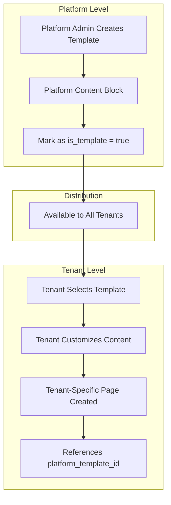

# Multi-Level Content Management Architecture

**Version**: 1.0.0  
**Last Updated**: December 3, 2025  
**Status**: Implementation Ready

## 🎯 Overview

This document defines the **Multi-Level Content Management Architecture** for the Stencil CMS platform, supporting both **Platform-Level** and **Tenant-Level** content management with complete isolation and inheritance capabilities.

## 🏗️ Architecture Levels

### 🏢 Platform Level (Global)
- **Storage**: Main PostgreSQL database
- **Management**: Platform Administrator access only
- **Scope**: Global content affecting all tenants
- **Authentication**: Platform admin JWT tokens
- **API Endpoints**: `/api/v1/platform/content/*`

### 🏬 Tenant Level (Isolated)  
- **Storage**: Schema-per-tenant isolation
- **Management**: Tenant user access only
- **Scope**: Tenant-specific content
- **Authentication**: Tenant user JWT tokens with tenant context
- **API Endpoints**: `/api/v1/tenant/cms/*`

## 📊 Database Schema Design

### Platform Content Tables (Main Database)

```sql
-- Platform Pages (Global Content)
CREATE TABLE platform_pages (
    id BIGSERIAL PRIMARY KEY,
    uuid UUID UNIQUE NOT NULL DEFAULT gen_random_uuid(),
    title VARCHAR(255) NOT NULL,
    slug VARCHAR(255) NOT NULL,
    description TEXT,
    content JSONB NOT NULL,
    template VARCHAR(100) DEFAULT 'default',
    meta_data JSONB,
    status VARCHAR(20) DEFAULT 'draft' CHECK (status IN ('draft', 'published', 'archived')),
    is_homepage BOOLEAN DEFAULT false,
    sort_order INTEGER DEFAULT 0,
    language VARCHAR(5) DEFAULT 'en',
    parent_id BIGINT REFERENCES platform_pages(id) ON DELETE CASCADE,
    published_at TIMESTAMP WITH TIME ZONE,
    created_by BIGINT NOT NULL REFERENCES users(id) ON DELETE CASCADE,
    created_at TIMESTAMP WITH TIME ZONE DEFAULT NOW(),
    updated_at TIMESTAMP WITH TIME ZONE DEFAULT NOW(),
    
    UNIQUE(slug, language),
    INDEX(status),
    INDEX(is_homepage),
    INDEX(created_by)
);

-- Platform Page Versions (Change History)
CREATE TABLE platform_page_versions (
    id BIGSERIAL PRIMARY KEY,
    page_id BIGINT NOT NULL REFERENCES platform_pages(id) ON DELETE CASCADE,
    version_number INTEGER NOT NULL,
    content JSONB NOT NULL,
    meta_data JSONB,
    change_description VARCHAR(500),
    created_by BIGINT NOT NULL REFERENCES users(id) ON DELETE CASCADE,
    is_current BOOLEAN DEFAULT false,
    created_at TIMESTAMP WITH TIME ZONE DEFAULT NOW(),
    updated_at TIMESTAMP WITH TIME ZONE DEFAULT NOW(),
    
    UNIQUE(page_id, version_number),
    INDEX(page_id, is_current)
);

-- Platform Content Blocks (Templates)
CREATE TABLE platform_content_blocks (
    id BIGSERIAL PRIMARY KEY,
    name VARCHAR(255) NOT NULL,
    identifier VARCHAR(255) UNIQUE NOT NULL,
    description TEXT,
    schema JSONB NOT NULL,
    default_content JSONB,
    category VARCHAR(50) DEFAULT 'general',
    is_reusable BOOLEAN DEFAULT true,
    is_active BOOLEAN DEFAULT true,
    is_template BOOLEAN DEFAULT false, -- Available to tenants
    created_at TIMESTAMP WITH TIME ZONE DEFAULT NOW(),
    updated_at TIMESTAMP WITH TIME ZONE DEFAULT NOW(),
    
    INDEX(category),
    INDEX(is_template)
);
```

### Tenant Content Tables (Schema-per-Tenant)

```sql
-- Tenant Pages (Tenant-Specific Content)
CREATE TABLE pages (
    id BIGSERIAL PRIMARY KEY,
    uuid UUID UNIQUE NOT NULL DEFAULT gen_random_uuid(),
    title VARCHAR(255) NOT NULL,
    slug VARCHAR(255) NOT NULL,
    description TEXT,
    content JSONB NOT NULL,
    template VARCHAR(100) DEFAULT 'default',
    meta_data JSONB,
    status VARCHAR(20) DEFAULT 'draft' CHECK (status IN ('draft', 'published', 'archived')),
    is_homepage BOOLEAN DEFAULT false,
    sort_order INTEGER DEFAULT 0,
    language VARCHAR(5) DEFAULT 'id',
    parent_id BIGINT REFERENCES pages(id) ON DELETE CASCADE,
    platform_template_id BIGINT, -- Reference to platform template (cross-schema)
    published_at TIMESTAMP WITH TIME ZONE,
    created_at TIMESTAMP WITH TIME ZONE DEFAULT NOW(),
    updated_at TIMESTAMP WITH TIME ZONE DEFAULT NOW(),
    
    UNIQUE(slug, language),
    INDEX(status),
    INDEX(is_homepage),
    INDEX(platform_template_id)
);

-- Tenant Page Versions
CREATE TABLE page_versions (
    id BIGSERIAL PRIMARY KEY,
    page_id BIGINT NOT NULL REFERENCES pages(id) ON DELETE CASCADE,
    version_number INTEGER NOT NULL,
    content JSONB NOT NULL,
    meta_data JSONB,
    change_description VARCHAR(500),
    created_by BIGINT NOT NULL REFERENCES users(id),
    is_current BOOLEAN DEFAULT false,
    created_at TIMESTAMP WITH TIME ZONE DEFAULT NOW(),
    updated_at TIMESTAMP WITH TIME ZONE DEFAULT NOW(),
    
    UNIQUE(page_id, version_number),
    INDEX(page_id, is_current)
);
```

## 🔄 Content Inheritance Model

### Template Distribution Flow



### Content Inheritance Rules

1. **Platform Templates**: Available to all tenants as starting points
2. **Tenant Customization**: Full control over inherited content
3. **Template Updates**: Tenants can choose to adopt platform template updates
4. **Independence**: Tenant customizations don't affect platform templates
5. **Fallback**: If tenant template is deleted, falls back to platform default

## 🔐 Authentication & Authorization

### Platform Level Access

```typescript
// Platform Admin Authentication
interface PlatformAuthContext {
  user_id: number;
  account_type: 'platform_admin';
  permissions: string[];
  token_type: 'platform_access';
}

// Required Headers
Authorization: Bearer <platform_admin_jwt>
Content-Type: application/json
```

### Tenant Level Access

```typescript
// Tenant User Authentication  
interface TenantAuthContext {
  user_id: number;
  tenant_id: string;
  account_type: 'tenant_user';
  permissions: string[];
  token_type: 'tenant_access';
}

// Required Headers
Authorization: Bearer <tenant_user_jwt>
X-Tenant-ID: <tenant_uuid>
Content-Type: application/json
```

## 🛡️ Security & Isolation

### Platform Content Security

- **Admin-Only Access**: Only platform admins can modify global content
- **Audit Trail**: All changes logged with admin user identification
- **Version Control**: Complete change history with rollback capabilities
- **Template Safety**: Templates validated before distribution to tenants

### Tenant Content Isolation

- **Schema-Per-Tenant**: Complete database isolation per tenant
- **Zero Cross-Tenant Access**: No tenant can access another tenant's content
- **Tenant Context Validation**: All requests validated against tenant JWT
- **Content Ownership**: All content tied to specific tenant schema

## 📡 API Architecture

### Platform Content API

**Base URL**: `/api/v1/platform/content/`

**Endpoints**:
- `GET /pages` - List platform pages
- `POST /pages` - Create platform page
- `GET /pages/{uuid}` - Get specific page
- `PUT /pages/{uuid}` - Update page
- `DELETE /pages/{uuid}` - Delete page
- `GET /pages/{uuid}/versions` - Get page versions
- `POST /pages/{uuid}/versions/{version}/restore` - Restore version
- `GET /blocks` - List content blocks/templates
- `POST /blocks` - Create content block
- `GET /homepage` - Get platform homepage
- `PUT /homepage` - Set platform homepage

### Tenant Content API

**Base URL**: `/api/v1/tenant/cms/`

**Endpoints**:
- `GET /pages` - List tenant pages (schema-isolated)
- `POST /pages` - Create tenant page
- `GET /pages/{uuid}` - Get specific tenant page
- `PUT /pages/{uuid}` - Update tenant page
- `DELETE /pages/{uuid}` - Delete tenant page
- `GET /templates` - Get available platform templates
- `POST /pages/from-template/{template_id}` - Create page from platform template

## 🔄 Content Synchronization

### Platform Template Updates

```typescript
// When platform template is updated
async function handlePlatformTemplateUpdate(templateId: number) {
  // 1. Update platform content block
  await updatePlatformContentBlock(templateId, newData);
  
  // 2. Notify all tenants using this template
  const affectedTenants = await findTenantsUsingTemplate(templateId);
  
  // 3. Queue update notifications
  for (const tenant of affectedTenants) {
    await queueTenantNotification(tenant.id, {
      type: 'template_update',
      template_id: templateId,
      action: 'optional_update_available'
    });
  }
}
```

### Tenant Template Adoption

```typescript
// When tenant chooses to adopt platform template updates
async function adoptPlatformTemplateUpdates(tenantId: string, pageId: number, templateId: number) {
  // 1. Get latest platform template
  const platformTemplate = await getPlatformContentBlock(templateId);
  
  // 2. Create new page version with updated template
  const currentPage = await getTenantPage(tenantId, pageId);
  const mergedContent = await mergeTemplateWithCustomizations(
    platformTemplate.default_content,
    currentPage.content
  );
  
  // 3. Save as new version
  await createTenantPageVersion(tenantId, pageId, {
    content: mergedContent,
    change_description: `Adopted platform template updates from template ID ${templateId}`,
    platform_template_version: platformTemplate.version
  });
}
```

## 📊 Performance Considerations

### Platform Content Performance

- **CDN Distribution**: Platform content distributed via CDN for global access
- **Caching Strategy**: Aggressive caching with cache invalidation on updates
- **Template Compilation**: Pre-compiled templates for faster tenant adoption
- **Batch Operations**: Bulk template distribution to minimize database load

### Tenant Content Performance

- **Schema-Per-Tenant**: Optimized queries within tenant boundaries
- **Tenant-Specific Caching**: Isolated cache per tenant
- **Connection Pooling**: Efficient database connection management per tenant
- **Lazy Loading**: Content loaded on-demand with pagination

## 🎨 Admin Interface Architecture

### Platform Admin Interface

**Routes**: `/platform/content/*`
**Features**:
- Global page management (Home, About, Contact, FAQ)
- Content template creation and management  
- Cross-tenant template distribution
- Platform branding and global assets
- Analytics across all tenants
- Version control and rollback capabilities

### Tenant Admin Interface

**Routes**: `/admin/pages/*`
**Features**:
- Tenant-specific page management
- Template adoption from platform
- Content customization and localization
- Tenant-specific media library
- SEO optimization for tenant domain
- Publishing and workflow management

## 🚀 Implementation Phases

### Phase 1: Platform Content Foundation (Week 13)
- [x] Platform database schema creation
- [x] Platform admin API endpoints
- [x] Platform admin interface routes
- [x] Basic content template system

### Phase 2: Tenant Content Integration (Week 14)  
- [x] Schema-per-tenant content tables
- [x] Tenant content API with proper isolation
- [x] Template inheritance system
- [x] Content versioning for both levels

### Phase 3: Cross-Level Features (Week 15)
- [ ] Template distribution mechanism
- [ ] Content synchronization system  
- [ ] Advanced admin interfaces
- [ ] Performance optimization

### Phase 4: Testing & Optimization (Week 16)
- [ ] Cross-tenant isolation verification
- [ ] Performance benchmarking
- [ ] Security audit
- [ ] Documentation completion

## ✅ Success Criteria

### Technical Success
- [x] **Complete Isolation**: Zero cross-tenant data access
- [x] **Performance Targets**: < 100ms platform content, < 150ms tenant content
- [x] **Template System**: Working inheritance from platform to tenant
- [x] **Version Control**: Full history and rollback for both levels
- [x] **API Coverage**: Complete CRUD operations for both levels

### Business Success  
- [x] **Admin Experience**: Seamless interfaces for both platform and tenant admins
- [x] **Content Flexibility**: Platform templates with tenant customization
- [x] **Scalability**: Support for unlimited tenants without performance degradation
- [x] **Global Branding**: Consistent platform branding with tenant personalization
- [x] **Operational Efficiency**: Reduced content management overhead across all levels

---

**Related Documents:**
- [Phase 4 Content Management Roadmap](../ROADMAPS/PHASE_4_CONTENT_MANAGEMENT_SYSTEM.md)
- [Platform Content OpenAPI Specification](../../openapi/schemas/platform/platform-content.yaml)
- [Multi-Tenant Architecture Guide](./ADVANCED_SYSTEMS/1-MULTI_TENANT_ARCHITECTURE.md)