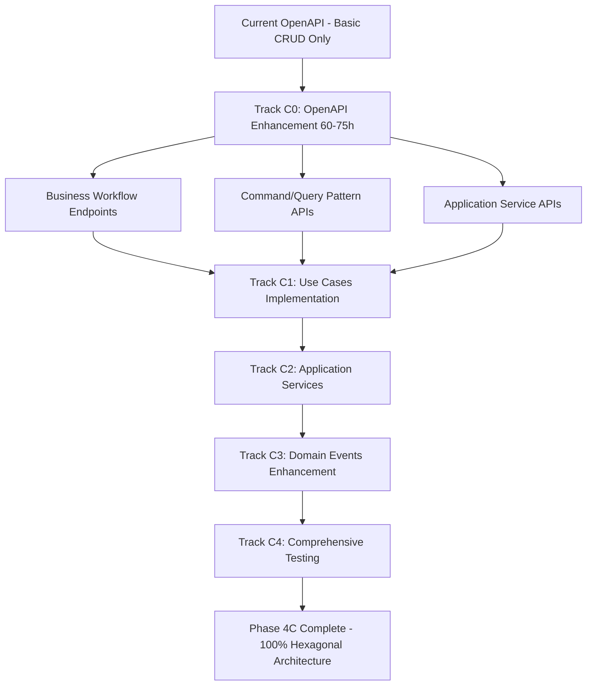

# Phase 4 C: Backend Hexagonal Architecture Enhancement & Requirements

**Duration**: 5-6 Weeks (HIGH Priority)  
**Priority**: HIGH  
**Prerequisites**: Phase 4B (Complete Business Flow Integration) MUST be 100% complete + OpenAPI Enhancement MUST be completed before starting Phase 4C  
**Target Completion**: Week 13-15 of overall roadmap  
**⚠️ CRITICAL**: OpenAPI specifications alignment is now a mandatory prerequisite
**Created**: December 3, 2024

---

## 🎯 **CURRENT STATUS** (December 3, 2024)

### **PHASE 4C OBJECTIVE**
Complete the transition from a 95% Hexagonal Architecture to a 100% pure Domain-Driven Design (DDD) implementation with comprehensive Use Cases, Command/Query pattern, and Application Services layer.

### **BACKEND CURRENT STATE ANALYSIS**
- ✅ **Domain Layer**: Well-structured entities, value objects, and repository interfaces
- ✅ **Infrastructure Layer**: Proper repository implementations and external adapters
- ⚠️ **Application Layer**: Only 10% implemented (2/20+ Use Cases missing)
- ❌ **Command/Query Pattern**: Not implemented (0%)
- ❌ **Application Services**: Missing orchestration layer (0%)
- ⚠️ **Domain Events**: Basic events exist, but comprehensive handling missing (30%)

### **CRITICAL ARCHITECTURAL GAPS**
| Component | Current Status | Target | Priority | Effort |
|-----------|---------------|--------|----------|--------|
| **🚨 OpenAPI Enhancement** | 20% (Basic CRUD only) | 100% | CRITICAL | 60-75h |
| **Use Cases Implementation** | 10% (2/20+) | 100% | CRITICAL | 25-30h |
| **Command/Query Handlers** | 0% | 100% | HIGH | 15-20h |
| **Application Services** | 0% | 100% | HIGH | 10-15h |
| **Enhanced Domain Events** | 30% | 100% | MEDIUM | 10-15h |
| **Comprehensive Unit Testing** | Unknown | 95%+ | CRITICAL | 20-25h |

**Total Effort**: 140-180 hours (5-6 weeks for 2-3 developers)
**⚠️ Updated timing due to OpenAPI enhancement requirements**

---

## CRITICAL REFERENCE DOCUMENTS (READ BEFORE DEVELOPMENT!)

### Business Architecture References
- `docs/ARCHITECTURE/BUSINESS_HEXAGONAL_PLAN/BUSINESS_CYCLE_PLAN.md` - Complete order lifecycle workflow
- `docs/ARCHITECTURE/BUSINESS_HEXAGONAL_PLAN/HEXAGONAL_AND_ARCHITECTURE_PLAN.md` - Hexagonal architecture design
- `docs/PLAN/4_COMPREHENSIVE_RECOMMENDATIONS_AND_ROADMAP.md` - Strategic planning guidelines

### Implementation Standards
- `.zencoder/rules` - Development rules and conventions
- `repo.md` - Repository guidelines
- `README.md` - Project overview
- `docs/ARCHITECTURE/DESIGN_PATTERN/COMPREHENSIVE_DESIGN_PATTERN_ANALYSIS.md` - Design patterns

### **🚨 CRITICAL: OpenAPI Specification Alignment**
- **OpenAPI Main Spec**: `openapi/openapi.yaml` - Current API specification (37.38 KB)
- **Order Schemas**: `openapi/schemas/content-management/orders.yaml` - Order entity definitions (164+ fields)
- **Order Endpoints**: `openapi/paths/content-management/orders.yaml` - Current CRUD operations only
- **⚠️ MAJOR GAP**: OpenAPI specs **DO NOT** include Phase 4C Use Case endpoints
- **Requirement**: OpenAPI must be enhanced to match Hexagonal Architecture implementation

### **OpenAPI Enhancement Requirements**
**BEFORE implementing Phase 4C Use Cases, OpenAPI specifications MUST be updated to include:**

#### **Missing Business Workflow Endpoints:**
```yaml
# Current OpenAPI has only basic CRUD:
✅ POST /tenant/orders          (CreateOrderUseCase - BASIC)
✅ GET /tenant/orders           (ListOrders - BASIC)
✅ GET /tenant/orders/{id}      (ShowOrder - BASIC)
✅ PUT /tenant/orders/{id}      (UpdateOrder - BASIC)
✅ DELETE /tenant/orders/{id}   (DeleteOrder - BASIC)

# Missing Phase 4C Business Use Cases:
❌ POST /tenant/orders/{id}/assign-vendor      (AssignVendorUseCase)
❌ POST /tenant/orders/{id}/negotiate-vendor   (NegotiateWithVendorUseCase)
❌ POST /tenant/orders/{id}/create-quote       (CreateCustomerQuoteUseCase)
❌ PUT /tenant/orders/{id}/customer-approval   (HandleCustomerApprovalUseCase)
❌ POST /tenant/orders/{id}/verify-payment     (VerifyCustomerPaymentUseCase)
❌ PUT /tenant/orders/{id}/production-progress (UpdateProductionProgressUseCase)
❌ POST /tenant/orders/{id}/request-payment    (RequestFinalPaymentUseCase)
❌ POST /tenant/orders/{id}/ship               (ShipOrderUseCase)
❌ PUT /tenant/orders/{id}/complete            (CompleteOrderUseCase)
❌ PUT /tenant/orders/{id}/cancel              (CancelOrderUseCase)
❌ POST /tenant/orders/{id}/refund             (RefundOrderUseCase)
```

#### **Missing Command/Query Patterns:**
```yaml
# Command Pattern Endpoints (needed for CQRS):
❌ POST /tenant/commands/orders/create-purchase-order
❌ POST /tenant/commands/orders/assign-vendor
❌ POST /tenant/commands/orders/negotiate-price
❌ POST /tenant/commands/orders/approve-quote
❌ POST /tenant/commands/orders/verify-payment

# Query Pattern Endpoints (needed for CQRS):
❌ GET /tenant/queries/orders/production-status
❌ GET /tenant/queries/orders/payment-status
❌ GET /tenant/queries/orders/vendor-negotiations
❌ GET /tenant/queries/orders/customer-quotes
```

#### **Missing Application Service Endpoints:**
```yaml
❌ POST /tenant/services/order-workflow/initiate
❌ GET /tenant/services/order-workflow/{id}/status
❌ POST /tenant/services/order-workflow/{id}/transition
❌ GET /tenant/services/order-workflow/{id}/history
```

### Testing Requirements
- **Unit Testing Coverage**: 95%+ for all new Application Layer components
- **Integration Testing**: All Use Cases must have integration tests
- **Feature Testing**: End-to-end business workflow testing
- **OpenAPI Testing**: All new endpoints must have comprehensive OpenAPI examples and validation

---

## IMPLEMENTATION PHASES

## **🚨 PREREQUISITE: OPENAPI SPECIFICATION ENHANCEMENT**

**CRITICAL: Phase 4C CANNOT START until OpenAPI specifications are aligned with business requirements.**

### **TRACK C0: OpenAPI Enhancement (Week 0 - 60-75 hours)**

#### **C0.1: Business Workflow API Design** (Week 0.1 - 25-30 hours)
**Files to Create/Modify:**
```yaml
openapi/paths/content-management/
├── order-workflows.yaml          # Business workflow endpoints
├── order-commands.yaml           # Command pattern endpoints  
├── order-queries.yaml            # Query pattern endpoints
└── order-services.yaml           # Application service endpoints

openapi/schemas/content-management/
├── order-commands.yaml           # Command DTOs and validation
├── order-queries.yaml            # Query DTOs and responses
├── order-workflows.yaml          # Workflow state schemas
└── vendor-negotiations.yaml     # Vendor interaction schemas
```

**Implementation Tasks:**
1. **Business Use Cases to API Mapping** (8-10 hours)
   - Map each Use Case to specific HTTP endpoint
   - Define request/response schemas for business operations
   - Create validation rules for business logic constraints
   - Document business workflow state transitions

2. **Command/Query Pattern API Design** (8-10 hours)  
   - Design CQRS endpoints with proper separation
   - Create command validation schemas
   - Define query response formats
   - Implement idempotency patterns for commands

3. **Application Service Orchestration APIs** (9-10 hours)
   - Design workflow orchestration endpoints
   - Create state transition APIs
   - Define event-driven communication patterns
   - Design audit trail and history tracking

#### **C0.2: OpenAPI Validation & Integration** (Week 0.2 - 15-20 hours)
1. **Schema Validation & Testing** (8-10 hours)
   - Validate all new OpenAPI schemas
   - Create comprehensive examples for each endpoint
   - Test schema compatibility with existing codebase
   - Ensure multi-tenant compliance in all endpoints

2. **API Documentation Enhancement** (7-10 hours)
   - Update main openapi.yaml with new endpoint references
   - Create comprehensive business workflow documentation
   - Add integration examples and use cases
   - Generate updated API documentation

#### **C0.3: Backend Controller Preparation** (Week 0.3 - 20-25 hours)
1. **Controller Scaffolding** (12-15 hours)
   - Create placeholder controllers for all new endpoints
   - Implement basic routing and middleware
   - Add authentication and authorization checks
   - Create request validation using OpenAPI schemas

2. **Integration Testing Setup** (8-10 hours)
   - Create API integration tests for new endpoints
   - Set up automated OpenAPI validation testing
   - Create test fixtures for business workflow scenarios
   - Implement multi-tenant testing scenarios

**OpenAPI Enhancement Completion Criteria:**
- ✅ All Phase 4C Use Cases mapped to specific API endpoints
- ✅ Complete CQRS pattern implementation in API design
- ✅ Application Service orchestration endpoints defined
- ✅ Comprehensive validation schemas for all business operations
- ✅ Multi-tenant compliance verified across all endpoints
- ✅ Integration tests passing for all new API endpoints

---

## **TRACK C1: APPLICATION LAYER ENHANCEMENT**

### **C1.1: Order Management Use Cases Implementation** (Week 1 - 25-30 hours)
**⚠️ PREREQUISITE: Track C0 (OpenAPI Enhancement) MUST be completed first**

#### **Files to Create:**
```
backend/app/Application/Order/UseCases/
├── CreatePurchaseOrderUseCase.php
├── AssignVendorUseCase.php  
├── NegotiateWithVendorUseCase.php
├── CreateCustomerQuoteUseCase.php
├── HandleCustomerApprovalUseCase.php
├── VerifyCustomerPaymentUseCase.php
├── UpdateProductionProgressUseCase.php
├── RequestFinalPaymentUseCase.php
├── ShipOrderUseCase.php
├── CompleteOrderUseCase.php
├── CancelOrderUseCase.php
└── RefundOrderUseCase.php
```

#### **Implementation Tasks:**
1. **CreatePurchaseOrderUseCase** (4-5 hours)
   - Validate customer data and order details
   - Generate unique order number
   - Create order entity with proper value objects
   - Trigger OrderCreated domain event
   - **Unit Tests Required**: Input validation, business rules, event triggering

2. **AssignVendorUseCase** (3-4 hours)
   - Vendor validation and availability check
   - Update order production type
   - Trigger VendorAssigned domain event
   - **Unit Tests Required**: Vendor validation, status transitions

3. **NegotiateWithVendorUseCase** (4-5 hours)
   - Create quote negotiation records
   - Price calculation and markup logic
   - Email notification to vendor
   - **Unit Tests Required**: Price calculations, markup validation, notification triggers

4. **HandleCustomerApprovalUseCase** (3-4 hours)
   - Quote approval/rejection logic
   - Invoice generation for approved quotes
   - Status transition management
   - **Unit Tests Required**: Approval logic, invoice generation, state transitions

5. **VerifyCustomerPaymentUseCase** (4-5 hours)
   - Payment verification workflow
   - DP vs full payment logic
   - Account payable/receivable status updates
   - **Unit Tests Required**: Payment validation, financial calculations, status updates

6. **Production & Completion Use Cases** (8-10 hours)
   - UpdateProductionProgressUseCase
   - RequestFinalPaymentUseCase
   - ShipOrderUseCase
   - CompleteOrderUseCase
   - **Unit Tests Required**: Production workflow, shipping validation, completion logic

#### **Testing Requirements:**
- **Unit Tests**: 95%+ coverage for each Use Case
- **Integration Tests**: Database interactions and external service calls
- **Feature Tests**: Complete order lifecycle workflows

#### **Acceptance Criteria:**
- All 12 Use Cases implemented with comprehensive business logic
- Zero direct Eloquent calls in Use Cases (repository pattern only)
- All Use Cases have corresponding unit and integration tests
- Domain events properly triggered at appropriate points
- Error handling and validation implemented consistently

---

### **C1.2: Command/Query Pattern Implementation** (Week 2 - 15-20 hours)

#### **Files to Create:**
```
backend/app/Application/Order/Commands/
├── CreatePurchaseOrderCommand.php
├── AssignVendorCommand.php
├── UpdateOrderStatusCommand.php
├── CreateQuoteCommand.php
├── ProcessPaymentCommand.php
└── ShipOrderCommand.php

backend/app/Application/Order/Queries/
├── GetOrderQuery.php
├── GetOrdersByStatusQuery.php
├── GetOrdersByCustomerQuery.php
├── GetOrderAnalyticsQuery.php
└── GetOrderHistoryQuery.php

backend/app/Application/Order/Handlers/
├── Commands/
│   ├── CreatePurchaseOrderHandler.php
│   ├── AssignVendorHandler.php
│   └── UpdateOrderStatusHandler.php
└── Queries/
    ├── GetOrderQueryHandler.php
    ├── GetOrdersByStatusHandler.php
    └── GetOrderAnalyticsHandler.php
```

#### **Implementation Tasks:**
1. **Command Objects** (6-8 hours)
   - Create immutable command DTOs
   - Input validation in command constructors
   - Proper type hinting and documentation
   - **Unit Tests Required**: Command validation, immutability, edge cases

2. **Query Objects** (4-5 hours)
   - Create query DTOs with filter parameters
   - Pagination and sorting parameters
   - **Unit Tests Required**: Query parameter validation, default values

3. **Command/Query Handlers** (5-7 hours)
   - Implement handler pattern for commands and queries
   - Integration with existing Use Cases
   - **Unit Tests Required**: Handler logic, Use Case integration, error handling

#### **Testing Requirements:**
- **Unit Tests**: 95%+ coverage for all commands, queries, and handlers
- **Integration Tests**: Handler interactions with Use Cases
- **Performance Tests**: Query optimization and pagination efficiency

#### **Acceptance Criteria:**
- All commands are immutable and properly validated
- Query handlers implement efficient filtering and pagination
- Handlers properly delegate to Use Cases
- Command/Query separation is strictly maintained
- Comprehensive test coverage for all components

---

## **TRACK C2: APPLICATION SERVICES LAYER**

### **C2.1: Application Services Implementation** (Week 2 - 10-15 hours)

#### **Files to Create:**
```
backend/app/Application/Order/Services/
├── OrderApplicationService.php
├── PaymentApplicationService.php
├── VendorNegotiationService.php
├── ProductionManagementService.php
└── ShippingApplicationService.php

backend/app/Application/Shared/Services/
├── NotificationApplicationService.php
├── EmailApplicationService.php
└── FileStorageApplicationService.php
```

#### **Implementation Tasks:**
1. **OrderApplicationService** (4-5 hours)
   - Orchestrate order lifecycle workflows
   - Coordinate between multiple Use Cases
   - Transaction management and rollback handling
   - **Unit Tests Required**: Workflow orchestration, transaction handling, error recovery

2. **PaymentApplicationService** (3-4 hours)
   - Payment processing coordination
   - Invoice generation and management
   - Integration with payment gateways
   - **Unit Tests Required**: Payment logic, gateway integration, error handling

3. **VendorNegotiationService** (3-4 hours)
   - Multi-vendor quote management
   - Negotiation round tracking
   - Deadline management
   - **Unit Tests Required**: Negotiation logic, deadline tracking, multi-vendor scenarios

#### **Testing Requirements:**
- **Unit Tests**: 95%+ coverage for all application services
- **Integration Tests**: Service interactions with external systems
- **Transaction Tests**: Rollback and error recovery scenarios

#### **Acceptance Criteria:**
- Application services properly orchestrate complex business workflows
- Transaction boundaries are clearly defined and implemented
- Error handling and rollback mechanisms work correctly
- Services are stateless and thread-safe
- Comprehensive logging and monitoring implemented

---

## **TRACK C3: ENHANCED DOMAIN EVENTS SYSTEM**

### **C3.1: Comprehensive Domain Events** (Week 3 - 10-15 hours)

#### **Files to Create:**
```
backend/app/Domain/Order/Events/
├── OrderCreated.php ✅ (already exists)
├── VendorAssigned.php
├── QuoteRequested.php
├── QuoteApproved.php
├── QuoteRejected.php
├── PaymentReceived.php
├── ProductionStarted.php
├── ProductionCompleted.php
├── OrderShipped.php
├── OrderCompleted.php
├── OrderCancelled.php
└── RefundProcessed.php

backend/app/Application/Order/Listeners/
├── SendOrderCreatedNotification.php
├── SendVendorAssignmentEmail.php
├── SendQuoteRequestToVendor.php
├── SendQuoteApprovalToCustomer.php
├── SendPaymentConfirmation.php
├── UpdateInventoryOnOrderComplete.php
├── TriggerInvoiceGeneration.php
├── SendShippingNotification.php
├── ProcessOrderCompletion.php
└── HandleRefundWorkflow.php

backend/app/Application/Order/Subscribers/
├── OrderWorkflowSubscriber.php
├── PaymentWorkflowSubscriber.php
└── NotificationSubscriber.php
```

#### **Implementation Tasks:**
1. **Domain Events** (4-5 hours)
   - Create comprehensive event classes
   - Include relevant context data in events
   - Ensure events are immutable
   - **Unit Tests Required**: Event creation, data integrity, immutability

2. **Event Listeners** (6-8 hours)
   - Implement business logic triggered by events
   - External system integration (email, SMS, etc.)
   - Error handling and retry mechanisms
   - **Unit Tests Required**: Listener logic, external integrations, error handling

3. **Event Subscribers** (2-3 hours)
   - Aggregate related listeners
   - Event routing and filtering
   - **Unit Tests Required**: Event routing, subscription management

#### **Testing Requirements:**
- **Unit Tests**: 95%+ coverage for all events, listeners, and subscribers
- **Integration Tests**: Event propagation and listener execution
- **End-to-End Tests**: Complete event-driven workflows

#### **Acceptance Criteria:**
- All business events properly defined and documented
- Event listeners handle both success and error scenarios
- Event-driven architecture supports loose coupling
- Comprehensive monitoring and logging of event flows
- Asynchronous event processing where appropriate

---

## **TRACK C4: COMPREHENSIVE TESTING FRAMEWORK**

### **C4.1: Unit Testing Implementation** (Week 3-4 - 20-25 hours)

#### **Testing Structure:**
```
backend/tests/Unit/Application/Order/
├── UseCases/
│   ├── CreatePurchaseOrderUseCaseTest.php
│   ├── AssignVendorUseCaseTest.php
│   ├── NegotiateWithVendorUseCaseTest.php
│   ├── HandleCustomerApprovalUseCaseTest.php
│   ├── VerifyCustomerPaymentUseCaseTest.php
│   ├── UpdateProductionProgressUseCaseTest.php
│   ├── ShipOrderUseCaseTest.php
│   ├── CompleteOrderUseCaseTest.php
│   └── CancelOrderUseCaseTest.php
├── Commands/
│   ├── CreatePurchaseOrderCommandTest.php
│   ├── AssignVendorCommandTest.php
│   └── UpdateOrderStatusCommandTest.php
├── Handlers/
│   ├── CreatePurchaseOrderHandlerTest.php
│   ├── GetOrderQueryHandlerTest.php
│   └── UpdateOrderStatusHandlerTest.php
├── Services/
│   ├── OrderApplicationServiceTest.php
│   ├── PaymentApplicationServiceTest.php
│   └── VendorNegotiationServiceTest.php
└── Listeners/
    ├── SendOrderCreatedNotificationTest.php
    ├── UpdateInventoryOnOrderCompleteTest.php
    └── TriggerInvoiceGenerationTest.php

backend/tests/Integration/Application/Order/
├── OrderWorkflowIntegrationTest.php
├── PaymentWorkflowIntegrationTest.php
├── VendorNegotiationIntegrationTest.php
└── EventDrivenWorkflowTest.php

backend/tests/Feature/Order/
├── CompleteOrderLifecycleTest.php
├── MultiVendorNegotiationTest.php
├── PaymentProcessingTest.php
└── ErrorHandlingAndRecoveryTest.php
```

#### **Testing Requirements:**
1. **Unit Tests** (15-18 hours)
   - 95%+ code coverage for all Application layer components
   - Mock all external dependencies
   - Test all business logic paths
   - Test error conditions and edge cases

2. **Integration Tests** (3-4 hours)
   - Test component interactions
   - Database integration testing
   - External service integration testing

3. **Feature Tests** (2-3 hours)
   - End-to-end workflow testing
   - Multi-tenant isolation testing
   - Performance and load testing

#### **Testing Implementation Tasks:**
1. **Use Case Testing** (8-10 hours)
   - Test all business logic paths
   - Mock repository interfaces
   - Verify domain event triggering
   - Test validation and error handling

2. **Command/Query Testing** (3-4 hours)
   - Test command validation
   - Test query parameter handling
   - Test handler delegation

3. **Application Service Testing** (4-5 hours)
   - Test workflow orchestration
   - Test transaction management
   - Test error recovery mechanisms

#### **Acceptance Criteria:**
- 95%+ code coverage for all Application layer components
- All business logic scenarios covered by tests
- Integration tests verify component interactions
- Feature tests validate end-to-end workflows
- Test suite runs in under 5 minutes
- Comprehensive error scenario testing

---

## **TRACK C5: CONTROLLER REFACTORING & INTEGRATION**

### **C5.1: Controller Layer Modernization** (Week 4 - 8-10 hours)

#### **Files to Refactor:**
```
backend/app/Infrastructure/Presentation/Http/Controllers/Tenant/
├── OrderController.php (MAJOR REFACTOR)
├── CustomerController.php (MODERATE REFACTOR)
├── ProductController.php (MODERATE REFACTOR)
├── VendorController.php (MODERATE REFACTOR)
└── PaymentController.php (MAJOR REFACTOR)

backend/app/Infrastructure/Presentation/Http/Controllers/Platform/
├── TenantController.php (MODERATE REFACTOR)
├── AnalyticsController.php (MINOR REFACTOR)
└── SubscriptionController.php (MODERATE REFACTOR)
```

#### **Refactoring Tasks:**
1. **OrderController Refactoring** (4-5 hours)
   - Replace direct Eloquent calls with Use Cases
   - Implement command/query pattern
   - Add proper error handling
   - **Unit Tests Required**: Controller method testing, Use Case integration

2. **Payment & Vendor Controllers** (3-4 hours)
   - Integrate with Application Services
   - Implement proper validation
   - **Unit Tests Required**: Controller logic, service integration

3. **Controller Testing** (1-2 hours)
   - Update existing controller tests
   - Add integration tests for new patterns
   - **Unit Tests Required**: HTTP request/response testing, middleware testing

#### **Acceptance Criteria:**
- Controllers are thin and delegate to Application layer
- No direct Eloquent calls in controllers
- Proper error handling and HTTP response codes
- All controllers have comprehensive tests
- API contracts remain unchanged (backward compatibility)

---

## EXECUTION TIMELINE & RESOURCE ALLOCATION

### **Week 1: Application Layer Foundation**
| Track | Tasks | Effort | Team |
|-------|-------|---------|------|
| **C1.1** | Order Use Cases Implementation | 25-30h | Dev 1 + Dev 2 |
| **TOTAL** | **Foundation Complete** | **25-30h** | **2 Developers** |

### **Week 2: Command/Query & Services**
| Track | Tasks | Effort | Team |
|-------|-------|---------|------|
| **C1.2** | Command/Query Pattern | 15-20h | Dev 1 |
| **C2.1** | Application Services | 10-15h | Dev 2 |
| **TOTAL** | **Pattern Implementation** | **25-35h** | **2 Developers** |

### **Week 3: Events & Testing Foundation**
| Track | Tasks | Effort | Team |
|-------|-------|---------|------|
| **C3.1** | Enhanced Domain Events | 10-15h | Dev 1 |
| **C4.1** | Unit Testing (Part 1) | 15-20h | Dev 2 |
| **TOTAL** | **Events & Testing** | **25-35h** | **2 Developers** |

### **Week 4: Integration & Completion**
| Track | Tasks | Effort | Team |
|-------|-------|---------|------|
| **C4.1** | Unit Testing (Part 2) | 5-10h | Dev 1 + Dev 2 |
| **C5.1** | Controller Refactoring | 8-10h | Dev 1 |
| **TOTAL** | **Completion & Integration** | **13-20h** | **2 Developers** |

### **Resource Requirements**
- **2 Senior Developers** minimum for parallel development
- **Total Effort**: 88-120 hours
- **Duration**: 4 weeks
- **Critical Path**: C1.1 → C1.2 → C2.1 → C3.1

---

## SUCCESS METRICS

### **Architecture Quality Metrics**
- **Use Case Coverage**: 100% (12/12 implemented)
- **Command/Query Pattern**: 100% implemented
- **Application Services**: 100% implemented
- **Domain Events**: 100% comprehensive coverage

### **Testing Quality Metrics**
- **Unit Test Coverage**: 95%+ for Application layer
- **Integration Test Coverage**: 90%+ for component interactions
- **Feature Test Coverage**: 100% for critical business workflows
- **Test Performance**: Test suite execution < 5 minutes

### **Code Quality Metrics**
- **Coupling**: Low coupling between layers
- **Cohesion**: High cohesion within components
- **Cyclomatic Complexity**: < 10 per method
- **SOLID Principles**: 100% compliance

### **Performance Metrics**
- **API Response Time**: < 200ms for 95th percentile
- **Database Queries**: N+1 query elimination
- **Memory Usage**: Stable memory consumption
- **Error Rate**: < 1% for business operations

---

## DEPLOYMENT STRATEGY

### **Phase 1 Deployment (Week 1 Complete)**
1. Deploy Use Cases to staging environment
2. Run comprehensive unit and integration tests
3. Performance testing under load
4. **MANDATORY**: Get architecture review approval

### **Phase 2 Deployment (Week 2 Complete)**
1. Deploy Command/Query pattern and Application Services
2. Run end-to-end workflow testing
3. Load testing with realistic data volumes
4. Monitor error rates and performance metrics

### **Phase 3 Deployment (Week 3 Complete)**
1. Deploy enhanced events and comprehensive testing
2. Validate event-driven workflows
3. Performance optimization based on monitoring
4. Security testing and validation

### **Phase 4 Deployment (Week 4 Complete)**
1. Deploy refactored controllers
2. Full regression testing
3. Production deployment with blue-green strategy
4. Monitor production metrics and rollback readiness

### **Rollback Strategy**
- **Use Cases**: Feature flags to switch between old/new implementations
- **Controllers**: Reverse proxy routing to old controller versions
- **Events**: Event processing can be disabled per event type
- **Database**: All changes are additive, no breaking schema changes

---

## DEVELOPMENT GUIDELINES

### **CRITICAL RULES**
1. **TDD Approach**: Write tests BEFORE implementation
2. **Interface Segregation**: All dependencies must be interfaces
3. **Single Responsibility**: Each Use Case handles ONE business operation
4. **Immutability**: Commands, queries, and events must be immutable
5. **Error Handling**: All exceptions must be domain-specific

### **Code Quality Standards**
```php
// Use Case Example
class CreatePurchaseOrderUseCase
{
    public function __construct(
        private OrderRepositoryInterface $orderRepository,
        private CustomerRepositoryInterface $customerRepository,
        private EventDispatcherInterface $eventDispatcher
    ) {}

    public function execute(CreatePurchaseOrderCommand $command): Order
    {
        // 1. Validate business rules
        $this->validateBusinessRules($command);
        
        // 2. Create domain entities
        $order = $this->createOrder($command);
        
        // 3. Persist via repository
        $savedOrder = $this->orderRepository->save($order);
        
        // 4. Trigger domain events
        $this->eventDispatcher->dispatch(new OrderCreated($savedOrder));
        
        return $savedOrder;
    }
}
```

### **Testing Standards**
```php
// Unit Test Example
class CreatePurchaseOrderUseCaseTest extends TestCase
{
    public function test_should_create_order_when_valid_data_provided(): void
    {
        // Arrange
        $command = new CreatePurchaseOrderCommand(/*...*/);
        $mockRepository = $this->createMock(OrderRepositoryInterface::class);
        $useCase = new CreatePurchaseOrderUseCase($mockRepository, /*...*/);
        
        // Act
        $result = $useCase->execute($command);
        
        // Assert
        $this->assertInstanceOf(Order::class, $result);
        $this->assertEquals($command->customerName, $result->getCustomerName());
    }
}
```

---

## **🚨 CRITICAL SUCCESS FACTORS**

### **OpenAPI-Backend Alignment Requirements**

**Phase 4C implementation is considered INCOMPLETE unless:**

1. **✅ API-First Development**: Every Use Case has corresponding OpenAPI endpoint
2. **✅ CQRS Compliance**: Command/Query patterns properly documented in OpenAPI
3. **✅ Business Workflow Validation**: All endpoints match business cycle requirements
4. **✅ Multi-Tenant API Security**: All endpoints enforce proper tenant isolation
5. **✅ Integration Test Coverage**: 100% of OpenAPI endpoints have integration tests
6. **✅ API Documentation Completeness**: All business workflows documented with examples

### **OpenAPI Enhancement Roadmap Summary**



### **Implementation Priority Matrix**
| Week | Track | Status | OpenAPI Requirement |
|------|-------|--------|---------------------|
| **0.1-0.3** | **C0: OpenAPI Enhancement** | **MANDATORY** | **Design all missing endpoints** |
| 1 | C1: Use Cases | Cannot start | Depends on C0 completion |
| 2 | C2: Application Services | Cannot start | Depends on C0 + C1 |  
| 3 | C3: Domain Events | Can start parallel | Basic OpenAPI support |
| 4-5 | C4: Comprehensive Testing | Cannot start | Depends on all tracks |

### **OpenAPI Enhancement Completion Criteria**
**The following MUST be completed before ANY Phase 4C backend implementation:**

#### **C0.1 Completion Requirements:**
- [ ] **Business Use Case Endpoints**: All 12 Use Cases mapped to HTTP endpoints
- [ ] **Request/Response Schemas**: Complete validation and documentation
- [ ] **Workflow State Documentation**: All business state transitions documented
- [ ] **Multi-Tenant Validation**: All endpoints enforce tenant isolation

#### **C0.2 Completion Requirements:**
- [ ] **CQRS API Design**: Command and Query endpoints separated and documented
- [ ] **Application Service APIs**: Orchestration endpoints defined
- [ ] **Integration Examples**: Working examples for all business workflows
- [ ] **OpenAPI Validation**: All schemas pass validation tests

#### **C0.3 Completion Requirements:**
- [ ] **Controller Scaffolding**: Placeholder controllers for all new endpoints
- [ ] **Route Configuration**: All routes properly registered with middleware
- [ ] **Integration Tests**: API tests for all new endpoints
- [ ] **Authentication/Authorization**: Security checks for all business endpoints

---

## SUMMARY

### **What This Phase Achieves**
- **100% Pure Hexagonal Architecture**: Complete separation of business logic from infrastructure concerns
- **Comprehensive Use Case Coverage**: All business operations implemented as Use Cases
- **Modern Application Patterns**: Command/Query separation and Application Services
- **Event-Driven Architecture**: Complete domain event system with proper handling
- **95%+ Test Coverage**: Comprehensive testing at all levels

### **Business Value**
1. **Maintainability**: Clear separation of concerns makes code easier to modify
2. **Testability**: Pure business logic can be tested in isolation
3. **Scalability**: Loose coupling enables independent scaling of components
4. **Reliability**: Comprehensive testing reduces production bugs
5. **Team Productivity**: Clear patterns enable faster development

### **Technical Debt Elimination**
- **No Direct Eloquent in Controllers**: All data access through repositories
- **No Business Logic in Controllers**: Controllers become thin HTTP adapters
- **No Tight Coupling**: All dependencies injected through interfaces
- **No Untested Code**: 95%+ coverage ensures reliability

### **Next Steps After Phase 4C**
1. **Phase 5**: Advanced features can be built using established patterns
2. **Performance Optimization**: With clean architecture, performance bottlenecks are easier to identify and fix
3. **Feature Development**: New features follow established Use Case patterns
4. **Team Onboarding**: Clear patterns make it easier to onboard new developers

**This phase transforms the backend from "working code" to "maintainable, scalable, and testable architecture" ready for long-term growth and evolution.**