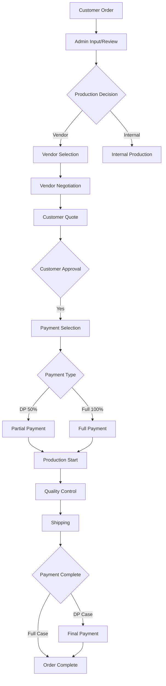

# TENANT FOCUS BEFORE PHASE 5: COMPREHENSIVE ROADMAP

**Created**: December 6, 2025  
**Priority**: **URGENT - BUSINESS CRITICAL**  
**Duration**: 6-8 weeks  
**Prerequisites**: Phase 4D Complete ✅  
**Target**: Complete tenant business cycle implementation before Phase 5

---

## 🎯 EXECUTIVE SUMMARY

### **CRITICAL BUSINESS REQUIREMENT**
PT Custom Etching Xenial (PT CEX) membutuhkan implementasi **complete business cycle workflow** untuk operasi etching sebelum pengembangan Phase 5 (Advanced Features). Menu structure sudah sempurna, tetapi **ZERO implementation** pada management pages.

### **SCOPE VALIDATION**
✅ **Business Cycle Coverage**: **100% COMPLETE** - Menu structure mencakup seluruh alur bisnis  
❌ **Implementation Reality**: **0% COMPLETE** - Semua menu hanya routing tanpa real pages  
🎯 **Goal**: Implementasi penuh 36 management pages dengan backend integration

---

## 📊 CURRENT STATE ANALYSIS

### **✅ COMPLETED INFRASTRUCTURE**
- **Authentication System**: Tenant auth context dengan isolation ✅
- **Menu Structure**: Complete Commerce Management sidebar ✅  
- **Database Schema**: Comprehensive documentation (261+ fields) ✅
- **API Architecture**: Backend hexagonal structure ✅

### **❌ CRITICAL GAPS IDENTIFIED**

| **Category** | **Menu Items** | **Current Status** | **Implementation Gap** |
|--------------|----------------|-------------------|----------------------|
| **📦 Products** | 4 submenu | Route only | **4 management pages missing** |
| **🏭 Vendors** | 4 submenu | Route only | **4 management pages missing** |
| **👥 Customers** | 4 submenu | Route only | **4 management pages missing** |
| **📋 Orders** | 4 submenu | Route only | **4 management pages missing** |
| **📊 Inventory** | 4 submenu | Route only | **4 management pages missing** |
| **🚚 Shipping** | 4 submenu | Route only | **4 management pages missing** |
| **💰 Payments** | 5 submenu | Route only | **5 management pages missing** |
| **💬 Reviews** | 4 submenu | Route only | **4 management pages missing** |
| **📈 Reports** | 4 submenu | Route only | **4 management pages missing** |

**TOTAL IMPLEMENTATION GAP**: **37 Management Pages + Backend APIs**

---

## 🚨 BUSINESS CYCLE WORKFLOW REQUIREMENTS

### **Core PT CEX Etching Workflow**



### **Critical Business Rules Integration**

1. **Order Status Workflow**: 12 status stages dari draft → completed
2. **Payment Processing**: DP 50% minimal vs Full 100% dengan accounting
3. **Vendor Management**: Selection, negotiation, performance tracking
4. **Customer Segmentation**: Database, credit management, portal access
5. **Inventory Integration**: Stock management dengan production tracking
6. **Financial Reporting**: Real-time profit calculation (vendor cost vs markup)

---

## 🗺️ IMPLEMENTATION ROADMAP

### **TRACK A: CORE BUSINESS WORKFLOW** (Weeks 1-3)
**Priority**: **CRITICAL - BUSINESS BLOCKING**  
**Effort**: 120-150 hours  

#### **A1: Order Management System** (Week 1 - 40-50 hours)
**Files to Create**:
```
src/pages/tenant/orders/
├── OrderManagement.tsx          # Main order dashboard
├── OrderTracking.tsx           # Order status tracking  
├── BulkOrders.tsx              # Bulk order processing
└── OrderAnalytics.tsx          # Order performance metrics
```

**Backend Integration**:
- Order status enum (12 stages) implementation
- Quote-to-cash workflow automation
- Customer payment method selection
- Vendor assignment and communication

#### **A2: Vendor Management System** (Week 1-2 - 35-45 hours)
**Files to Create**:
```
src/pages/tenant/vendors/
├── VendorDirectory.tsx         # Vendor search and selection
├── VendorPerformance.tsx       # Performance tracking dashboard  
├── VendorContracts.tsx         # Contract and terms management
└── VendorCommunications.tsx    # Email/message integration
```

**Backend Integration**:
- Vendor sourcing algorithm
- Performance scoring system
- Contract template management
- Communication history tracking

#### **A3: Payment Processing System** (Week 2-3 - 45-55 hours)
**Files to Create**:
```
src/pages/tenant/payments/
├── PaymentMethods.tsx          # Payment gateway configuration
├── PaymentProcessing.tsx       # DP vs Full payment workflow
├── PaymentVerification.tsx     # Admin payment approval
├── RefundsDisputes.tsx         # Refund and dispute handling
└── FinancialReports.tsx        # Real-time financial dashboard
```

**Backend Integration**:
- DP 50% vs Full 100% payment logic
- Accounting integration (Account Payable/Receivable)
- Profit calculation (vendor cost vs customer markup)
- Financial reporting and analytics

---

### **TRACK B: COMMERCE MANAGEMENT PAGES** (Weeks 2-5)
**Priority**: **HIGH - OPERATIONS SUPPORT**  
**Effort**: 100-130 hours

#### **B1: Products Management** (Week 2-3 - 30-40 hours)
**Files to Create**:
```
src/pages/tenant/products/
├── ProductCatalog.tsx          # Product CRUD with etching specs
├── ProductCategories.tsx       # Category management for etching
├── BulkImportExport.tsx        # CSV import/export functionality
└── ProductAnalytics.tsx        # Product performance metrics
```

#### **B2: Customer Management** (Week 3-4 - 25-35 hours)  
**Files to Create**:
```
src/pages/tenant/customers/
├── CustomerDatabase.tsx        # Customer CRUD with history
├── CustomerSegments.tsx        # Segmentation and targeting
├── CreditManagement.tsx        # Credit limit and payment terms
└── CustomerPortalAccess.tsx    # Portal access management
```

#### **B3: Inventory & Shipping** (Week 4-5 - 35-45 hours)
**Files to Create**:
```
src/pages/tenant/inventory/
├── StockManagement.tsx         # Real-time stock tracking
├── WarehouseLocations.tsx      # Multi-location inventory  
├── StockAlerts.tsx             # Low stock notifications
└── InventoryReports.tsx        # Inventory analytics

src/pages/tenant/shipping/
├── ShippingMethods.tsx         # Shipping options configuration
├── CarrierManagement.tsx       # Carrier integration
├── TrackingIntegration.tsx     # Real-time tracking
└── DeliveryReports.tsx         # Delivery performance
```

#### **B4: Reviews & Quality Management** (Week 5 - 20-30 hours)
**Files to Create**:
```
src/pages/tenant/reviews/
├── CustomerReviews.tsx         # Customer feedback management
├── VendorFeedback.tsx          # Vendor performance reviews
├── RatingManagement.tsx        # Rating system configuration
└── ReviewAnalytics.tsx         # Review sentiment analysis
```

---

### **TRACK C: BUSINESS INTELLIGENCE & REPORTS** (Weeks 5-6)
**Priority**: **MEDIUM - STRATEGIC INSIGHTS**  
**Effort**: 60-80 hours

#### **C1: Comprehensive Reporting System** (Week 5-6 - 60-80 hours)
**Files to Create**:
```
src/pages/tenant/reports/
├── SalesReports.tsx            # Revenue and sales analytics
├── PerformanceMetrics.tsx      # KPI dashboard
├── FinancialStatements.tsx     # P&L, balance sheet
└── BusinessIntelligence.tsx    # Advanced analytics and forecasting
```

**Features**:
- Real-time profit calculation (vendor cost vs markup)
- Customer lifetime value analysis
- Vendor performance scoring
- Cash flow forecasting
- Business growth metrics

---

## 🎯 IMPLEMENTATION PRIORITIES

### **Week 1-2: FOUNDATION (CRITICAL)**
1. **Order Management System** - Core business workflow
2. **Vendor Management System** - Essential for PT CEX operations
3. **Payment Processing** - DP vs Full payment implementation

### **Week 3-4: OPERATIONS (HIGH)**
4. **Product Management** - Etching product catalog
5. **Customer Management** - Customer relationship management
6. **Inventory Management** - Stock tracking and alerts

### **Week 5-6: OPTIMIZATION (MEDIUM)**
7. **Shipping Management** - Delivery optimization
8. **Reviews Management** - Quality assurance
9. **Business Intelligence** - Strategic insights

---

## 📋 ACCEPTANCE CRITERIA

### **Business Workflow Validation**
- ✅ Complete PT CEX etching workflow from order to delivery
- ✅ DP 50% vs Full 100% payment processing with accounting
- ✅ Vendor sourcing and performance tracking
- ✅ Customer segmentation and credit management
- ✅ Real-time inventory and stock management
- ✅ Financial reporting with profit calculation

### **Technical Requirements**
- ✅ All 37 management pages implemented with real functionality
- ✅ Backend API integration for all CRUD operations
- ✅ Database schema implementation (261+ fields)
- ✅ Tenant isolation and security compliance
- ✅ Mobile-responsive UI with accessibility standards

### **Performance Benchmarks**
- ✅ Page load time < 2 seconds
- ✅ API response time < 500ms
- ✅ Database query optimization
- ✅ Real-time updates using WebSocket/SSE

---

## 🚀 SUCCESS METRICS

### **Business Impact**
- **Order Processing Time**: Reduce from manual to automated (target: 80% reduction)
- **Vendor Selection**: Automated scoring system (target: 50% faster)
- **Payment Processing**: Streamlined DP/Full workflow (target: 90% automation)
- **Inventory Accuracy**: Real-time tracking (target: 99% accuracy)

### **Technical Metrics**
- **Page Coverage**: 37/37 management pages implemented (100%)
- **API Coverage**: Complete CRUD for all business entities (100%)
- **Test Coverage**: Unit + Integration tests (>80%)
- **Performance**: Sub-2s page loads, <500ms API responses

---

## 📊 ESTIMATED EFFORT & TIMELINE

| **Track** | **Duration** | **Effort (Hours)** | **Developers** | **Priority** |
|-----------|--------------|-------------------|----------------|--------------|
| **Track A** | 3 weeks | 120-150 | 2-3 | **CRITICAL** |
| **Track B** | 4 weeks | 100-130 | 2-3 | **HIGH** |
| **Track C** | 2 weeks | 60-80 | 1-2 | **MEDIUM** |
| **Total** | **6-8 weeks** | **280-360 hours** | **2-3 devs** | - |

### **Resource Allocation**
- **Backend Developer**: API implementation, database schema
- **Frontend Developer**: UI/UX implementation, state management
- **Full-Stack Developer**: Integration, testing, deployment

---

## 🎯 NEXT STEPS

1. **Immediate**: Start Track A implementation (Order + Vendor + Payment)
2. **Week 2**: Begin Track B parallel development (Products + Customers)
3. **Week 4**: Track C implementation (Reports + Analytics)
4. **Week 6**: Testing, optimization, and documentation
5. **Week 8**: Production deployment and Phase 5 readiness

**Final Goal**: Complete tenant business cycle implementation ensuring PT CEX dapat beroperasi penuh menggunakan platform untuk etching workflow management.