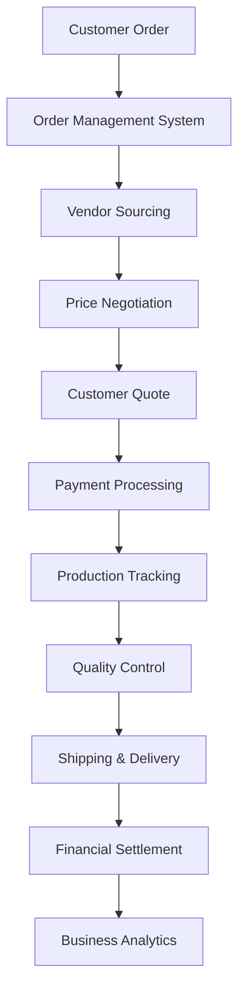

# TENANT FOCUS BEFORE PHASE 5: ROADMAP INDEX

**Created**: December 6, 2025  
**Status**: Ready for Implementation  
**Priority**: **CRITICAL - BUSINESS BLOCKING**  
**Target Completion**: 6-8 weeks from start date

---

## 📋 ROADMAP OVERVIEW

This comprehensive roadmap addresses the **critical gap** between current menu structure (navigation only) and complete business workflow implementation required for PT Custom Etching Xenial (PT CEX) operations.

### **Problem Statement**
- ✅ **Menu Structure**: 37 Commerce Management items perfectly designed
- ❌ **Implementation**: 0% functional pages - all routes lead to empty components
- 🎯 **Business Need**: Complete etching workflow automation before Phase 5

### **Solution Approach**
**3-Track Parallel Development** to deliver maximum business value in minimum time:
- **Track A**: Core Business Workflow (Critical)
- **Track B**: Commerce Management Pages (High Priority)  
- **Track C**: Business Intelligence & Reports (Strategic)

---

## 📂 ROADMAP DOCUMENTS

### **Core Implementation Tracks**

| Document | Purpose | Duration | Priority | Status |
|----------|---------|----------|----------|---------|
| **[01-TRACK_A_CORE_BUSINESS_WORKFLOW.md](01-TRACK_A_CORE_BUSINESS_WORKFLOW.md)** | Order Management, Vendor Sourcing, Payment Processing | 3 weeks | **CRITICAL** | Ready |
| **[02-TRACK_B_COMMERCE_MANAGEMENT_PAGES.md](02-TRACK_B_COMMERCE_MANAGEMENT_PAGES.md)** | Product, Customer, Inventory, Shipping Management | 4 weeks | **HIGH** | Ready |
| **[03-TRACK_C_BUSINESS_INTELLIGENCE.md](03-TRACK_C_BUSINESS_INTELLIGENCE.md)** | Analytics, Reports, Forecasting, KPI Dashboard | 2 weeks | **MEDIUM** | Ready |

### **Implementation Support**

| Document | Purpose | Audience | Status |
|----------|---------|----------|---------|
| **[04-IMPLEMENTATION_GUIDE.md](04-IMPLEMENTATION_GUIDE.md)** | Step-by-step development guidelines | Development Team | Ready |
| **[00-COMPREHENSIVE_ROADMAP.md](00-COMPREHENSIVE_ROADMAP.md)** | Executive summary and overview | Project Stakeholders | Ready |

---

## 🎯 BUSINESS CYCLE COVERAGE

### **Complete PT CEX Etching Workflow**



### **Menu Structure Implementation Status**

| **Category** | **Items** | **Current** | **Target** | **Track** |
|--------------|-----------|-------------|------------|-----------|
| 📦 **Products** | 4 pages | Routes only | Full CRUD | Track B |
| 🏭 **Vendors** | 4 pages | Routes only | Sourcing System | Track A |
| 👥 **Customers** | 4 pages | Routes only | CRM System | Track B |
| 📋 **Orders** | 4 pages | Routes only | Workflow Engine | Track A |
| 📊 **Inventory** | 4 pages | Routes only | Real-time Tracking | Track B |
| 🚚 **Shipping** | 4 pages | Routes only | Carrier Integration | Track B |
| 💰 **Payments** | 5 pages | Routes only | DP/Full Processing | Track A |
| 💬 **Reviews** | 4 pages | Routes only | Quality Management | Track B |
| 📈 **Reports** | 4 pages | Routes only | BI Dashboard | Track C |

**Total Implementation Gap**: **37 Management Pages + Backend APIs**

---

## ⚡ QUICK START GUIDE

### **For Development Team**

1. **Read Track A Documentation**
   - Start with `01-TRACK_A_CORE_BUSINESS_WORKFLOW.md`
   - Focus on Week 1: Order Management System
   - Review database schema and use case patterns

2. **Setup Development Environment**
   - Ensure Phase 4D completion status
   - Verify tenant authentication working
   - Check database migration status

3. **Begin Implementation**
   - Follow `04-IMPLEMENTATION_GUIDE.md` step-by-step
   - Start with database schema (Day 1)
   - Implement business logic (Day 2-3)
   - Create API endpoints (Day 4)
   - Build frontend (Day 5)

### **For Project Stakeholders**

1. **Review Business Impact**
   - Read `00-COMPREHENSIVE_ROADMAP.md` executive summary
   - Understand business cycle workflow coverage
   - Review success metrics and KPIs

2. **Track Progress**
   - Monitor weekly deliverables per track
   - Review acceptance criteria completion
   - Validate business workflow functionality

---

## 📊 IMPLEMENTATION METRICS

### **Development Timeline**

```
Week 1: Track A - Order Management ✓ Core Workflow Foundation
Week 2: Track A - Vendor Management + Track B - Products (Parallel)
Week 3: Track A - Payment Processing + Track B - Customers (Parallel)  
Week 4: Track B - Inventory & Shipping Management
Week 5: Track C - Sales Reports & Performance Metrics
Week 6: Track C - Financial Statements & Business Intelligence
```

### **Resource Requirements**

| **Role** | **Allocation** | **Focus Areas** |
|----------|----------------|-----------------|
| **Backend Developer** | Full-time | Database schema, business logic, API endpoints |
| **Frontend Developer** | Full-time | React components, state management, UI/UX |
| **Full-Stack Developer** | Full-time | Integration, testing, deployment support |

### **Success Metrics**

| **Category** | **Metric** | **Target** | **Business Impact** |
|--------------|------------|------------|-------------------|
| **Workflow Automation** | Order processing time reduction | 80% | Operational efficiency |
| **System Performance** | Page load times | < 2 seconds | User experience |
| **Business Intelligence** | Real-time reporting | 100% accurate | Decision making |
| **Test Coverage** | Backend + Frontend | > 80% | Quality assurance |

---

## 🚨 CRITICAL DEPENDENCIES

### **Prerequisites (Must Be Complete)**
- ✅ **Phase 4D**: Separation of concerns with backend MVC architecture
- ✅ **Tenant Authentication**: Multi-tenant isolation working properly
- ✅ **Database Schema**: Platform and tenant separation established
- ✅ **API Infrastructure**: RESTful endpoints with proper authentication

### **External Dependencies**
- **Payment Gateway Integration**: For payment processing automation
- **Carrier APIs**: For shipping and tracking integration (JNE, TIKI, Pos Indonesia)
- **Email Service**: For notification and communication workflows
- **File Storage**: For document management and media handling

---

## 🎯 EXPECTED OUTCOMES

### **Immediate Business Value (Week 3)**
- **Order Management**: Complete 12-status workflow automation
- **Vendor Sourcing**: Automated vendor selection and negotiation
- **Payment Processing**: DP 50% vs Full 100% workflow implementation

### **Operational Excellence (Week 4-5)**
- **Product Management**: Complete etching product catalog with specifications
- **Customer Management**: Segmentation and credit management system
- **Inventory Tracking**: Real-time stock management across locations

### **Strategic Intelligence (Week 6)**
- **Financial Reporting**: Real-time profit/loss calculation
- **Business Analytics**: KPI dashboard with forecasting
- **Performance Insights**: AI-powered business recommendations

---

## 📞 SUPPORT & ESCALATION

### **Documentation Issues**
- Review individual track documentation for detailed specifications
- Check implementation guide for step-by-step instructions
- Validate against business cycle plan for workflow requirements

### **Technical Challenges**
- Database schema issues: Reference existing Phase 4 patterns
- API integration problems: Follow hexagonal architecture principles
- Frontend complexity: Use established component patterns from tenant sidebar

### **Business Requirements**
- Workflow questions: Consult `BUSINESS_CYCLE_PLAN.md`
- Feature priorities: Reference track priority levels (Critical/High/Medium)
- Success criteria: Validate against defined acceptance criteria

---

## 🏁 PHASE 5 READINESS

Upon completion of this Tenant Focus roadmap, the platform will be ready for **Phase 5: Advanced Features** with:

- ✅ **Complete Business Operations**: Full tenant workflow automation
- ✅ **Scalable Architecture**: Proven patterns for advanced feature development
- ✅ **Performance Foundation**: Optimized for real-world tenant usage
- ✅ **Business Intelligence**: Data-driven foundation for marketplace features

**Next Phase**: Enhanced marketplace, mobile app development, API marketplace, third-party integrations

---

**Status**: ✅ **READY FOR IMPLEMENTATION**  
**Business Priority**: 🔥 **CRITICAL - BLOCKS PHASE 5 PROGRESS**  
**Implementation Start**: **Immediate**