# INVENTORY MANAGEMENT MODULE
## Enterprise-Grade Multi-Tenant Inventory Management System

**Module:** Operations - Inventory Management Engine  
**Total Fields:** 180+ fields (Updated after comprehensive audit)  
**Total Tables:** 8 tables (inventory_items, inventory_locations, inventory_movements, inventory_adjustments, inventory_alerts, inventory_counts, inventory_reservations, inventory_suppliers)  
**Admin Page:** `src/pages/admin/InventoryManagement.tsx`  
**Type Definition:** `src/types/inventory.ts` (MISSING - REQUIRES CREATION)  
**Status:** 🚨 **MASSIVE FEATURE GAP IDENTIFIED** - Critical implementation deficit  
**Architecture Reference:** `docs/ARCHITECTURE/ADVANCED_SYSTEMS/1-MULTI_TENANT_ARCHITECTURE.md`  
**Business Integration:** `docs/DEVELOPMENTS/PLAN/BUSINESS_HEXAGONAL_PLAN/BUSINESS_CYCLE_PLAN.md`  
**RBAC Integration:** `docs/ARCHITECTURE/ADVANCED_SYSTEMS/2-RBAC_PERMISSION_SYSTEM.md`

> **🚨 MASSIVE IMPLEMENTATION GAP**  
> **Documentation**: **180+ fields, 8 tables** - Enterprise-grade inventory system  
> **Reality**: **7 basic fields only** - productName, sku, stock, etc.  
> **Gap Size**: **95% documented features MISSING**  
> **Priority**: **HIGH** - Core business operations severely limited

## 🔒 CORE IMMUTABLE RULES COMPLIANCE

### **Rule 1: Teams Enabled with tenant_id as team_foreign_key**
❌ **DOCUMENTED ONLY** - Claims comprehensive tenant isolation but **ONLY 7 BASIC FIELDS IMPLEMENTED**. No actual inventory tables with tenant_id.

### **Rule 2: API Guard Implementation**  
❌ **NO ADVANCED API** - Basic inventory endpoint may exist but **NO ENTERPRISE FEATURES** like movements, adjustments, locations.

### **Rule 3: UUID model_morph_key**
❌ **BASIC IMPLEMENTATION ONLY** - Simple inventory tracking without enterprise UUID schema for complex relationships.

### **Rule 4: Strict Tenant Data Isolation**
❌ **SEVERE LIMITATION** - With only 7 basic fields, **NO REAL BUSINESS OPERATIONS** possible. Cannot track movements, locations, or supplier relationships.

### **Rule 5: RBAC Integration Requirements**
❌ **BASIC PERMISSIONS ONLY** - Enterprise inventory permissions impossible without underlying feature implementation:
- `inventory.view` - View inventory levels and basic information
- `inventory.manage` - Manage inventory items and locations
- `inventory.movements` - Record stock movements (in/out)
- `inventory.adjustments` - Perform inventory adjustments and counts
- `inventory.reports` - Access inventory reports and analytics

---

## 🚨 MASSIVE FEATURE GAP ANALYSIS

### **AUDIT SUMMARY**
**Date**: November 12, 2025  
**Auditor**: CanvaStack Stencil  
**Scope**: Enterprise inventory documentation vs basic implementation reality  
**Status**: **95% FEATURE DEFICIT - CRITICAL BUSINESS IMPACT**

### **📊 IMPLEMENTATION REALITY CHECK**

#### **DOCUMENTED ENTERPRISE FEATURES (180+ fields, 8 tables):**
- ✅ Advanced inventory locations and warehouses
- ✅ Stock movements tracking and audit trails  
- ✅ Inventory adjustments and cycle counts
- ✅ Supplier relationship management
- ✅ Automated reorder points and alerts
- ✅ Reserved inventory for pending orders
- ✅ Multi-location stock transfers
- ✅ Cost tracking and valuation methods

#### **ACTUAL IMPLEMENTATION (7 basic fields only):**
- ⚠️ **productName** - Basic product identification
- ⚠️ **sku** - Simple SKU tracking
- ⚠️ **stock** - Basic stock quantity only
- ⚠️ **price** - Simple pricing
- ⚠️ **category** - Basic categorization
- ⚠️ **supplier** - Simple supplier name (no relations)
- ⚠️ **notes** - Basic text notes

### **🔴 CRITICAL BUSINESS LIMITATIONS**

**Cannot Support:**
- ❌ Multi-location inventory management
- ❌ Stock movement tracking and audit trails
- ❌ Automated reorder alerts
- ❌ Supplier performance analysis
- ❌ Inventory valuation (FIFO/LIFO/Average)
- ❌ Reserved stock for orders
- ❌ Cycle counting and adjustments
- ❌ Integration with ORDERS and VENDORS modules

### **📈 FEATURE GAP SCORECARD**

| Feature Category | Documented | Implemented | Gap |
|------------------|------------|-------------|-----|
| **Basic Stock Tracking** | ✅ | ✅ | **0%** |
| **Multi-Location Support** | ✅ | ❌ | **100%** |
| **Movement Tracking** | ✅ | ❌ | **100%** |
| **Supplier Integration** | ✅ | ❌ | **100%** |
| **Automated Alerts** | ✅ | ❌ | **100%** |
| **Cost Valuation** | ✅ | ❌ | **100%** |
| **Reserved Inventory** | ✅ | ❌ | **100%** |
| **Cycle Counting** | ✅ | ❌ | **100%** |

**Average Feature Gap**: **87.5%** - **SEVERELY LIMITED BUSINESS OPERATIONS**

### **🎯 IMMEDIATE IMPACT ASSESSMENT**

**Business Risk**: **HIGH** - Cannot support professional inventory operations
**User Experience**: **POOR** - Basic spreadsheet-level functionality only
**Integration**: **BROKEN** - Cannot integrate with ORDERS/VENDORS workflows
**Scalability**: **NONE** - Cannot grow beyond simple product list

---

## TABLE OF CONTENTS

1. [🚨 Massive Feature Gap Analysis](#-massive-feature-gap-analysis)
2. [Overview](#overview)
3. [Business Context](#business-context)
4. [Database Schema](#database-schema)
5. [Relationship Diagram](#relationship-diagram)
6. [Field Specifications](#field-specifications)
7. [Business Rules](#business-rules)
8. [🔧 Implementation Priority Plan](#-implementation-priority-plan)
8. [Inventory Categories](#inventory-categories)
9. [API Endpoints](#api-endpoints)
10. [Admin UI Features](#admin-ui-features)
11. [Sample Data](#sample-data)
12. [Migration Script](#migration-script)
13. [Performance Indexes](#performance-indexes)
14. [🔧 Required Fixes & Implementation Plan](#-required-fixes--implementation-plan)

---

## 🚨 CRITICAL AUDIT FINDINGS

### **AUDIT SUMMARY**
**Date**: November 12, 2025  
**Auditor**: CanvaStack Stencil  
**Scope**: Complete documentation vs implementation analysis  
**Status**: **CRITICAL MISMATCHES FOUND**

### **🔴 CRITICAL ISSUES IDENTIFIED**

#### **1. CORE IMMUTABLE RULES VIOLATIONS**

**❌ ISSUE #1: Missing TypeScript Type Definitions**
- **Claim**: "Type Definition: `src/types/inventory.ts`"
- **Reality**: File **DOES NOT EXIST** - no inventory types defined
- **Impact**: **ZERO type safety** - frontend cannot integrate with backend
- **Risk Level**: **CRITICAL** - Development cannot proceed without types

**❌ ISSUE #2: Frontend Implementation Mismatch**
- **Documentation**: Claims 8 tables with 180+ fields for comprehensive inventory management
- **Frontend Reality**: Simple interface with only 7 basic fields (productName, sku, category, stock, minStock, unit, location)
- **Impact**: **Massive feature gap** - 95% of documented functionality missing
- **Risk Level**: **CRITICAL** - System unusable for enterprise inventory management

**❌ ISSUE #3: No Tenant Context Integration**
- **Current**: InventoryManagement.tsx has no tenant awareness or multi-tenant context
- **Required**: Tenant context provider and tenant-scoped inventory operations
- **Impact**: Cannot operate in multi-tenant environment
- **Risk Level**: **CRITICAL** - System unusable for multi-tenancy

#### **2. BUSINESS WORKFLOW INTEGRATION GAPS**

**❌ ISSUE #4: Missing Integration with ORDERS Schema**
- **Documentation**: Claims integration with etching business cycle
- **Reality**: No connection to purchase orders, vendor sourcing, or production workflow
- **Impact**: **Inventory operates in isolation** - no business workflow integration
- **Risk Level**: **HIGH** - Core business requirements not met

**❌ ISSUE #5: Missing Advanced Inventory Features**
- **Documented**: Batch tracking, serial numbers, quality control, multi-location management
- **Implemented**: Basic stock levels only
- **Impact**: **Enterprise features missing** - unsuitable for complex inventory operations
- **Risk Level**: **HIGH** - Cannot support etching business requirements

#### **3. RBAC AND SECURITY GAPS**

**❌ ISSUE #6: No Permission-Based Access Control**
- **Claim**: "Inventory management requires specific tenant-scoped permissions"
- **Reality**: No permission checking in frontend implementation
- **Impact**: No access control, security vulnerabilities
- **Risk Level**: **HIGH** - Security breach potential

### **🟡 ALIGNMENT ANALYSIS WITH OTHER SCHEMAS**

#### **Comparison with PRODUCTS Schema**
- **PRODUCTS**: Has critical audit findings but comprehensive documentation
- **INVENTORY**: Similar documentation quality but worse implementation gap
- **Alignment**: Both need frontend integration and tenant context

#### **Comparison with ORDERS Schema**
- **ORDERS**: Enterprise-ready documentation with complete business workflow
- **INVENTORY**: Missing integration with order workflow entirely
- **Gap**: Inventory should integrate with order material consumption tracking

#### **Comparison with VENDORS Schema**
- **VENDORS**: Enterprise-ready with complete vendor lifecycle management
- **INVENTORY**: Missing supplier management integration
- **Gap**: Inventory should integrate with vendor procurement and supplier management

---

## OVERVIEW

**Inventory Management Module** adalah sistem **comprehensive inventory control** yang dirancang khusus untuk mendukung **etching business operations** dengan tracking material, work-in-progress, finished goods, dan supplier management. Sistem ini terintegrasi penuh dengan business cycle dari inquiry hingga delivery.

### Core Features

1. **Multi-Location Inventory Tracking**
   - Multiple warehouse/location support
   - Location-specific stock levels
   - Inter-location transfers
   - Location-based access control
   - Real-time stock visibility

2. **Material Management for Etching Business**
   - Raw materials (metals, glass, acrylics, etc.)
   - Consumables (chemicals, tools, packaging)
   - Work-in-progress tracking
   - Finished goods inventory
   - Quality control integration

3. **Stock Movement Tracking**
   - Inbound receipts from suppliers
   - Outbound shipments to customers
   - Production consumption
   - Inter-location transfers
   - Adjustments and corrections

4. **Automated Reorder Management**
   - Minimum stock level alerts
   - Automatic purchase order generation
   - Supplier lead time tracking
   - Economic order quantity (EOQ) calculations
   - Seasonal demand forecasting

5. **Inventory Valuation Methods**
   - FIFO (First In, First Out)
   - LIFO (Last In, First Out)
   - Weighted Average Cost
   - Standard Cost
   - Real-time cost updates

6. **Quality Control Integration**
   - Batch/lot tracking
   - Expiration date management
   - Quality inspection workflows
   - Quarantine management
   - Defect tracking

7. **Inventory Analytics & Reporting**
   - Stock aging analysis
   - Turnover ratios
   - Dead stock identification
   - Demand forecasting
   - Cost analysis reports

---

## BUSINESS CONTEXT

### **Integration with Etching Business Cycle**

Inventory Management System is specifically designed to support the **custom etching business workflow** with comprehensive material tracking throughout the entire production process:

**1. Inquiry Stage Inventory Check:**
- **Material Availability**: Check stock levels for quoted materials
- **Lead Time Calculation**: Factor inventory levels into delivery estimates
- **Cost Estimation**: Use current material costs for accurate pricing
- **Alternative Materials**: Suggest substitutes if primary materials unavailable

**2. Quotation Stage Inventory Planning:**
- **Material Requirements**: Calculate exact material needs for quoted projects
- **Procurement Planning**: Identify materials that need to be ordered
- **Cost Validation**: Verify material costs against current inventory values
- **Capacity Planning**: Ensure sufficient materials for production timeline

**3. Order Processing Inventory Reservation:**
- **Stock Reservation**: Reserve materials for confirmed orders
- **Procurement Triggers**: Automatically generate purchase orders for shortfalls
- **Production Scheduling**: Align production schedule with material availability
- **Quality Assurance**: Ensure reserved materials meet quality standards

**4. Production Stage Inventory Consumption:**
- **Material Consumption**: Track actual material usage vs. planned
- **Waste Tracking**: Record material waste and scrap for cost analysis
- **Work-in-Progress**: Monitor partially completed items
- **Quality Control**: Track defective materials and rework requirements

**5. Delivery Stage Inventory Completion:**
- **Finished Goods**: Move completed items to finished goods inventory
- **Packaging Materials**: Track packaging and shipping materials
- **Final Quality Check**: Ensure finished goods meet quality standards
- **Inventory Reconciliation**: Update all inventory records post-delivery

### **Etching-Specific Inventory Categories**

**1. Raw Materials:**
- **Metals**: Stainless steel, aluminum, brass, copper sheets/plates
- **Glass**: Various types and thicknesses for glass etching
- **Acrylics**: Different colors and grades for acrylic etching
- **Chemicals**: Etching acids, cleaning solutions, protective coatings

**2. Consumables:**
- **Tools**: Etching bits, cutting tools, polishing compounds
- **Protective Equipment**: Masks, stencils, protective films
- **Packaging**: Boxes, padding, protective wrapping
- **Maintenance**: Equipment maintenance supplies

**3. Work-in-Progress:**
- **Partially Etched Items**: Items in various stages of completion
- **Quality Control Samples**: Items awaiting approval
- **Rework Items**: Items requiring additional processing
- **Custom Tooling**: Project-specific jigs and fixtures

**4. Finished Goods:**
- **Completed Projects**: Ready for delivery items
- **Stock Items**: Standard products kept in inventory
- **Samples**: Display and demonstration pieces
- **Replacement Parts**: Warranty and service items

---

## DATABASE SCHEMA

### Table 1: inventory_items

**Schema**: Tenant (per-tenant)  
**Purpose**: Master inventory item catalog with detailed specifications  
**Relationships**: Referenced by inventory_movements, inventory_locations, inventory_reservations

```sql
CREATE TABLE inventory_items (
    -- Primary Key
    id UUID PRIMARY KEY DEFAULT gen_random_uuid(),
    uuid UUID NOT NULL UNIQUE DEFAULT gen_random_uuid(), -- CORE RULE: model_morph_key
    
    -- Multi-Tenant Isolation (CORE RULE COMPLIANCE)
    tenant_id UUID NOT NULL, -- CORE RULE: team_foreign_key
    
    -- Item Identification
    item_code VARCHAR(100) NOT NULL,
    item_name VARCHAR(255) NOT NULL,
    description TEXT,
    
    -- Categorization
    category VARCHAR(100) NOT NULL,
    subcategory VARCHAR(100),
    item_type VARCHAR(50) DEFAULT 'material' CHECK (item_type IN ('material', 'consumable', 'tool', 'finished_good', 'work_in_progress')),
    
    -- Physical Specifications
    unit_of_measure VARCHAR(50) NOT NULL,
    weight_per_unit DECIMAL(10,4),
    dimensions_length DECIMAL(10,2),
    dimensions_width DECIMAL(10,2),
    dimensions_height DECIMAL(10,2),
    volume_per_unit DECIMAL(10,4),
    
    -- Etching-Specific Properties
    material_type VARCHAR(100), -- steel, aluminum, glass, acrylic, etc.
    material_grade VARCHAR(50),
    thickness DECIMAL(8,3),
    finish VARCHAR(100),
    color VARCHAR(50),
    
    -- Inventory Control
    is_serialized BOOLEAN DEFAULT false,
    is_batch_tracked BOOLEAN DEFAULT false,
    is_expirable BOOLEAN DEFAULT false,
    shelf_life_days INTEGER,
    
    -- Stock Levels
    current_stock DECIMAL(15,4) DEFAULT 0,
    available_stock DECIMAL(15,4) DEFAULT 0,
    reserved_stock DECIMAL(15,4) DEFAULT 0,
    on_order_stock DECIMAL(15,4) DEFAULT 0,
    
    -- Reorder Management
    minimum_stock_level DECIMAL(15,4) DEFAULT 0,
    maximum_stock_level DECIMAL(15,4),
    reorder_point DECIMAL(15,4) DEFAULT 0,
    reorder_quantity DECIMAL(15,4) DEFAULT 0,
    economic_order_quantity DECIMAL(15,4),
    
    -- Cost Information
    standard_cost DECIMAL(15,4) DEFAULT 0,
    average_cost DECIMAL(15,4) DEFAULT 0,
    last_purchase_cost DECIMAL(15,4) DEFAULT 0,
    current_market_price DECIMAL(15,4),
    
    -- Valuation Method
    valuation_method VARCHAR(20) DEFAULT 'FIFO' CHECK (valuation_method IN ('FIFO', 'LIFO', 'AVERAGE', 'STANDARD')),
    
    -- Quality Control
    quality_grade VARCHAR(50),
    inspection_required BOOLEAN DEFAULT false,
    quarantine_required BOOLEAN DEFAULT false,
    
    -- Supplier Information
    primary_supplier_id UUID,
    supplier_part_number VARCHAR(100),
    lead_time_days INTEGER DEFAULT 0,
    
    -- Status & Flags
    is_active BOOLEAN DEFAULT true,
    is_discontinued BOOLEAN DEFAULT false,
    is_hazardous BOOLEAN DEFAULT false,
    hazard_classification VARCHAR(100),
    
    -- Storage Requirements
    storage_temperature_min DECIMAL(5,2),
    storage_temperature_max DECIMAL(5,2),
    storage_humidity_max DECIMAL(5,2),
    special_storage_requirements TEXT,
    
    -- Metadata
    barcode VARCHAR(100),
    qr_code VARCHAR(255),
    image_url TEXT,
    technical_specifications JSONB,
    custom_fields JSONB DEFAULT '{}',
    
    -- Audit Trail
    created_by UUID NOT NULL,
    updated_by UUID,
    
    -- Timestamps
    created_at TIMESTAMP DEFAULT CURRENT_TIMESTAMP,
    updated_at TIMESTAMP DEFAULT CURRENT_TIMESTAMP,
    deleted_at TIMESTAMP,
    
    -- Foreign Key Constraints (CORE RULE COMPLIANCE)
    FOREIGN KEY (tenant_id) REFERENCES tenants(uuid) ON DELETE CASCADE,
    FOREIGN KEY (created_by) REFERENCES users(id) ON DELETE RESTRICT,
    FOREIGN KEY (updated_by) REFERENCES users(id) ON DELETE SET NULL,
    
    -- Unique Constraints
    UNIQUE(tenant_id, item_code)
);

-- Performance Indexes
CREATE INDEX idx_inventory_items_tenant ON inventory_items(tenant_id);
CREATE INDEX idx_inventory_items_code ON inventory_items(item_code);
CREATE INDEX idx_inventory_items_category ON inventory_items(category, subcategory);
CREATE INDEX idx_inventory_items_type ON inventory_items(item_type);
CREATE INDEX idx_inventory_items_active ON inventory_items(is_active) WHERE is_active = true;
CREATE INDEX idx_inventory_items_reorder ON inventory_items(tenant_id, current_stock, reorder_point) 
    WHERE current_stock <= reorder_point AND is_active = true;
CREATE INDEX idx_inventory_items_material ON inventory_items(material_type, material_grade);
CREATE INDEX idx_inventory_items_barcode ON inventory_items(barcode) WHERE barcode IS NOT NULL;

-- Full-Text Search Index
CREATE INDEX idx_inventory_items_search ON inventory_items USING GIN(
    to_tsvector('english', 
        COALESCE(item_name, '') || ' ' || 
        COALESCE(description, '') || ' ' || 
        COALESCE(item_code, '')
    )
);

-- Updated Timestamp Trigger
CREATE TRIGGER update_inventory_items_updated_at
BEFORE UPDATE ON inventory_items
FOR EACH ROW
EXECUTE FUNCTION update_updated_at_column();
```

**Field Count**: 52 fields

---

### Table 2: inventory_locations

**Schema**: Tenant (per-tenant)  
**Purpose**: Define storage locations and warehouses with capacity management  
**Relationships**: Referenced by inventory_movements, inventory_counts

```sql
CREATE TABLE inventory_locations (
    -- Primary Key
    id UUID PRIMARY KEY DEFAULT gen_random_uuid(),
    uuid UUID NOT NULL UNIQUE DEFAULT gen_random_uuid(), -- CORE RULE: model_morph_key
    
    -- Multi-Tenant Isolation (CORE RULE COMPLIANCE)
    tenant_id UUID NOT NULL, -- CORE RULE: team_foreign_key
    
    -- Location Identification
    location_code VARCHAR(50) NOT NULL,
    location_name VARCHAR(255) NOT NULL,
    description TEXT,
    
    -- Location Hierarchy
    parent_location_id UUID,
    location_level INTEGER DEFAULT 1,
    location_path VARCHAR(500),
    
    -- Location Type
    location_type VARCHAR(50) DEFAULT 'warehouse' CHECK (location_type IN ('warehouse', 'production', 'quality_control', 'shipping', 'receiving', 'quarantine', 'scrap')),
    
    -- Physical Address
    address_line_1 VARCHAR(255),
    address_line_2 VARCHAR(255),
    city VARCHAR(100),
    state_province VARCHAR(100),
    postal_code VARCHAR(20),
    country VARCHAR(100) DEFAULT 'Indonesia',
    
    -- Capacity Management
    total_capacity DECIMAL(15,4),
    used_capacity DECIMAL(15,4) DEFAULT 0,
    available_capacity DECIMAL(15,4) GENERATED ALWAYS AS (total_capacity - used_capacity) STORED,
    capacity_unit VARCHAR(20) DEFAULT 'cubic_meter',
    
    -- Environmental Conditions
    temperature_controlled BOOLEAN DEFAULT false,
    temperature_min DECIMAL(5,2),
    temperature_max DECIMAL(5,2),
    humidity_controlled BOOLEAN DEFAULT false,
    humidity_max DECIMAL(5,2),
    
    -- Security & Access
    security_level VARCHAR(20) DEFAULT 'standard' CHECK (security_level IN ('low', 'standard', 'high', 'restricted')),
    access_restrictions TEXT,
    
    -- Operational Status
    is_active BOOLEAN DEFAULT true,
    is_receiving_enabled BOOLEAN DEFAULT true,
    is_shipping_enabled BOOLEAN DEFAULT true,
    
    -- Contact Information
    manager_name VARCHAR(255),
    manager_email VARCHAR(255),
    manager_phone VARCHAR(50),
    
    -- Metadata
    custom_fields JSONB DEFAULT '{}',
    
    -- Audit Trail
    created_by UUID NOT NULL,
    updated_by UUID,
    
    -- Timestamps
    created_at TIMESTAMP DEFAULT CURRENT_TIMESTAMP,
    updated_at TIMESTAMP DEFAULT CURRENT_TIMESTAMP,
    deleted_at TIMESTAMP,
    
    -- Foreign Key Constraints (CORE RULE COMPLIANCE)
    FOREIGN KEY (tenant_id) REFERENCES tenants(uuid) ON DELETE CASCADE,
    FOREIGN KEY (parent_location_id) REFERENCES inventory_locations(id) ON DELETE SET NULL,
    FOREIGN KEY (created_by) REFERENCES users(id) ON DELETE RESTRICT,
    FOREIGN KEY (updated_by) REFERENCES users(id) ON DELETE SET NULL,
    
    -- Unique Constraints
    UNIQUE(tenant_id, location_code)
);

-- Performance Indexes
CREATE INDEX idx_inventory_locations_tenant ON inventory_locations(tenant_id);
CREATE INDEX idx_inventory_locations_code ON inventory_locations(location_code);
CREATE INDEX idx_inventory_locations_type ON inventory_locations(location_type);
CREATE INDEX idx_inventory_locations_parent ON inventory_locations(parent_location_id);
CREATE INDEX idx_inventory_locations_active ON inventory_locations(is_active) WHERE is_active = true;

-- Updated Timestamp Trigger
CREATE TRIGGER update_inventory_locations_updated_at
BEFORE UPDATE ON inventory_locations
FOR EACH ROW
EXECUTE FUNCTION update_updated_at_column();
```

**Field Count**: 32 fields

---

### Table 3: inventory_movements

**Schema**: Tenant (per-tenant)  
**Purpose**: Track all inventory movements (in/out/transfers) with complete audit trail  
**Relationships**: References inventory_items, inventory_locations, purchase_orders, users

```sql
CREATE TABLE inventory_movements (
    -- Primary Key
    id UUID PRIMARY KEY DEFAULT gen_random_uuid(),
    uuid UUID NOT NULL UNIQUE DEFAULT gen_random_uuid(), -- CORE RULE: model_morph_key
    
    -- Multi-Tenant Isolation (CORE RULE COMPLIANCE)
    tenant_id UUID NOT NULL, -- CORE RULE: team_foreign_key
    
    -- Movement Identification
    movement_number VARCHAR(100) NOT NULL,
    movement_type VARCHAR(50) NOT NULL CHECK (movement_type IN ('receipt', 'issue', 'transfer', 'adjustment', 'production_consumption', 'production_output', 'return', 'scrap')),
    
    -- Item & Location References
    item_id UUID NOT NULL,
    from_location_id UUID,
    to_location_id UUID,
    
    -- Movement Details
    quantity DECIMAL(15,4) NOT NULL,
    unit_cost DECIMAL(15,4) DEFAULT 0,
    total_cost DECIMAL(15,4) GENERATED ALWAYS AS (quantity * unit_cost) STORED,
    
    -- Batch/Serial Tracking
    batch_number VARCHAR(100),
    serial_number VARCHAR(100),
    expiry_date DATE,
    
    -- Reference Documents
    reference_type VARCHAR(50), -- purchase_order, sales_order, production_order, adjustment
    reference_id UUID,
    reference_number VARCHAR(100),
    
    -- Movement Reason & Notes
    reason_code VARCHAR(50),
    notes TEXT,
    
    -- Quality Control
    quality_status VARCHAR(20) DEFAULT 'approved' CHECK (quality_status IN ('pending', 'approved', 'rejected', 'quarantine')),
    quality_notes TEXT,
    
    -- Approval Workflow
    status VARCHAR(20) DEFAULT 'pending' CHECK (status IN ('pending', 'approved', 'rejected', 'cancelled')),
    approved_by UUID,
    approved_at TIMESTAMP,
    
    -- Audit Trail
    created_by UUID NOT NULL,
    updated_by UUID,
    
    -- Timestamps
    movement_date TIMESTAMP DEFAULT CURRENT_TIMESTAMP,
    created_at TIMESTAMP DEFAULT CURRENT_TIMESTAMP,
    updated_at TIMESTAMP DEFAULT CURRENT_TIMESTAMP,
    deleted_at TIMESTAMP,
    
    -- Foreign Key Constraints (CORE RULE COMPLIANCE)
    FOREIGN KEY (tenant_id) REFERENCES tenants(uuid) ON DELETE CASCADE,
    FOREIGN KEY (item_id) REFERENCES inventory_items(id) ON DELETE RESTRICT,
    FOREIGN KEY (from_location_id) REFERENCES inventory_locations(id) ON DELETE RESTRICT,
    FOREIGN KEY (to_location_id) REFERENCES inventory_locations(id) ON DELETE RESTRICT,
    FOREIGN KEY (approved_by) REFERENCES users(id) ON DELETE SET NULL,
    FOREIGN KEY (created_by) REFERENCES users(id) ON DELETE RESTRICT,
    FOREIGN KEY (updated_by) REFERENCES users(id) ON DELETE SET NULL,
    
    -- Unique Constraints
    UNIQUE(tenant_id, movement_number)
);

-- Performance Indexes
CREATE INDEX idx_inventory_movements_tenant ON inventory_movements(tenant_id);
CREATE INDEX idx_inventory_movements_item ON inventory_movements(item_id);
CREATE INDEX idx_inventory_movements_type ON inventory_movements(movement_type);
CREATE INDEX idx_inventory_movements_date ON inventory_movements(movement_date);
CREATE INDEX idx_inventory_movements_reference ON inventory_movements(reference_type, reference_id);
CREATE INDEX idx_inventory_movements_batch ON inventory_movements(batch_number) WHERE batch_number IS NOT NULL;
CREATE INDEX idx_inventory_movements_serial ON inventory_movements(serial_number) WHERE serial_number IS NOT NULL;
CREATE INDEX idx_inventory_movements_status ON inventory_movements(status);

-- Updated Timestamp Trigger
CREATE TRIGGER update_inventory_movements_updated_at
BEFORE UPDATE ON inventory_movements
FOR EACH ROW
EXECUTE FUNCTION update_updated_at_column();
```

**Field Count**: 28 fields

---

### Table 4: inventory_adjustments

**Schema**: Tenant (per-tenant)  
**Purpose**: Record inventory adjustments and cycle counts with approval workflow  
**Relationships**: References inventory_items, inventory_locations, users

```sql
CREATE TABLE inventory_adjustments (
    -- Primary Key
    id UUID PRIMARY KEY DEFAULT gen_random_uuid(),
    uuid UUID NOT NULL UNIQUE DEFAULT gen_random_uuid(), -- CORE RULE: model_morph_key
    
    -- Multi-Tenant Isolation (CORE RULE COMPLIANCE)
    tenant_id UUID NOT NULL, -- CORE RULE: team_foreign_key
    
    -- Adjustment Identification
    adjustment_number VARCHAR(100) NOT NULL,
    adjustment_type VARCHAR(50) NOT NULL CHECK (adjustment_type IN ('cycle_count', 'physical_count', 'shrinkage', 'damage', 'obsolete', 'correction', 'write_off')),
    
    -- Item & Location References
    item_id UUID NOT NULL,
    location_id UUID NOT NULL,
    
    -- Adjustment Details
    book_quantity DECIMAL(15,4) NOT NULL,
    physical_quantity DECIMAL(15,4) NOT NULL,
    adjustment_quantity DECIMAL(15,4) GENERATED ALWAYS AS (physical_quantity - book_quantity) STORED,
    
    -- Cost Impact
    unit_cost DECIMAL(15,4) DEFAULT 0,
    total_cost_impact DECIMAL(15,4) GENERATED ALWAYS AS (adjustment_quantity * unit_cost) STORED,
    
    -- Batch/Serial Tracking
    batch_number VARCHAR(100),
    serial_number VARCHAR(100),
    
    -- Adjustment Reason
    reason_code VARCHAR(50) NOT NULL,
    reason_description TEXT,
    root_cause_analysis TEXT,
    
    -- Approval Workflow
    status VARCHAR(20) DEFAULT 'pending' CHECK (status IN ('pending', 'approved', 'rejected', 'cancelled')),
    approved_by UUID,
    approved_at TIMESTAMP,
    approval_notes TEXT,
    
    -- Count Details
    count_date TIMESTAMP DEFAULT CURRENT_TIMESTAMP,
    counted_by UUID NOT NULL,
    verified_by UUID,
    
    -- Audit Trail
    created_by UUID NOT NULL,
    updated_by UUID,
    
    -- Timestamps
    created_at TIMESTAMP DEFAULT CURRENT_TIMESTAMP,
    updated_at TIMESTAMP DEFAULT CURRENT_TIMESTAMP,
    deleted_at TIMESTAMP,
    
    -- Foreign Key Constraints (CORE RULE COMPLIANCE)
    FOREIGN KEY (tenant_id) REFERENCES tenants(uuid) ON DELETE CASCADE,
    FOREIGN KEY (item_id) REFERENCES inventory_items(id) ON DELETE RESTRICT,
    FOREIGN KEY (location_id) REFERENCES inventory_locations(id) ON DELETE RESTRICT,
    FOREIGN KEY (counted_by) REFERENCES users(id) ON DELETE RESTRICT,
    FOREIGN KEY (verified_by) REFERENCES users(id) ON DELETE SET NULL,
    FOREIGN KEY (approved_by) REFERENCES users(id) ON DELETE SET NULL,
    FOREIGN KEY (created_by) REFERENCES users(id) ON DELETE RESTRICT,
    FOREIGN KEY (updated_by) REFERENCES users(id) ON DELETE SET NULL,
    
    -- Unique Constraints
    UNIQUE(tenant_id, adjustment_number)
);

-- Performance Indexes
CREATE INDEX idx_inventory_adjustments_tenant ON inventory_adjustments(tenant_id);
CREATE INDEX idx_inventory_adjustments_item ON inventory_adjustments(item_id);
CREATE INDEX idx_inventory_adjustments_location ON inventory_adjustments(location_id);
CREATE INDEX idx_inventory_adjustments_type ON inventory_adjustments(adjustment_type);
CREATE INDEX idx_inventory_adjustments_date ON inventory_adjustments(count_date);
CREATE INDEX idx_inventory_adjustments_status ON inventory_adjustments(status);
CREATE INDEX idx_inventory_adjustments_batch ON inventory_adjustments(batch_number) WHERE batch_number IS NOT NULL;

-- Updated Timestamp Trigger
CREATE TRIGGER update_inventory_adjustments_updated_at
BEFORE UPDATE ON inventory_adjustments
FOR EACH ROW
EXECUTE FUNCTION update_updated_at_column();
```

**Field Count**: 26 fields

---

### Table 5: inventory_alerts

**Schema**: Tenant (per-tenant)  
**Purpose**: Automated inventory alerts for reorder points, expiry, and stock issues  
**Relationships**: References inventory_items, inventory_locations, users

```sql
CREATE TABLE inventory_alerts (
    -- Primary Key
    id UUID PRIMARY KEY DEFAULT gen_random_uuid(),
    uuid UUID NOT NULL UNIQUE DEFAULT gen_random_uuid(), -- CORE RULE: model_morph_key
    
    -- Multi-Tenant Isolation (CORE RULE COMPLIANCE)
    tenant_id UUID NOT NULL, -- CORE RULE: team_foreign_key
    
    -- Alert Identification
    alert_type VARCHAR(50) NOT NULL CHECK (alert_type IN ('low_stock', 'out_of_stock', 'overstock', 'expiry_warning', 'expired', 'slow_moving', 'dead_stock', 'quality_issue')),
    priority VARCHAR(20) DEFAULT 'medium' CHECK (priority IN ('low', 'medium', 'high', 'critical')),
    
    -- Item & Location References
    item_id UUID NOT NULL,
    location_id UUID,
    
    -- Alert Details
    alert_title VARCHAR(255) NOT NULL,
    alert_message TEXT NOT NULL,
    current_stock DECIMAL(15,4),
    threshold_value DECIMAL(15,4),
    
    -- Alert Triggers
    trigger_condition VARCHAR(100),
    trigger_value DECIMAL(15,4),
    
    -- Status & Resolution
    status VARCHAR(20) DEFAULT 'active' CHECK (status IN ('active', 'acknowledged', 'resolved', 'dismissed')),
    acknowledged_by UUID,
    acknowledged_at TIMESTAMP,
    resolved_by UUID,
    resolved_at TIMESTAMP,
    resolution_notes TEXT,
    
    -- Auto-Resolution
    auto_resolve BOOLEAN DEFAULT false,
    auto_resolve_condition VARCHAR(100),
    
    -- Notification Settings
    notification_sent BOOLEAN DEFAULT false,
    notification_sent_at TIMESTAMP,
    notification_recipients TEXT[], -- Array of email addresses
    
    -- Escalation
    escalation_level INTEGER DEFAULT 1,
    escalated_at TIMESTAMP,
    escalated_to UUID,
    
    -- Audit Trail
    created_by UUID,
    updated_by UUID,
    
    -- Timestamps
    created_at TIMESTAMP DEFAULT CURRENT_TIMESTAMP,
    updated_at TIMESTAMP DEFAULT CURRENT_TIMESTAMP,
    deleted_at TIMESTAMP,
    
    -- Foreign Key Constraints (CORE RULE COMPLIANCE)
    FOREIGN KEY (tenant_id) REFERENCES tenants(uuid) ON DELETE CASCADE,
    FOREIGN KEY (item_id) REFERENCES inventory_items(id) ON DELETE CASCADE,
    FOREIGN KEY (location_id) REFERENCES inventory_locations(id) ON DELETE SET NULL,
    FOREIGN KEY (acknowledged_by) REFERENCES users(id) ON DELETE SET NULL,
    FOREIGN KEY (resolved_by) REFERENCES users(id) ON DELETE SET NULL,
    FOREIGN KEY (escalated_to) REFERENCES users(id) ON DELETE SET NULL,
    FOREIGN KEY (created_by) REFERENCES users(id) ON DELETE SET NULL,
    FOREIGN KEY (updated_by) REFERENCES users(id) ON DELETE SET NULL
);

-- Performance Indexes
CREATE INDEX idx_inventory_alerts_tenant ON inventory_alerts(tenant_id);
CREATE INDEX idx_inventory_alerts_item ON inventory_alerts(item_id);
CREATE INDEX idx_inventory_alerts_type ON inventory_alerts(alert_type);
CREATE INDEX idx_inventory_alerts_priority ON inventory_alerts(priority);
CREATE INDEX idx_inventory_alerts_status ON inventory_alerts(status);
CREATE INDEX idx_inventory_alerts_active ON inventory_alerts(tenant_id, status) WHERE status = 'active';
CREATE INDEX idx_inventory_alerts_created ON inventory_alerts(created_at);

-- Updated Timestamp Trigger
CREATE TRIGGER update_inventory_alerts_updated_at
BEFORE UPDATE ON inventory_alerts
FOR EACH ROW
EXECUTE FUNCTION update_updated_at_column();
```

**Field Count**: 28 fields

---

### Table 6: inventory_counts

**Schema**: Tenant (per-tenant)  
**Purpose**: Scheduled and ad-hoc inventory count sessions with team assignments  
**Relationships**: References inventory_locations, users

```sql
CREATE TABLE inventory_counts (
    -- Primary Key
    id UUID PRIMARY KEY DEFAULT gen_random_uuid(),
    uuid UUID NOT NULL UNIQUE DEFAULT gen_random_uuid(), -- CORE RULE: model_morph_key
    
    -- Multi-Tenant Isolation (CORE RULE COMPLIANCE)
    tenant_id UUID NOT NULL, -- CORE RULE: team_foreign_key
    
    -- Count Session Identification
    count_number VARCHAR(100) NOT NULL,
    count_name VARCHAR(255) NOT NULL,
    count_type VARCHAR(50) NOT NULL CHECK (count_type IN ('full_physical', 'cycle_count', 'spot_check', 'abc_analysis', 'annual_count')),
    
    -- Scope Definition
    location_id UUID,
    item_category VARCHAR(100),
    item_type VARCHAR(50),
    include_zero_stock BOOLEAN DEFAULT false,
    
    -- Count Schedule
    scheduled_date DATE NOT NULL,
    start_date DATE,
    end_date DATE,
    
    -- Count Team
    count_supervisor UUID NOT NULL,
    count_team UUID[], -- Array of user IDs
    
    -- Count Progress
    status VARCHAR(20) DEFAULT 'planned' CHECK (status IN ('planned', 'in_progress', 'completed', 'cancelled', 'on_hold')),
    total_items_to_count INTEGER DEFAULT 0,
    items_counted INTEGER DEFAULT 0,
    items_with_variances INTEGER DEFAULT 0,
    completion_percentage DECIMAL(5,2) GENERATED ALWAYS AS (
        CASE 
            WHEN total_items_to_count > 0 THEN (items_counted::DECIMAL / total_items_to_count) * 100
            ELSE 0
        END
    ) STORED,
    
    -- Count Results
    total_book_value DECIMAL(15,4) DEFAULT 0,
    total_physical_value DECIMAL(15,4) DEFAULT 0,
    total_variance_value DECIMAL(15,4) GENERATED ALWAYS AS (total_physical_value - total_book_value) STORED,
    variance_percentage DECIMAL(5,2) GENERATED ALWAYS AS (
        CASE 
            WHEN total_book_value > 0 THEN (total_variance_value / total_book_value) * 100
            ELSE 0
        END
    ) STORED,
    
    -- Count Instructions
    count_instructions TEXT,
    special_requirements TEXT,
    
    -- Approval & Sign-off
    approved_by UUID,
    approved_at TIMESTAMP,
    approval_notes TEXT,
    
    -- Audit Trail
    created_by UUID NOT NULL,
    updated_by UUID,
    
    -- Timestamps
    created_at TIMESTAMP DEFAULT CURRENT_TIMESTAMP,
    updated_at TIMESTAMP DEFAULT CURRENT_TIMESTAMP,
    deleted_at TIMESTAMP,
    
    -- Foreign Key Constraints (CORE RULE COMPLIANCE)
    FOREIGN KEY (tenant_id) REFERENCES tenants(uuid) ON DELETE CASCADE,
    FOREIGN KEY (location_id) REFERENCES inventory_locations(id) ON DELETE SET NULL,
    FOREIGN KEY (count_supervisor) REFERENCES users(id) ON DELETE RESTRICT,
    FOREIGN KEY (approved_by) REFERENCES users(id) ON DELETE SET NULL,
    FOREIGN KEY (created_by) REFERENCES users(id) ON DELETE RESTRICT,
    FOREIGN KEY (updated_by) REFERENCES users(id) ON DELETE SET NULL,
    
    -- Unique Constraints
    UNIQUE(tenant_id, count_number)
);

-- Performance Indexes
CREATE INDEX idx_inventory_counts_tenant ON inventory_counts(tenant_id);
CREATE INDEX idx_inventory_counts_location ON inventory_counts(location_id);
CREATE INDEX idx_inventory_counts_type ON inventory_counts(count_type);
CREATE INDEX idx_inventory_counts_status ON inventory_counts(status);
CREATE INDEX idx_inventory_counts_date ON inventory_counts(scheduled_date);
CREATE INDEX idx_inventory_counts_supervisor ON inventory_counts(count_supervisor);

-- Updated Timestamp Trigger
CREATE TRIGGER update_inventory_counts_updated_at
BEFORE UPDATE ON inventory_counts
FOR EACH ROW
EXECUTE FUNCTION update_updated_at_column();
```

**Field Count**: 30 fields

---

### Table 7: inventory_reservations

**Schema**: Tenant (per-tenant)  
**Purpose**: Reserve inventory for orders and production with automatic release  
**Relationships**: References inventory_items, inventory_locations, purchase_orders

```sql
CREATE TABLE inventory_reservations (
    -- Primary Key
    id UUID PRIMARY KEY DEFAULT gen_random_uuid(),
    uuid UUID NOT NULL UNIQUE DEFAULT gen_random_uuid(), -- CORE RULE: model_morph_key
    
    -- Multi-Tenant Isolation (CORE RULE COMPLIANCE)
    tenant_id UUID NOT NULL, -- CORE RULE: team_foreign_key
    
    -- Reservation Identification
    reservation_number VARCHAR(100) NOT NULL,
    reservation_type VARCHAR(50) NOT NULL CHECK (reservation_type IN ('sales_order', 'production_order', 'transfer_order', 'quality_hold', 'manual_hold')),
    
    -- Item & Location References
    item_id UUID NOT NULL,
    location_id UUID NOT NULL,
    
    -- Reservation Details
    reserved_quantity DECIMAL(15,4) NOT NULL,
    allocated_quantity DECIMAL(15,4) DEFAULT 0,
    remaining_quantity DECIMAL(15,4) GENERATED ALWAYS AS (reserved_quantity - allocated_quantity) STORED,
    
    -- Batch/Serial Tracking
    batch_number VARCHAR(100),
    serial_numbers TEXT[], -- Array for multiple serial numbers
    
    -- Reference Document
    reference_type VARCHAR(50) NOT NULL, -- order, production, transfer
    reference_id UUID NOT NULL,
    reference_number VARCHAR(100),
    reference_line_number INTEGER,
    
    -- Reservation Timing
    reservation_date TIMESTAMP DEFAULT CURRENT_TIMESTAMP,
    required_date DATE NOT NULL,
    expiry_date DATE,
    
    -- Priority & Status
    priority VARCHAR(20) DEFAULT 'normal' CHECK (priority IN ('low', 'normal', 'high', 'urgent')),
    status VARCHAR(20) DEFAULT 'active' CHECK (status IN ('active', 'partial', 'fulfilled', 'cancelled', 'expired')),
    
    -- Auto-Release Settings
    auto_release BOOLEAN DEFAULT true,
    auto_release_days INTEGER DEFAULT 30,
    
    -- Fulfillment Tracking
    fulfilled_quantity DECIMAL(15,4) DEFAULT 0,
    fulfilled_date TIMESTAMP,
    fulfilled_by UUID,
    
    -- Cancellation/Release
    cancelled_quantity DECIMAL(15,4) DEFAULT 0,
    cancelled_date TIMESTAMP,
    cancelled_by UUID,
    cancellation_reason TEXT,
    
    -- Notes
    reservation_notes TEXT,
    
    -- Audit Trail
    created_by UUID NOT NULL,
    updated_by UUID,
    
    -- Timestamps
    created_at TIMESTAMP DEFAULT CURRENT_TIMESTAMP,
    updated_at TIMESTAMP DEFAULT CURRENT_TIMESTAMP,
    deleted_at TIMESTAMP,
    
    -- Foreign Key Constraints (CORE RULE COMPLIANCE)
    FOREIGN KEY (tenant_id) REFERENCES tenants(uuid) ON DELETE CASCADE,
    FOREIGN KEY (item_id) REFERENCES inventory_items(id) ON DELETE RESTRICT,
    FOREIGN KEY (location_id) REFERENCES inventory_locations(id) ON DELETE RESTRICT,
    FOREIGN KEY (fulfilled_by) REFERENCES users(id) ON DELETE SET NULL,
    FOREIGN KEY (cancelled_by) REFERENCES users(id) ON DELETE SET NULL,
    FOREIGN KEY (created_by) REFERENCES users(id) ON DELETE RESTRICT,
    FOREIGN KEY (updated_by) REFERENCES users(id) ON DELETE SET NULL,
    
    -- Unique Constraints
    UNIQUE(tenant_id, reservation_number)
);

-- Performance Indexes
CREATE INDEX idx_inventory_reservations_tenant ON inventory_reservations(tenant_id);
CREATE INDEX idx_inventory_reservations_item ON inventory_reservations(item_id);
CREATE INDEX idx_inventory_reservations_location ON inventory_reservations(location_id);
CREATE INDEX idx_inventory_reservations_type ON inventory_reservations(reservation_type);
CREATE INDEX idx_inventory_reservations_status ON inventory_reservations(status);
CREATE INDEX idx_inventory_reservations_reference ON inventory_reservations(reference_type, reference_id);
CREATE INDEX idx_inventory_reservations_date ON inventory_reservations(required_date);
CREATE INDEX idx_inventory_reservations_expiry ON inventory_reservations(expiry_date) WHERE expiry_date IS NOT NULL;
CREATE INDEX idx_inventory_reservations_batch ON inventory_reservations(batch_number) WHERE batch_number IS NOT NULL;

-- Updated Timestamp Trigger
CREATE TRIGGER update_inventory_reservations_updated_at
BEFORE UPDATE ON inventory_reservations
FOR EACH ROW
EXECUTE FUNCTION update_updated_at_column();
```

**Field Count**: 32 fields

---

### Table 8: inventory_suppliers

**Schema**: Tenant (per-tenant)  
**Purpose**: Link inventory items to suppliers with pricing and lead time information  
**Relationships**: References inventory_items, vendors

```sql
CREATE TABLE inventory_suppliers (
    -- Primary Key
    id UUID PRIMARY KEY DEFAULT gen_random_uuid(),
    uuid UUID NOT NULL UNIQUE DEFAULT gen_random_uuid(), -- CORE RULE: model_morph_key
    
    -- Multi-Tenant Isolation (CORE RULE COMPLIANCE)
    tenant_id UUID NOT NULL, -- CORE RULE: team_foreign_key
    
    -- Item & Supplier References
    item_id UUID NOT NULL,
    supplier_id UUID NOT NULL, -- References vendors table
    
    -- Supplier Item Information
    supplier_part_number VARCHAR(100),
    supplier_item_name VARCHAR(255),
    supplier_description TEXT,
    
    -- Pricing Information
    unit_price DECIMAL(15,4) NOT NULL,
    currency VARCHAR(3) DEFAULT 'IDR',
    price_valid_from DATE DEFAULT CURRENT_DATE,
    price_valid_to DATE,
    minimum_order_quantity DECIMAL(15,4) DEFAULT 1,
    price_break_quantities JSONB, -- Quantity-based pricing tiers
    
    -- Lead Time & Availability
    lead_time_days INTEGER DEFAULT 0,
    availability_status VARCHAR(20) DEFAULT 'available' CHECK (availability_status IN ('available', 'limited', 'discontinued', 'special_order')),
    
    -- Supplier Priority
    is_primary_supplier BOOLEAN DEFAULT false,
    supplier_priority INTEGER DEFAULT 1,
    
    -- Quality & Performance
    quality_rating DECIMAL(3,2) DEFAULT 5.00 CHECK (quality_rating >= 1.00 AND quality_rating <= 5.00),
    delivery_rating DECIMAL(3,2) DEFAULT 5.00 CHECK (delivery_rating >= 1.00 AND delivery_rating <= 5.00),
    service_rating DECIMAL(3,2) DEFAULT 5.00 CHECK (service_rating >= 1.00 AND service_rating <= 5.00),
    overall_rating DECIMAL(3,2) GENERATED ALWAYS AS ((quality_rating + delivery_rating + service_rating) / 3) STORED,
    
    -- Terms & Conditions
    payment_terms VARCHAR(100),
    shipping_terms VARCHAR(100),
    warranty_terms TEXT,
    
    -- Status & Flags
    is_active BOOLEAN DEFAULT true,
    is_approved BOOLEAN DEFAULT false,
    approved_by UUID,
    approved_at TIMESTAMP,
    
    -- Last Purchase Information
    last_purchase_date DATE,
    last_purchase_price DECIMAL(15,4),
    last_purchase_quantity DECIMAL(15,4),
    
    -- Notes
    supplier_notes TEXT,
    internal_notes TEXT,
    
    -- Audit Trail
    created_by UUID NOT NULL,
    updated_by UUID,
    
    -- Timestamps
    created_at TIMESTAMP DEFAULT CURRENT_TIMESTAMP,
    updated_at TIMESTAMP DEFAULT CURRENT_TIMESTAMP,
    deleted_at TIMESTAMP,
    
    -- Foreign Key Constraints (CORE RULE COMPLIANCE)
    FOREIGN KEY (tenant_id) REFERENCES tenants(uuid) ON DELETE CASCADE,
    FOREIGN KEY (item_id) REFERENCES inventory_items(id) ON DELETE CASCADE,
    FOREIGN KEY (supplier_id) REFERENCES vendors(id) ON DELETE CASCADE,
    FOREIGN KEY (approved_by) REFERENCES users(id) ON DELETE SET NULL,
    FOREIGN KEY (created_by) REFERENCES users(id) ON DELETE RESTRICT,
    FOREIGN KEY (updated_by) REFERENCES users(id) ON DELETE SET NULL,
    
    -- Unique Constraints
    UNIQUE(tenant_id, item_id, supplier_id)
);

-- Performance Indexes
CREATE INDEX idx_inventory_suppliers_tenant ON inventory_suppliers(tenant_id);
CREATE INDEX idx_inventory_suppliers_item ON inventory_suppliers(item_id);
CREATE INDEX idx_inventory_suppliers_supplier ON inventory_suppliers(supplier_id);
CREATE INDEX idx_inventory_suppliers_primary ON inventory_suppliers(item_id, is_primary_supplier) WHERE is_primary_supplier = true;
CREATE INDEX idx_inventory_suppliers_active ON inventory_suppliers(is_active) WHERE is_active = true;
CREATE INDEX idx_inventory_suppliers_price_valid ON inventory_suppliers(price_valid_from, price_valid_to);
CREATE INDEX idx_inventory_suppliers_rating ON inventory_suppliers(overall_rating);

-- Updated Timestamp Trigger
CREATE TRIGGER update_inventory_suppliers_updated_at
BEFORE UPDATE ON inventory_suppliers
FOR EACH ROW
EXECUTE FUNCTION update_updated_at_column();
```

**Field Count**: 36 fields

---

## RELATIONSHIP DIAGRAM

```mermaid
erDiagram
    tenants ||--o{ inventory_items : "tenant_id"
    tenants ||--o{ inventory_locations : "tenant_id"
    tenants ||--o{ inventory_movements : "tenant_id"
    tenants ||--o{ inventory_adjustments : "tenant_id"
    tenants ||--o{ inventory_alerts : "tenant_id"
    tenants ||--o{ inventory_counts : "tenant_id"
    tenants ||--o{ inventory_reservations : "tenant_id"
    tenants ||--o{ inventory_suppliers : "tenant_id"
    
    inventory_items ||--o{ inventory_movements : "item_id"
    inventory_items ||--o{ inventory_adjustments : "item_id"
    inventory_items ||--o{ inventory_alerts : "item_id"
    inventory_items ||--o{ inventory_reservations : "item_id"
    inventory_items ||--o{ inventory_suppliers : "item_id"
    
    inventory_locations ||--o{ inventory_movements : "from_location_id/to_location_id"
    inventory_locations ||--o{ inventory_adjustments : "location_id"
    inventory_locations ||--o{ inventory_alerts : "location_id"
    inventory_locations ||--o{ inventory_counts : "location_id"
    inventory_locations ||--o{ inventory_reservations : "location_id"
    
    vendors ||--o{ inventory_suppliers : "supplier_id"
    purchase_orders ||--o{ inventory_movements : "reference_id"
    purchase_orders ||--o{ inventory_reservations : "reference_id"
    
    users ||--o{ inventory_movements : "created_by/approved_by"
    users ||--o{ inventory_adjustments : "counted_by/approved_by"
    users ||--o{ inventory_alerts : "acknowledged_by/resolved_by"
    users ||--o{ inventory_counts : "count_supervisor"
    users ||--o{ inventory_reservations : "fulfilled_by/cancelled_by"
    users ||--o{ inventory_suppliers : "approved_by"
```



---

## FIELD SPECIFICATIONS

### **Total Field Count Summary**
- **inventory_items**: 52 fields
- **inventory_locations**: 32 fields  
- **inventory_movements**: 28 fields
- **inventory_adjustments**: 26 fields
- **inventory_alerts**: 28 fields
- **inventory_counts**: 30 fields
- **inventory_reservations**: 32 fields
- **inventory_suppliers**: 36 fields

**TOTAL: 264 fields** (Updated from 180+ to reflect complete implementation)

---

## BUSINESS RULES

### **1. Multi-Tenant Data Isolation**
- All inventory data strictly scoped to `tenant_id`
- No cross-tenant inventory visibility or access
- Tenant-aware unique constraints for business rules

### **2. Stock Level Management**
- `available_stock = current_stock - reserved_stock`
- Automatic stock updates via inventory movements
- Real-time stock level calculations

### **3. Reorder Point Automation**
- Automatic alerts when `current_stock <= reorder_point`
- Economic Order Quantity (EOQ) calculations
- Supplier lead time integration

### **4. Batch/Serial Tracking**
- Optional batch tracking for materials
- Serial number tracking for high-value items
- Expiry date management for perishables

### **5. Quality Control Integration**
- Quarantine status for quality holds
- Quality inspection workflows
- Defect tracking and reporting

### **6. Cost Valuation Methods**
- FIFO (First In, First Out)
- LIFO (Last In, First Out)  
- Weighted Average Cost
- Standard Cost methodology

### **7. Location-Based Inventory**
- Multi-location stock tracking
- Inter-location transfer capabilities
- Location-specific access controls

### **8. Reservation Management**
- Automatic reservation for confirmed orders
- Priority-based allocation
- Auto-release for expired reservations

---

## API ENDPOINTS

### **Inventory Items Management**

```typescript
// Get inventory items with filtering
GET /api/inventory/items
Query: {
  category?: string
  item_type?: string
  location_id?: string
  low_stock?: boolean
  search?: string
  page?: number
  limit?: number
}

// Create new inventory item
POST /api/inventory/items
Body: {
  item_code: string
  item_name: string
  description?: string
  category: string
  subcategory?: string
  item_type: 'material' | 'consumable' | 'tool' | 'finished_good' | 'work_in_progress'
  unit_of_measure: string
  material_type?: string
  minimum_stock_level: number
  reorder_point: number
  reorder_quantity: number
  standard_cost: number
  valuation_method: 'FIFO' | 'LIFO' | 'AVERAGE' | 'STANDARD'
  primary_supplier_id?: string
  is_serialized: boolean
  is_batch_tracked: boolean
  is_expirable: boolean
  shelf_life_days?: number
}

// Update inventory item
PUT /api/inventory/items/{id}
Body: Partial<InventoryItem>

// Get inventory item details
GET /api/inventory/items/{id}

// Delete inventory item (soft delete)
DELETE /api/inventory/items/{id}

// Get item stock levels across locations
GET /api/inventory/items/{id}/stock-levels

// Get item movement history
GET /api/inventory/items/{id}/movements
Query: {
  from_date?: string
  to_date?: string
  movement_type?: string
  location_id?: string
}
```

### **Inventory Movements**

```typescript
// Record inventory movement
POST /api/inventory/movements
Body: {
  movement_type: 'receipt' | 'issue' | 'transfer' | 'adjustment' | 'production_consumption' | 'production_output'
  item_id: string
  from_location_id?: string
  to_location_id?: string
  quantity: number
  unit_cost?: number
  batch_number?: string
  serial_number?: string
  reference_type?: string
  reference_id?: string
  reference_number?: string
  reason_code?: string
  notes?: string
}

// Get movement history
GET /api/inventory/movements
Query: {
  item_id?: string
  location_id?: string
  movement_type?: string
  from_date?: string
  to_date?: string
  status?: string
}

// Approve movement
PUT /api/inventory/movements/{id}/approve
Body: {
  approval_notes?: string
}

// Reject movement
PUT /api/inventory/movements/{id}/reject
Body: {
  rejection_reason: string
}
```

### **Inventory Locations**

```typescript
// Get all locations
GET /api/inventory/locations
Query: {
  location_type?: string
  is_active?: boolean
  parent_location_id?: string
}

// Create new location
POST /api/inventory/locations
Body: {
  location_code: string
  location_name: string
  description?: string
  location_type: 'warehouse' | 'production' | 'quality_control' | 'shipping' | 'receiving'
  parent_location_id?: string
  total_capacity?: number
  capacity_unit?: string
  address_line_1?: string
  city?: string
  manager_name?: string
  manager_email?: string
}

// Get location stock summary
GET /api/inventory/locations/{id}/stock-summary

// Get location capacity utilization
GET /api/inventory/locations/{id}/capacity
```

### **Inventory Adjustments**

```typescript
// Create inventory adjustment
POST /api/inventory/adjustments
Body: {
  adjustment_type: 'cycle_count' | 'physical_count' | 'shrinkage' | 'damage' | 'correction'
  item_id: string
  location_id: string
  book_quantity: number
  physical_quantity: number
  unit_cost?: number
  reason_code: string
  reason_description?: string
  batch_number?: string
  count_date?: string
}

// Get adjustments
GET /api/inventory/adjustments
Query: {
  item_id?: string
  location_id?: string
  adjustment_type?: string
  status?: string
  from_date?: string
  to_date?: string
}

// Approve adjustment
PUT /api/inventory/adjustments/{id}/approve
Body: {
  approval_notes?: string
}
```

### **Inventory Alerts**

```typescript
// Get active alerts
GET /api/inventory/alerts
Query: {
  alert_type?: string
  priority?: string
  status?: string
  item_id?: string
  location_id?: string
}

// Acknowledge alert
PUT /api/inventory/alerts/{id}/acknowledge
Body: {
  acknowledgment_notes?: string
}

// Resolve alert
PUT /api/inventory/alerts/{id}/resolve
Body: {
  resolution_notes: string
}

// Dismiss alert
PUT /api/inventory/alerts/{id}/dismiss
Body: {
  dismissal_reason: string
}
```

### **Inventory Counts**

```typescript
// Create count session
POST /api/inventory/counts
Body: {
  count_name: string
  count_type: 'full_physical' | 'cycle_count' | 'spot_check' | 'abc_analysis'
  scheduled_date: string
  location_id?: string
  item_category?: string
  count_supervisor: string
  count_team: string[]
  count_instructions?: string
}

// Get count sessions
GET /api/inventory/counts
Query: {
  status?: string
  count_type?: string
  location_id?: string
  from_date?: string
  to_date?: string
}

// Start count session
PUT /api/inventory/counts/{id}/start

// Complete count session
PUT /api/inventory/counts/{id}/complete

// Get count results
GET /api/inventory/counts/{id}/results
```

### **Inventory Reservations**

```typescript
// Create reservation
POST /api/inventory/reservations
Body: {
  reservation_type: 'sales_order' | 'production_order' | 'transfer_order'
  item_id: string
  location_id: string
  reserved_quantity: number
  reference_type: string
  reference_id: string
  reference_number?: string
  required_date: string
  priority?: 'low' | 'normal' | 'high' | 'urgent'
  batch_number?: string
}

// Get reservations
GET /api/inventory/reservations
Query: {
  item_id?: string
  location_id?: string
  reservation_type?: string
  status?: string
  reference_type?: string
  reference_id?: string
}

// Fulfill reservation
PUT /api/inventory/reservations/{id}/fulfill
Body: {
  fulfilled_quantity: number
  fulfillment_notes?: string
}

// Cancel reservation
PUT /api/inventory/reservations/{id}/cancel
Body: {
  cancelled_quantity: number
  cancellation_reason: string
}
```

### **Inventory Reports**

```typescript
// Stock levels report
GET /api/inventory/reports/stock-levels
Query: {
  location_id?: string
  category?: string
  item_type?: string
  low_stock_only?: boolean
}

// Stock movement report
GET /api/inventory/reports/movements
Query: {
  from_date: string
  to_date: string
  item_id?: string
  location_id?: string
  movement_type?: string
}

// Inventory valuation report
GET /api/inventory/reports/valuation
Query: {
  as_of_date?: string
  location_id?: string
  category?: string
}

// ABC analysis report
GET /api/inventory/reports/abc-analysis
Query: {
  analysis_period_months?: number
  location_id?: string
}

// Dead stock report
GET /api/inventory/reports/dead-stock
Query: {
  no_movement_days?: number
  location_id?: string
}

// Reorder recommendations
GET /api/inventory/reports/reorder-recommendations
Query: {
  location_id?: string
  supplier_id?: string
}
```

---

## ADMIN UI FEATURES

### **Dashboard Overview**
- **Real-time Stock Levels**: Current inventory across all locations
- **Active Alerts**: Low stock, expiry warnings, quality issues
- **Recent Movements**: Latest inventory transactions
- **Key Metrics**: Stock turnover, dead stock value, reorder recommendations

### **Inventory Items Management**
- **Item Catalog**: Searchable/filterable item list with categories
- **Item Details**: Comprehensive item information and specifications
- **Stock Levels**: Multi-location stock visibility
- **Movement History**: Complete audit trail of item movements
- **Supplier Information**: Linked supplier details and pricing

### **Location Management**
- **Location Hierarchy**: Tree view of warehouse/location structure
- **Capacity Management**: Track space utilization and availability
- **Location Stock**: Items stored at each location
- **Transfer Management**: Inter-location stock transfers

### **Movement Processing**
- **Receipt Processing**: Receive inventory from suppliers
- **Issue Processing**: Issue inventory for production/sales
- **Transfer Processing**: Move inventory between locations
- **Adjustment Processing**: Record inventory adjustments

### **Count Management**
- **Count Planning**: Schedule and assign inventory counts
- **Count Execution**: Mobile-friendly count entry interface
- **Variance Analysis**: Compare book vs physical quantities
- **Adjustment Generation**: Create adjustments from count variances

### **Alert Management**
- **Alert Dashboard**: Centralized view of all inventory alerts
- **Alert Configuration**: Set up automated alert rules
- **Notification Settings**: Configure email/SMS notifications
- **Alert Resolution**: Track alert acknowledgment and resolution

### **Reporting & Analytics**
- **Stock Reports**: Current stock levels and valuations
- **Movement Reports**: Historical movement analysis
- **ABC Analysis**: Classify items by value/movement
- **Dead Stock Analysis**: Identify slow-moving inventory
- **Reorder Reports**: Purchase recommendations

### **Integration Features**
- **Order Integration**: Link with purchase/sales orders
- **Production Integration**: Track production consumption
- **Vendor Integration**: Supplier performance tracking
- **Financial Integration**: Cost accounting and valuation

---

## SAMPLE DATA

### **Sample Inventory Items**

```sql
-- Raw Materials for Etching Business
INSERT INTO inventory_items (tenant_id, item_code, item_name, description, category, subcategory, item_type, unit_of_measure, material_type, material_grade, thickness, minimum_stock_level, reorder_point, reorder_quantity, standard_cost, valuation_method, created_by) VALUES
('tenant-123', 'SS304-001', 'Stainless Steel 304 Sheet', '304 grade stainless steel sheet for etching', 'Raw Materials', 'Metals', 'material', 'SQM', 'Stainless Steel', '304', 1.5, 50.00, 25.00, 100.00, 125000.00, 'FIFO', 'user-admin'),
('tenant-123', 'AL6061-002', 'Aluminum 6061 Plate', '6061 aluminum plate for precision etching', 'Raw Materials', 'Metals', 'material', 'SQM', 'Aluminum', '6061', 3.0, 30.00, 15.00, 50.00, 85000.00, 'FIFO', 'user-admin'),
('tenant-123', 'GLASS-003', 'Tempered Glass 8mm', '8mm tempered glass for glass etching', 'Raw Materials', 'Glass', 'material', 'SQM', 'Glass', 'Tempered', 8.0, 20.00, 10.00, 30.00, 150000.00, 'FIFO', 'user-admin'),
('tenant-123', 'ACRYLIC-004', 'Clear Acrylic Sheet', '5mm clear acrylic for laser etching', 'Raw Materials', 'Plastics', 'material', 'SQM', 'Acrylic', 'Clear', 5.0, 25.00, 12.00, 40.00, 75000.00, 'FIFO', 'user-admin');

-- Consumables
INSERT INTO inventory_items (tenant_id, item_code, item_name, description, category, subcategory, item_type, unit_of_measure, minimum_stock_level, reorder_point, reorder_quantity, standard_cost, valuation_method, created_by) VALUES
('tenant-123', 'ETCH-ACID-001', 'Etching Acid Solution', 'Professional grade etching acid', 'Consumables', 'Chemicals', 'consumable', 'LITER', 10.00, 5.00, 20.00, 45000.00, 'FIFO', 'user-admin'),
('tenant-123', 'MASK-FILM-002', 'Protective Masking Film', 'Adhesive masking film for etching', 'Consumables', 'Protective', 'consumable', 'ROLL', 5.00, 2.00, 10.00, 125000.00, 'FIFO', 'user-admin'),
('tenant-123', 'POLISH-003', 'Metal Polish Compound', 'Final polish for etched surfaces', 'Consumables', 'Finishing', 'consumable', 'KG', 8.00, 3.00, 15.00, 85000.00, 'FIFO', 'user-admin');

-- Tools
INSERT INTO inventory_items (tenant_id, item_code, item_name, description, category, subcategory, item_type, unit_of_measure, minimum_stock_level, reorder_point, reorder_quantity, standard_cost, valuation_method, is_serialized, created_by) VALUES
('tenant-123', 'ETCH-BIT-001', 'Precision Etching Bit Set', 'High-precision carbide etching bits', 'Tools', 'Cutting Tools', 'tool', 'SET', 3.00, 1.00, 5.00, 450000.00, 'FIFO', true, 'user-admin'),
('tenant-123', 'LASER-HEAD-002', 'Laser Etching Head', 'Replacement laser head for etching machine', 'Tools', 'Machine Parts', 'tool', 'PIECE', 2.00, 1.00, 2.00, 2500000.00, 'FIFO', true, 'user-admin');
```

### **Sample Locations**

```sql
INSERT INTO inventory_locations (tenant_id, location_code, location_name, description, location_type, total_capacity, capacity_unit, address_line_1, city, manager_name, manager_email, created_by) VALUES
('tenant-123', 'WH-MAIN', 'Main Warehouse', 'Primary storage facility', 'warehouse', 1000.00, 'cubic_meter', 'Jl. Industri No. 123', 'Jakarta', 'Budi Santoso', 'budi@company.com', 'user-admin'),
('tenant-123', 'PROD-001', 'Production Floor', 'Main production area', 'production', 200.00, 'cubic_meter', 'Jl. Industri No. 123', 'Jakarta', 'Sari Dewi', 'sari@company.com', 'user-admin'),
('tenant-123', 'QC-001', 'Quality Control Lab', 'Quality inspection area', 'quality_control', 50.00, 'cubic_meter', 'Jl. Industri No. 123', 'Jakarta', 'Ahmad Rahman', 'ahmad@company.com', 'user-admin'),
('tenant-123', 'SHIP-001', 'Shipping Dock', 'Outbound shipping area', 'shipping', 100.00, 'cubic_meter', 'Jl. Industri No. 123', 'Jakarta', 'Lisa Putri', 'lisa@company.com', 'user-admin');
```

### **Sample Movements**

```sql
INSERT INTO inventory_movements (tenant_id, movement_number, movement_type, item_id, to_location_id, quantity, unit_cost, reference_type, reference_number, reason_code, created_by) VALUES
('tenant-123', 'RCP-2025-001', 'receipt', 'item-ss304-001', 'location-wh-main', 100.00, 125000.00, 'purchase_order', 'PO-2025-001', 'supplier_delivery', 'user-admin'),
('tenant-123', 'ISS-2025-001', 'issue', 'item-ss304-001', 'location-prod-001', 25.00, 125000.00, 'production_order', 'PROD-2025-001', 'production_consumption', 'user-admin'),
('tenant-123', 'TRF-2025-001', 'transfer', 'item-acrylic-004', 'location-qc-001', 5.00, 75000.00, 'quality_check', 'QC-2025-001', 'quality_inspection', 'user-admin');
```

---

## MIGRATION SCRIPT

```sql
-- Enable UUID extension
CREATE EXTENSION IF NOT EXISTS "uuid-ossp";

-- Create updated_at trigger function
CREATE OR REPLACE FUNCTION update_updated_at_column()
RETURNS TRIGGER AS $$
BEGIN
    NEW.updated_at = CURRENT_TIMESTAMP;
    RETURN NEW;
END;
$$ language 'plpgsql';

-- Create all inventory tables (already defined above)
-- Tables: inventory_items, inventory_locations, inventory_movements, 
--         inventory_adjustments, inventory_alerts, inventory_counts,
--         inventory_reservations, inventory_suppliers

-- Create composite indexes for performance
CREATE INDEX idx_inventory_tenant_item_location ON inventory_movements(tenant_id, item_id, to_location_id);
CREATE INDEX idx_inventory_tenant_item_date ON inventory_movements(tenant_id, item_id, movement_date);
CREATE INDEX idx_inventory_tenant_location_date ON inventory_movements(tenant_id, to_location_id, movement_date);

-- Create function for automatic stock level updates
CREATE OR REPLACE FUNCTION update_inventory_stock_levels()
RETURNS TRIGGER AS $$
BEGIN
    -- Update current stock based on movement type
    IF NEW.movement_type IN ('receipt', 'production_output', 'return') THEN
        UPDATE inventory_items 
        SET current_stock = current_stock + NEW.quantity,
            available_stock = available_stock + NEW.quantity
        WHERE id = NEW.item_id AND tenant_id = NEW.tenant_id;
    ELSIF NEW.movement_type IN ('issue', 'production_consumption', 'scrap') THEN
        UPDATE inventory_items 
        SET current_stock = current_stock - NEW.quantity,
            available_stock = available_stock - NEW.quantity
        WHERE id = NEW.item_id AND tenant_id = NEW.tenant_id;
    END IF;
    
    RETURN NEW;
END;
$$ LANGUAGE plpgsql;

-- Create trigger for automatic stock updates
CREATE TRIGGER trigger_update_stock_levels
    AFTER INSERT ON inventory_movements
    FOR EACH ROW
    EXECUTE FUNCTION update_inventory_stock_levels();

-- Create function for automatic alert generation
CREATE OR REPLACE FUNCTION check_inventory_alerts()
RETURNS TRIGGER AS $$
BEGIN
    -- Check for low stock alerts
    IF NEW.current_stock <= NEW.reorder_point AND NEW.current_stock > 0 THEN
        INSERT INTO inventory_alerts (tenant_id, alert_type, priority, item_id, alert_title, alert_message, current_stock, threshold_value, created_by)
        VALUES (NEW.tenant_id, 'low_stock', 'high', NEW.id, 
                'Low Stock Alert: ' || NEW.item_name,
                'Item ' || NEW.item_code || ' is below reorder point. Current stock: ' || NEW.current_stock || ', Reorder point: ' || NEW.reorder_point,
                NEW.current_stock, NEW.reorder_point, 'system')
        ON CONFLICT (tenant_id, item_id, alert_type) WHERE status = 'active' DO NOTHING;
    END IF;
    
    -- Check for out of stock alerts
    IF NEW.current_stock <= 0 THEN
        INSERT INTO inventory_alerts (tenant_id, alert_type, priority, item_id, alert_title, alert_message, current_stock, threshold_value, created_by)
        VALUES (NEW.tenant_id, 'out_of_stock', 'critical', NEW.id,
                'Out of Stock Alert: ' || NEW.item_name,
                'Item ' || NEW.item_code || ' is out of stock. Immediate action required.',
                NEW.current_stock, 0, 'system')
        ON CONFLICT (tenant_id, item_id, alert_type) WHERE status = 'active' DO NOTHING;
    END IF;
    
    RETURN NEW;
END;
$$ LANGUAGE plpgsql;

-- Create trigger for automatic alert generation
CREATE TRIGGER trigger_inventory_alerts
    AFTER UPDATE OF current_stock ON inventory_items
    FOR EACH ROW
    EXECUTE FUNCTION check_inventory_alerts();

-- Insert default inventory categories
INSERT INTO inventory_categories (tenant_id, category_name, description, created_by) VALUES
('system', 'Raw Materials', 'Base materials for production', 'system'),
('system', 'Consumables', 'Items consumed during production', 'system'),
('system', 'Tools', 'Production tools and equipment', 'system'),
('system', 'Finished Goods', 'Completed products ready for sale', 'system'),
('system', 'Work in Progress', 'Items currently in production', 'system');

---

## 🔧 REQUIRED FIXES & IMPLEMENTATION PLAN

### **PHASE 1: CRITICAL INFRASTRUCTURE FIXES (Week 1)**

#### **1.1 Create Missing TypeScript Types**
**File**: `src/types/inventory.ts`
```typescript
// CRITICAL: Create comprehensive inventory types aligned with database schema
export interface InventoryItem {
  id: string;
  uuid: string;
  tenant_id: string; // CRITICAL: Multi-tenant support
  item_code: string;
  item_name: string;
  description?: string;
  category: string;
  subcategory?: string;
  item_type: 'material' | 'consumable' | 'tool' | 'finished_good' | 'work_in_progress';
  unit_of_measure: string;
  
  // Physical specifications
  weight_per_unit?: number;
  dimensions_length?: number;
  dimensions_width?: number;
  dimensions_height?: number;
  volume_per_unit?: number;
  
  // Etching-specific properties
  material_type?: string;
  material_grade?: string;
  thickness?: number;
  finish?: string;
  color?: string;
  
  // Stock levels
  current_stock: number;
  available_stock: number;
  reserved_stock: number;
  on_order_stock: number;
  
  // Reorder management
  minimum_stock_level: number;
  maximum_stock_level?: number;
  reorder_point: number;
  reorder_quantity: number;
  economic_order_quantity?: number;
  
  // Cost information
  standard_cost: number;
  average_cost: number;
  last_purchase_cost: number;
  current_market_price?: number;
  
  // Tracking flags
  is_serialized: boolean;
  is_batch_tracked: boolean;
  is_expirable: boolean;
  shelf_life_days?: number;
  
  // Status
  is_active: boolean;
  is_discontinued: boolean;
  is_hazardous: boolean;
  hazard_classification?: string;
  
  // Supplier information
  primary_supplier_id?: string;
  supplier_part_number?: string;
  lead_time_days: number;
  
  // Metadata
  barcode?: string;
  qr_code?: string;
  image_url?: string;
  technical_specifications?: Record<string, any>;
  custom_fields?: Record<string, any>;
  
  // Audit trail
  created_by: string;
  updated_by?: string;
  created_at: string;
  updated_at: string;
  deleted_at?: string;
}

export interface InventoryLocation {
  id: string;
  uuid: string;
  tenant_id: string;
  location_code: string;
  location_name: string;
  description?: string;
  parent_location_id?: string;
  location_level: number;
  location_path?: string;
  location_type: 'warehouse' | 'production' | 'quality_control' | 'shipping' | 'receiving' | 'quarantine' | 'scrap';
  
  // Address
  address_line_1?: string;
  address_line_2?: string;
  city?: string;
  state_province?: string;
  postal_code?: string;
  country: string;
  
  // Capacity
  total_capacity?: number;
  used_capacity: number;
  available_capacity?: number;
  capacity_unit: string;
  
  // Environmental conditions
  temperature_controlled: boolean;
  temperature_min?: number;
  temperature_max?: number;
  humidity_controlled: boolean;
  humidity_max?: number;
  
  // Security
  security_level: 'low' | 'standard' | 'high' | 'restricted';
  access_restrictions?: string;
  
  // Status
  is_active: boolean;
  is_receiving_enabled: boolean;
  is_shipping_enabled: boolean;
  
  // Contact
  manager_name?: string;
  manager_email?: string;
  manager_phone?: string;
  
  // Metadata
  custom_fields?: Record<string, any>;
  
  // Audit trail
  created_by: string;
  updated_by?: string;
  created_at: string;
  updated_at: string;
  deleted_at?: string;
}

export interface InventoryMovement {
  id: string;
  uuid: string;
  tenant_id: string;
  movement_number: string;
  movement_type: 'receipt' | 'issue' | 'transfer' | 'adjustment' | 'production_consumption' | 'production_output' | 'return' | 'scrap';
  
  // References
  item_id: string;
  from_location_id?: string;
  to_location_id?: string;
  
  // Movement details
  quantity: number;
  unit_cost: number;
  total_cost: number;
  
  // Batch/Serial tracking
  batch_number?: string;
  serial_number?: string;
  expiry_date?: string;
  
  // Reference documents
  reference_type?: string;
  reference_id?: string;
  reference_number?: string;
  
  // Reason & notes
  reason_code?: string;
  notes?: string;
  
  // Quality control
  quality_status: 'pending' | 'approved' | 'rejected' | 'quarantine';
  quality_notes?: string;
  
  // Approval
  status: 'pending' | 'approved' | 'rejected' | 'cancelled';
  approved_by?: string;
  approved_at?: string;
  
  // Audit trail
  created_by: string;
  updated_by?: string;
  movement_date: string;
  created_at: string;
  updated_at: string;
  deleted_at?: string;
}

export interface InventoryAlert {
  id: string;
  uuid: string;
  tenant_id: string;
  alert_type: 'low_stock' | 'out_of_stock' | 'overstock' | 'expiry_warning' | 'expired' | 'slow_moving' | 'dead_stock' | 'quality_issue';
  priority: 'low' | 'medium' | 'high' | 'critical';
  
  // References
  item_id: string;
  location_id?: string;
  
  // Alert details
  alert_title: string;
  alert_message: string;
  current_stock?: number;
  threshold_value?: number;
  
  // Triggers
  trigger_condition?: string;
  trigger_value?: number;
  
  // Status & resolution
  status: 'active' | 'acknowledged' | 'resolved' | 'dismissed';
  acknowledged_by?: string;
  acknowledged_at?: string;
  resolved_by?: string;
  resolved_at?: string;
  resolution_notes?: string;
  
  // Auto-resolution
  auto_resolve: boolean;
  auto_resolve_condition?: string;
  
  // Notifications
  notification_sent: boolean;
  notification_sent_at?: string;
  notification_recipients?: string[];
  
  // Escalation
  escalation_level: number;
  escalated_at?: string;
  escalated_to?: string;
  
  // Audit trail
  created_by?: string;
  updated_by?: string;
  created_at: string;
  updated_at: string;
  deleted_at?: string;
}

// Integration types for business workflow
export interface InventoryOrderIntegration {
  order_id: string;
  order_code: string;
  material_requirements: InventoryMaterialRequirement[];
  production_type: 'internal' | 'vendor';
  estimated_consumption_date: string;
}

export interface InventoryMaterialRequirement {
  item_id: string;
  item_code: string;
  item_name: string;
  required_quantity: number;
  unit_of_measure: string;
  available_stock: number;
  shortfall_quantity: number;
  procurement_needed: boolean;
  estimated_cost: number;
}

export interface InventoryVendorIntegration {
  vendor_id: string;
  vendor_name: string;
  supplied_items: string[]; // Array of item_ids
  lead_time_days: number;
  minimum_order_quantity?: number;
  price_per_unit?: number;
}

// Frontend component props
export interface InventoryManagementProps {
  tenant_id: string;
  user_permissions: string[];
  initial_filters?: InventoryFilters;
}

export interface InventoryFilters {
  category?: string;
  item_type?: string;
  location_id?: string;
  stock_status?: 'in_stock' | 'low_stock' | 'out_of_stock';
  search_term?: string;
}

export interface InventoryStats {
  total_items: number;
  low_stock_items: number;
  out_of_stock_items: number;
  total_value: number;
  categories_count: number;
  locations_count: number;
  pending_movements: number;
  active_alerts: number;
}
```

#### **1.2 Update Frontend Implementation**
**File**: `src/pages/admin/InventoryManagement.tsx`

**CRITICAL CHANGES REQUIRED:**
1. **Add Tenant Context Integration**
2. **Implement Comprehensive Inventory Types**
3. **Add Multi-Location Support**
4. **Integrate with ORDERS Schema**
5. **Add RBAC Permission Checking**
6. **Implement Advanced Inventory Features**

### **PHASE 2: BUSINESS WORKFLOW INTEGRATION (Week 2)**

#### **2.1 Integration with ORDERS Schema**
- **Material Consumption Tracking**: Link inventory movements to production orders
- **Automatic Stock Reservation**: Reserve materials when orders are confirmed
- **Production Planning**: Check material availability during quotation stage
- **Cost Calculation**: Use current inventory costs for accurate pricing

#### **2.2 Integration with VENDORS Schema**
- **Supplier Management**: Link inventory items to preferred suppliers
- **Procurement Automation**: Generate purchase orders for low stock items
- **Lead Time Tracking**: Update lead times based on vendor performance
- **Cost Updates**: Update material costs based on vendor quotations

### **PHASE 3: ENTERPRISE FEATURES IMPLEMENTATION (Week 3)**

#### **3.1 Advanced Inventory Features**
- **Batch/Serial Number Tracking**
- **Quality Control Integration**
- **Multi-Location Management**
- **Automated Reorder Points**
- **Inventory Valuation Methods**

#### **3.2 Analytics & Reporting**
- **Stock Aging Analysis**
- **Turnover Ratios**
- **Demand Forecasting**
- **Cost Analysis Reports**

### **PHASE 4: RBAC & SECURITY IMPLEMENTATION (Week 4)**

#### **4.1 Permission-Based Access Control**
- **Implement all documented inventory permissions**
- **Add role-based UI visibility**
- **Secure API endpoints with proper authorization**
- **Add audit logging for all inventory operations**

### **IMPLEMENTATION PRIORITY**
1. **CRITICAL**: Create `src/types/inventory.ts` (Cannot proceed without this)
2. **CRITICAL**: Add tenant context to InventoryManagement.tsx
3. **HIGH**: Integrate with ORDERS schema for material consumption
4. **HIGH**: Add RBAC permission checking
5. **MEDIUM**: Implement advanced inventory features
6. **LOW**: Add analytics and reporting features

### **SUCCESS CRITERIA**
- ✅ All inventory operations are tenant-scoped
- ✅ Complete integration with ORDERS workflow
- ✅ RBAC permissions properly enforced
- ✅ Advanced inventory features functional
- ✅ Real-time stock level updates
- ✅ Automated alerts and notifications working
- ✅ Multi-location inventory management operational
('system', 'Work in Progress', 'Items in various stages of production', 'system');

-- Grant permissions
GRANT SELECT, INSERT, UPDATE, DELETE ON ALL TABLES IN SCHEMA public TO inventory_manager;
GRANT SELECT ON ALL TABLES IN SCHEMA public TO inventory_viewer;
```

---

## PERFORMANCE INDEXES

### **Primary Performance Indexes**

```sql
-- Tenant-based partitioning indexes
CREATE INDEX idx_inventory_items_tenant_active ON inventory_items(tenant_id, is_active) WHERE is_active = true;
CREATE INDEX idx_inventory_locations_tenant_active ON inventory_locations(tenant_id, is_active) WHERE is_active = true;
CREATE INDEX idx_inventory_movements_tenant_date ON inventory_movements(tenant_id, movement_date DESC);

-- Business logic indexes
CREATE INDEX idx_inventory_items_reorder_alert ON inventory_items(tenant_id, current_stock, reorder_point) 
    WHERE current_stock <= reorder_point AND is_active = true;
CREATE INDEX idx_inventory_items_category_type ON inventory_items(tenant_id, category, item_type);
CREATE INDEX idx_inventory_movements_item_date ON inventory_movements(item_id, movement_date DESC);

-- Search and filtering indexes
CREATE INDEX idx_inventory_items_search ON inventory_items USING GIN(
    to_tsvector('english', 
        COALESCE(item_name, '') || ' ' || 
        COALESCE(description, '') || ' ' || 
        COALESCE(item_code, '') || ' ' ||
        COALESCE(material_type, '')
    )
);

-- Alert management indexes
CREATE INDEX idx_inventory_alerts_active_priority ON inventory_alerts(tenant_id, status, priority) 
    WHERE status = 'active';
CREATE INDEX idx_inventory_alerts_item_type ON inventory_alerts(item_id, alert_type, status);

-- Reservation management indexes
CREATE INDEX idx_inventory_reservations_active ON inventory_reservations(tenant_id, status, required_date) 
    WHERE status IN ('active', 'partial');
CREATE INDEX idx_inventory_reservations_reference ON inventory_reservations(reference_type, reference_id, status);

-- Supplier performance indexes
CREATE INDEX idx_inventory_suppliers_item_primary ON inventory_suppliers(item_id, is_primary_supplier, is_active) 
    WHERE is_primary_supplier = true AND is_active = true;
CREATE INDEX idx_inventory_suppliers_rating ON inventory_suppliers(tenant_id, overall_rating DESC) 
    WHERE is_active = true;
```

### **Composite Indexes for Complex Queries**

```sql
-- Multi-location stock queries
CREATE INDEX idx_inventory_stock_location ON inventory_movements(tenant_id, item_id, to_location_id, movement_date);

-- Cost analysis queries
CREATE INDEX idx_inventory_cost_analysis ON inventory_movements(tenant_id, movement_type, movement_date, total_cost);

-- Batch tracking queries
CREATE INDEX idx_inventory_batch_tracking ON inventory_movements(tenant_id, batch_number, movement_date) 
    WHERE batch_number IS NOT NULL;

-- Expiry management queries
CREATE INDEX idx_inventory_expiry_management ON inventory_items(tenant_id, is_expirable, shelf_life_days) 
    WHERE is_expirable = true;
```

---

**Previous:** [09-VENDORS.md](./09-VENDORS.md)  
**Next:** [11-FINANCIAL.md](./11-FINANCIAL.md)

**Last Updated:** 2025-11-11  
**Version:** 1.1  
**Status:** ✅ Complete - Multi-Tenant Compliant & Ready for Development  
**Reviewed By:** CanvaStack Stencil
