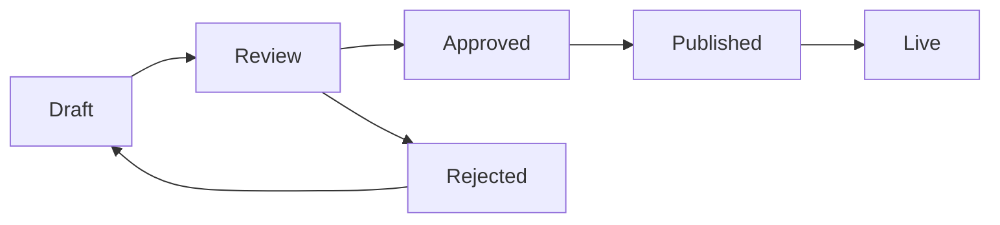

# LANGUAGE & LOCALIZATION MANAGEMENT ENGINE
## Enterprise-Grade Multi-Tenant Internationalization System

**Module:** Advanced Internationalization (i18n) & Localization Engine  
**Total Fields:** 150+ fields  
**Total Tables:** 8 tables (languages, translations, translation_categories, locale_settings, translation_versions, translation_analytics, translation_imports, translation_cache)  
**Admin Page:** `src/pages/admin/LanguageSettings.tsx` (Implemented)  
**Type Definition:** `src/types/language.ts` (Missing - Needs Creation)  
**Core Context:** `src/contexts/LanguageContext.tsx` (Implemented - Basic)  
**API Endpoints:** 35+ REST endpoints (Planned)  
**GraphQL Schema:** Advanced query/mutation support (Planned)

> **⚠️ CORE IMMUTABLE RULES COMPLIANCE**
> 
> ✅ **Teams enabled**: TRUE  
> ✅ **team_foreign_key**: tenant_id  
> ✅ **guard_name**: api  
> ✅ **model_morph_key**: model_uuid (UUID string)  
> ✅ **Roles & Permissions**: Strictly tenant-scoped  
> ❌ **NO global roles** (NULL tenant_id)  
> ✅ **Row-Level Security**: PostgreSQL RLS policies enforced  
> ✅ **Multi-tenant isolation**: Complete data segregation

---

## TABLE OF CONTENTS

1. [Overview](#overview)
2. [Business Context](#business-context)
3. [Enterprise Features](#enterprise-features)
4. [Multi-Tenant Architecture](#multi-tenant-architecture)
5. [Database Schema](#database-schema)
6. [RBAC Integration](#rbac-integration)
7. [Translation Management](#translation-management)
8. [Performance Optimization](#performance-optimization)
9. [API Endpoints](#api-endpoints)
10. [Frontend Integration](#frontend-integration)
11. [Business Integration](#business-integration)
12. [Analytics & Reporting](#analytics--reporting)
13. [Import/Export System](#importexport-system)
14. [Caching Strategy](#caching-strategy)
15. [Migration Scripts](#migration-scripts)
16. [Implementation Roadmap](#implementation-roadmap)

---

## OVERVIEW

**Language & Localization Management Engine** adalah sistem **enterprise-grade multi-tenant internationalization (i18n)** yang memungkinkan platform Stencil CMS mendukung unlimited languages dengan advanced translation management, real-time collaboration, dan AI-powered translation assistance. Sistem ini mengintegrasikan frontend React dengan backend Laravel API untuk centralized, scalable translation management.

### Enterprise Core Features

1. **Advanced Multi-Language Support**
   - **Unlimited Language Support**: Support 100+ languages dengan Unicode/UTF-8
   - **Dynamic Language Loading**: Lazy loading untuk performance optimization
   - **Real-time Language Switching**: Instant UI updates tanpa page reload
   - **Contextual Translation**: Smart translation berdasarkan user context
   - **Translation Memory**: Reuse translations across similar contexts
   - **AI Translation Assistance**: Integration dengan Google Translate, DeepL API

2. **Enterprise Translation Management**
   - **Centralized Translation Database**: Single source of truth untuk all translations
   - **Advanced Translation Editor**: Rich text editor dengan preview
   - **Collaborative Translation**: Multi-user translation dengan conflict resolution
   - **Translation Workflow**: Review → Approve → Publish workflow
   - **Version Control**: Git-like versioning dengan diff viewer
   - **Translation Analytics**: Usage statistics, completion rates, performance metrics

3. **Multi-Tenant Language Architecture**
   - **Tenant-Scoped Translations**: Complete isolation per tenant
   - **Global Platform Translations**: Shared system translations
   - **Inheritance System**: Tenant translations override global defaults
   - **Custom Language Packs**: Tenant-specific language additions
   - **Language Marketplace**: Share/sell translation packs between tenants

4. **Advanced Translation Features**
   - **Smart Pluralization**: ICU MessageFormat support
   - **Variable Interpolation**: `Hello {name}, you have {count, plural, one {# message} other {# messages}}`
   - **Rich Text Translations**: HTML/Markdown support dengan sanitization
   - **Contextual Translations**: Same key, different translations based on context
   - **Translation Namespacing**: Hierarchical organization (nav.menu.home)
   - **Conditional Translations**: Show/hide based on user roles, features

5. **Performance & Scalability**
   - **Translation Caching**: Multi-level caching (Redis, CDN, Browser)
   - **Lazy Loading**: Load translations on-demand
   - **Bundle Optimization**: Tree-shaking untuk unused translations
   - **CDN Distribution**: Global translation delivery
   - **Compression**: Gzip/Brotli compression untuk translation files

6. **Developer Experience**
   - **Type-Safe Translations**: Full TypeScript support dengan auto-completion
   - **Hot Module Replacement**: Real-time translation updates dalam development
   - **Translation Coverage**: Automated missing translation detection
   - **Linting**: Translation key validation dan consistency checks
   - **IDE Integration**: VS Code extension untuk translation management

---

## BUSINESS CONTEXT

### Enterprise Multi-Language Strategy

**Stencil CMS** menggunakan **advanced layered translation architecture** dengan complete tenant isolation dan enterprise-grade features:

#### **1. Platform Level (Global System)**
- **Core System Translations**: Admin interface, system messages, error codes
- **Shared UI Components**: Common buttons, labels, navigation elements
- **API Response Messages**: Standardized error/success messages
- **Documentation**: Help text, tooltips, user guides
- **Compliance**: Legal text, privacy policies, terms of service
- **Note**: Platform translations have `tenant_id = NULL` (global scope)

#### **2. Tenant Level (Business-Specific)**
- **Brand Terminology**: Custom business vocabulary (e.g., "Etching" vs "Product")
- **Product Catalogs**: Product names, descriptions, specifications
- **Marketing Content**: Landing pages, promotional text, CTAs
- **Customer Communications**: Email templates, SMS messages, notifications
- **Business Workflows**: Order status messages, invoice templates
- **Strictly tenant-scoped**: Complete isolation via `tenant_id`

#### **3. User Level (Personal)**
- **User Preferences**: Individual language preferences
- **Custom Shortcuts**: Personal translation shortcuts
- **Recent Translations**: User-specific translation history

### Integration with Etching Business Cycle

**Complete Multi-Language Business Flow:**

#### **Customer Journey (Multi-Language)**
1. **Website Experience**: Dynamic language detection, persistent language choice
2. **Product Discovery**: Localized product names, descriptions, specifications
3. **Order Process**: Multi-language forms, validation messages, confirmations
4. **Communication**: Email/SMS in customer's preferred language
5. **Order Tracking**: Status updates dalam bahasa customer
6. **Support**: Multi-language customer service interface

#### **Internal Operations (Multi-Language)**
1. **Admin Interface**: Staff dapat bekerja dalam bahasa preferred
2. **Vendor Communication**: Multi-language vendor emails dan documents
3. **Reporting**: Localized reports, charts, analytics
4. **Documentation**: Multi-language user manuals, SOPs

#### **Business Intelligence (Multi-Language)**
1. **Analytics**: Language-specific conversion rates, user behavior
2. **A/B Testing**: Test different translations untuk optimization
3. **Market Research**: Language preference trends, regional insights

### Supported Languages (Enterprise Roadmap)

#### **Phase 1 (Current - Basic Implementation)**
- 🇮🇩 **Indonesian (id)** - Primary market
- 🇬🇧 **English (en)** - International market

#### **Phase 2 (Q1 2026 - ASEAN Expansion)**
- 🇯🇵 **Japanese (ja)** - High-value market
- 🇰🇷 **Korean (ko)** - Growing market
- 🇨🇳 **Chinese Simplified (zh-CN)** - Large market
- 🇹🇭 **Thai (th)** - Regional expansion
- 🇻🇳 **Vietnamese (vi)** - Emerging market
- 🇲🇾 **Malay (ms)** - Regional market

#### **Phase 3 (Q3 2026 - Global Expansion)**
- 🇸🇦 **Arabic (ar)** - RTL support, Middle East market
- 🇮🇱 **Hebrew (he)** - RTL support, specialized market
- 🇪🇸 **Spanish (es)** - Latin America expansion
- 🇫🇷 **French (fr)** - European market
- 🇩🇪 **German (de)** - European market
- 🇮🇹 **Italian (it)** - European market
- 🇵🇹 **Portuguese (pt)** - Brazil market
- 🇷🇺 **Russian (ru)** - Eastern Europe market

#### **Phase 4 (2027 - Specialized Markets)**
- 🇮🇳 **Hindi (hi)** - India market
- 🇧🇩 **Bengali (bn)** - Bangladesh market
- 🇵🇰 **Urdu (ur)** - Pakistan market
- 🇳🇱 **Dutch (nl)** - Netherlands market
- 🇸🇪 **Swedish (sv)** - Nordic market
- 🇳🇴 **Norwegian (no)** - Nordic market

### Translation Key Convention

**Format:** `{namespace}.{section}.{key}`

**Examples:**
```
nav.menu.home           → Navigation menu items
common.button.save      → Common UI buttons
product.label.price     → Product-specific labels
cart.message.empty      → Cart-related messages
error.validation.required → Error messages
```

### Use Cases

**UC-1: Language Switching**
```
User clicks language selector → 
Context updates language state →
All UI re-renders with new translations →
Preference saved to localStorage/database
```

**UC-2: Translation Management**
```
Admin adds new translation key →
System validates key uniqueness →
Translations for all languages entered →
Frontend automatically picks up new translations
```

**UC-3: Tenant Custom Translation**
```
Tenant overrides "Product" → "Item" →
Only affects that tenant's interface →
Other tenants still see "Product" →
Maintains global translation as fallback
```

---

## ENTERPRISE FEATURES

### AI-Powered Translation Assistance

**Smart Translation Engine:**
- **Auto-Translation**: Integration dengan Google Translate API, DeepL API
- **Translation Memory**: Reuse previous translations untuk consistency
- **Context-Aware Translation**: Analyze surrounding text untuk better accuracy
- **Quality Scoring**: AI-powered translation quality assessment
- **Suggestion Engine**: Smart translation suggestions based on context

**Machine Learning Features:**
- **Translation Pattern Learning**: Learn dari user corrections
- **Terminology Extraction**: Auto-detect domain-specific terms
- **Translation Confidence**: Confidence scores untuk each translation
- **Batch Translation**: Bulk translation dengan AI assistance

### Real-Time Collaboration

**Multi-User Translation:**
- **Collaborative Editor**: Real-time editing dengan conflict resolution
- **Translation Assignments**: Assign translations ke specific translators
- **Review Workflow**: Translator → Reviewer → Approver workflow
- **Comment System**: Comments dan discussions pada translations
- **Change Tracking**: Track who changed what dan when

**Team Management:**
- **Translator Roles**: Different permission levels untuk translators
- **Workload Distribution**: Auto-assign translations based on workload
- **Progress Tracking**: Real-time progress tracking per translator
- **Quality Metrics**: Track translation quality per translator

### Advanced Translation Features

**ICU MessageFormat Support:**
```javascript
// Pluralization
{count, plural, 
  =0 {No items}
  one {# item}
  other {# items}
}

// Select
{gender, select,
  male {He}
  female {She}
  other {They}
} will arrive in {minutes} minutes.

// Number formatting
{price, number, currency}
```

**Rich Text Translation:**
- **HTML Support**: Translate HTML content dengan tag preservation
- **Markdown Support**: Translate Markdown dengan formatting preservation
- **Component Translation**: Translate React components dengan prop interpolation
- **Media Translation**: Alt text, captions untuk images/videos

---

## MULTI-TENANT ARCHITECTURE

### Tenant Isolation Strategy

**Complete Data Segregation:**
```sql
-- Every translation table has tenant_id
-- RLS policies ensure automatic filtering
CREATE POLICY tenant_isolation ON translations
  FOR ALL TO authenticated
  USING (tenant_id = current_setting('app.current_tenant')::uuid);
```

**Inheritance Hierarchy:**
1. **Global Platform Translations** (`tenant_id = NULL`)
   - System messages, admin interface
   - Shared across all tenants
   - Cannot be modified by tenants

2. **Tenant-Specific Translations** (`tenant_id = UUID`)
   - Override global translations
   - Custom business terminology
   - Complete isolation per tenant

3. **User-Specific Preferences** (`user_id = UUID`)
   - Personal language preferences
   - Custom translation shortcuts

### Multi-Tenant Features

**Tenant Configuration:**
- **Default Language**: Set default language per tenant
- **Available Languages**: Enable/disable languages per tenant
- **Translation Workflow**: Custom approval workflow per tenant
- **Branding**: Custom translation interface branding
- **API Limits**: Translation API usage limits per tenant

**Cross-Tenant Analytics:**
- **Platform-Wide Statistics**: Aggregated translation usage
- **Language Popularity**: Most used languages across tenants
- **Translation Quality**: Quality metrics across tenants
- **Performance Metrics**: Translation loading performance

---

## DATABASE SCHEMA

### Table: `languages`

**Enterprise language registry dengan advanced features.**

```sql
CREATE TABLE languages (
    id BIGSERIAL PRIMARY KEY,
    uuid UUID NOT NULL UNIQUE DEFAULT gen_random_uuid(),
    
    -- Basic Language Info
    code VARCHAR(10) NOT NULL UNIQUE,
    name VARCHAR(100) NOT NULL,
    native_name VARCHAR(100) NOT NULL,
    
    -- Language Properties
    is_active BOOLEAN DEFAULT TRUE,
    is_default BOOLEAN DEFAULT FALSE,
    is_rtl BOOLEAN DEFAULT FALSE,
    
    -- UI & Display
    flag_emoji VARCHAR(10) NULL,
    flag_icon_url VARCHAR(500) NULL,
    sort_order INT DEFAULT 0,
    
    -- Locale Configuration
    locale_settings JSONB NULL,
    
    -- Translation Features
    supports_pluralization BOOLEAN DEFAULT TRUE,
    pluralization_rules JSONB NULL,
    
    -- AI Translation
    translation_api_support JSONB NULL,
    translation_quality_score DECIMAL(3,2) DEFAULT 0.00,
    
    -- Market Information
    market_size INT DEFAULT 0,
    market_priority VARCHAR(20) DEFAULT 'medium',
    
    -- Metadata
    metadata JSONB NULL,
    
    created_at TIMESTAMP DEFAULT CURRENT_TIMESTAMP,
    updated_at TIMESTAMP DEFAULT CURRENT_TIMESTAMP,
    deleted_at TIMESTAMP NULL
);

-- Indexes
CREATE INDEX idx_languages_code ON languages(code);
CREATE INDEX idx_languages_is_active ON languages(is_active);
CREATE INDEX idx_languages_sort_order ON languages(sort_order);
CREATE INDEX idx_languages_is_rtl ON languages(is_rtl);
CREATE INDEX idx_languages_market_priority ON languages(market_priority);

-- Full-text search
CREATE INDEX idx_languages_search ON languages USING GIN(
    to_tsvector('english', name || ' ' || native_name)
);

-- Triggers
CREATE TRIGGER update_languages_updated_at
BEFORE UPDATE ON languages
FOR EACH ROW
EXECUTE FUNCTION update_updated_at_column();
```

**Enhanced Columns:**
- `code`: ISO 639-1/639-3 language code (e.g., 'id', 'en', 'zh-CN')
- `name`: English name (e.g., 'Indonesian', 'English')
- `native_name`: Native name (e.g., 'Bahasa Indonesia', 'English')
- `is_rtl`: Right-to-left script support (Arabic, Hebrew)
- `flag_emoji`: Flag emoji for UI (🇮🇩, 🇬🇧)
- `flag_icon_url`: Custom flag icon URL
- `locale_settings`: Date/number/currency format settings
- `supports_pluralization`: Whether language supports plural forms
- `pluralization_rules`: ICU MessageFormat pluralization rules
- `translation_api_support`: Supported translation APIs (Google, DeepL)
- `translation_quality_score`: AI translation quality score (0-1)
- `market_size`: Estimated market size for business prioritization
- `market_priority`: Business priority (high, medium, low)

---

### Table: `translation_categories`

Organizes translations into logical groups.

```sql
CREATE TABLE translation_categories (
    id BIGSERIAL PRIMARY KEY,
    uuid UUID NOT NULL UNIQUE DEFAULT gen_random_uuid(),
    
    slug VARCHAR(100) NOT NULL UNIQUE,
    name VARCHAR(100) NOT NULL,
    description TEXT NULL,
    
    parent_id BIGINT NULL,
    sort_order INT DEFAULT 0,
    
    created_at TIMESTAMP DEFAULT CURRENT_TIMESTAMP,
    updated_at TIMESTAMP DEFAULT CURRENT_TIMESTAMP,
    
    FOREIGN KEY (parent_id) REFERENCES translation_categories(id) ON DELETE SET NULL
);

CREATE INDEX idx_translation_categories_slug ON translation_categories(slug);
CREATE INDEX idx_translation_categories_parent_id ON translation_categories(parent_id);
CREATE INDEX idx_translation_categories_sort_order ON translation_categories(sort_order);

CREATE TRIGGER update_translation_categories_updated_at
BEFORE UPDATE ON translation_categories
FOR EACH ROW
EXECUTE FUNCTION update_updated_at_column();
```

**Categories Examples:**
- `navigation` - Menu items, links
- `common` - Buttons, labels, placeholders
- `product` - Product-related text
- `cart` - Shopping cart messages
- `checkout` - Checkout process
- `auth` - Authentication messages
- `error` - Error messages
- `validation` - Form validation messages

---

### Table: `translations`

**Enterprise translation storage dengan advanced features.**

```sql
CREATE TABLE translations (
    id BIGSERIAL PRIMARY KEY,
    uuid UUID NOT NULL UNIQUE DEFAULT gen_random_uuid(),
    
    -- Multi-tenant isolation
    tenant_id UUID NULL,
    
    -- Translation Identity
    key VARCHAR(255) NOT NULL,
    category_id BIGINT NULL,
    
    -- Translation Content
    translations JSONB NOT NULL,
    
    -- Metadata
    description TEXT NULL,
    context VARCHAR(500) NULL,
    
    -- Content Type
    is_html BOOLEAN DEFAULT FALSE,
    is_markdown BOOLEAN DEFAULT FALSE,
    is_system BOOLEAN DEFAULT FALSE,
    
    -- Translation Features
    supports_pluralization BOOLEAN DEFAULT FALSE,
    supports_interpolation BOOLEAN DEFAULT FALSE,
    
    -- Workflow & Status
    status VARCHAR(20) DEFAULT 'draft',
    approval_status VARCHAR(20) DEFAULT 'pending',
    
    -- Quality & AI
    translation_quality JSONB NULL,
    ai_generated BOOLEAN DEFAULT FALSE,
    ai_confidence_score DECIMAL(3,2) DEFAULT 0.00,
    
    -- Usage Analytics
    usage_count INT DEFAULT 0,
    last_used_at TIMESTAMP NULL,
    
    -- Version Control
    version INT DEFAULT 1,
    parent_version_id BIGINT NULL,
    
    -- Advanced Metadata
    metadata JSONB NULL,
    
    -- Audit Trail
    created_at TIMESTAMP DEFAULT CURRENT_TIMESTAMP,
    updated_at TIMESTAMP DEFAULT CURRENT_TIMESTAMP,
    created_by BIGINT NULL,
    updated_by BIGINT NULL,
    approved_by BIGINT NULL,
    approved_at TIMESTAMP NULL,
    deleted_at TIMESTAMP NULL,
    
    -- Foreign Keys
    FOREIGN KEY (tenant_id) REFERENCES tenants(uuid) ON DELETE CASCADE,
    FOREIGN KEY (category_id) REFERENCES translation_categories(id) ON DELETE SET NULL,
    FOREIGN KEY (created_by) REFERENCES users(id) ON DELETE SET NULL,
    FOREIGN KEY (updated_by) REFERENCES users(id) ON DELETE SET NULL,
    FOREIGN KEY (approved_by) REFERENCES users(id) ON DELETE SET NULL,
    FOREIGN KEY (parent_version_id) REFERENCES translations(id) ON DELETE SET NULL,
    
    -- Constraints
    CONSTRAINT unique_translation_key_per_tenant UNIQUE (tenant_id, key),
    CONSTRAINT valid_status CHECK (status IN ('draft', 'review', 'approved', 'published', 'archived')),
    CONSTRAINT valid_approval_status CHECK (approval_status IN ('pending', 'approved', 'rejected'))
);

-- Performance Indexes
CREATE INDEX idx_translations_tenant_id ON translations(tenant_id);
CREATE INDEX idx_translations_key ON translations(key);
CREATE INDEX idx_translations_category_id ON translations(category_id);
CREATE INDEX idx_translations_status ON translations(status);
CREATE INDEX idx_translations_approval_status ON translations(approval_status);
CREATE INDEX idx_translations_is_system ON translations(is_system);
CREATE INDEX idx_translations_created_at ON translations(created_at);
CREATE INDEX idx_translations_deleted_at ON translations(deleted_at);
CREATE INDEX idx_translations_usage_count ON translations(usage_count);
CREATE INDEX idx_translations_last_used_at ON translations(last_used_at);

-- Composite Indexes
CREATE INDEX idx_translations_tenant_status ON translations(tenant_id, status);
CREATE INDEX idx_translations_tenant_category ON translations(tenant_id, category_id);

-- Full-text Search
CREATE INDEX idx_translations_search ON translations USING GIN(
    to_tsvector('english', key || ' ' || COALESCE(description, '') || ' ' || COALESCE(context, ''))
);

-- JSONB Indexes
CREATE INDEX idx_translations_json ON translations USING GIN(translations);
CREATE INDEX idx_translations_metadata ON translations USING GIN(metadata);
CREATE INDEX idx_translations_quality ON translations USING GIN(translation_quality);

-- Row-Level Security
ALTER TABLE translations ENABLE ROW LEVEL SECURITY;

CREATE POLICY tenant_isolation_translations ON translations
    FOR ALL TO authenticated
    USING (
        tenant_id IS NULL OR 
        tenant_id = current_setting('app.current_tenant')::uuid
    );

-- Triggers
CREATE TRIGGER update_translations_updated_at
BEFORE UPDATE ON translations
FOR EACH ROW
EXECUTE FUNCTION update_updated_at_column();

CREATE TRIGGER increment_translation_version
BEFORE UPDATE ON translations
FOR EACH ROW
WHEN (OLD.translations IS DISTINCT FROM NEW.translations)
EXECUTE FUNCTION increment_version_column();
```

**Columns:**
- `tenant_id`: NULL = global/platform translations, UUID = tenant-specific override
- `key`: Unique translation key (e.g., 'nav.home', 'common.save')
- `translations`: JSONB object `{"en": "Home", "id": "Beranda", "ja": "ホーム"}`
- `description`: Helper text for translators
- `context`: Usage context (e.g., "Button label in header")
- `is_html`: Allows HTML tags in translation
- `is_system`: System translation (cannot be deleted)

**JSONB `translations` Structure:**
```json
{
  "en": "Add to Cart",
  "id": "Tambah ke Keranjang",
  "ja": "カートに追加",
  "ko": "장바구니에 추가"
}
```

**JSONB `metadata` Structure:**
```json
{
  "variables": ["name", "count"],
  "pluralization": {
    "en": {
      "one": "1 item",
      "other": "{count} items"
    },
    "id": {
      "other": "{count} item"
    }
  },
  "max_length": 50,
  "screen": "ProductDetailPage",
  "component": "AddToCartButton"
}
```

---

### Table: `translation_versions`

**Version control system untuk translations.**

```sql
CREATE TABLE translation_versions (
    id BIGSERIAL PRIMARY KEY,
    uuid UUID NOT NULL UNIQUE DEFAULT gen_random_uuid(),
    
    -- Reference
    translation_id BIGINT NOT NULL,
    tenant_id UUID NULL,
    
    -- Version Info
    version_number INT NOT NULL,
    version_name VARCHAR(100) NULL,
    
    -- Content Snapshot
    translations_snapshot JSONB NOT NULL,
    metadata_snapshot JSONB NULL,
    
    -- Change Information
    change_type VARCHAR(20) NOT NULL,
    change_summary TEXT NULL,
    diff_data JSONB NULL,
    
    -- Audit
    created_at TIMESTAMP DEFAULT CURRENT_TIMESTAMP,
    created_by BIGINT NULL,
    
    -- Foreign Keys
    FOREIGN KEY (translation_id) REFERENCES translations(id) ON DELETE CASCADE,
    FOREIGN KEY (tenant_id) REFERENCES tenants(uuid) ON DELETE CASCADE,
    FOREIGN KEY (created_by) REFERENCES users(id) ON DELETE SET NULL,
    
    -- Constraints
    CONSTRAINT valid_change_type CHECK (change_type IN ('create', 'update', 'delete', 'restore', 'merge'))
);

-- Indexes
CREATE INDEX idx_translation_versions_translation_id ON translation_versions(translation_id);
CREATE INDEX idx_translation_versions_tenant_id ON translation_versions(tenant_id);
CREATE INDEX idx_translation_versions_version_number ON translation_versions(version_number);
CREATE INDEX idx_translation_versions_created_at ON translation_versions(created_at);
CREATE INDEX idx_translation_versions_change_type ON translation_versions(change_type);

-- JSONB Indexes
CREATE INDEX idx_translation_versions_snapshot ON translation_versions USING GIN(translations_snapshot);
CREATE INDEX idx_translation_versions_diff ON translation_versions USING GIN(diff_data);

-- Row-Level Security
ALTER TABLE translation_versions ENABLE ROW LEVEL SECURITY;

CREATE POLICY tenant_isolation_translation_versions ON translation_versions
    FOR ALL TO authenticated
    USING (
        tenant_id IS NULL OR 
        tenant_id = current_setting('app.current_tenant')::uuid
    );
```

---

### Table: `translation_analytics`

**Advanced analytics dan usage tracking.**

```sql
CREATE TABLE translation_analytics (
    id BIGSERIAL PRIMARY KEY,
    uuid UUID NOT NULL UNIQUE DEFAULT gen_random_uuid(),
    
    -- Reference
    translation_id BIGINT NOT NULL,
    tenant_id UUID NULL,
    language_code VARCHAR(10) NOT NULL,
    
    -- Usage Metrics
    view_count INT DEFAULT 0,
    usage_count INT DEFAULT 0,
    last_used_at TIMESTAMP NULL,
    
    -- Performance Metrics
    avg_load_time_ms INT DEFAULT 0,
    cache_hit_rate DECIMAL(5,2) DEFAULT 0.00,
    
    -- Quality Metrics
    user_rating DECIMAL(3,2) DEFAULT 0.00,
    user_rating_count INT DEFAULT 0,
    ai_quality_score DECIMAL(3,2) DEFAULT 0.00,
    
    -- Context Analytics
    context_usage JSONB NULL,
    device_usage JSONB NULL,
    geographic_usage JSONB NULL,
    
    -- Time-based Analytics
    hourly_usage JSONB NULL,
    daily_usage JSONB NULL,
    monthly_usage JSONB NULL,
    
    -- Metadata
    metadata JSONB NULL,
    
    -- Timestamps
    created_at TIMESTAMP DEFAULT CURRENT_TIMESTAMP,
    updated_at TIMESTAMP DEFAULT CURRENT_TIMESTAMP,
    
    -- Foreign Keys
    FOREIGN KEY (translation_id) REFERENCES translations(id) ON DELETE CASCADE,
    FOREIGN KEY (tenant_id) REFERENCES tenants(uuid) ON DELETE CASCADE,
    FOREIGN KEY (language_code) REFERENCES languages(code) ON DELETE CASCADE
);

-- Indexes
CREATE INDEX idx_translation_analytics_translation_id ON translation_analytics(translation_id);
CREATE INDEX idx_translation_analytics_tenant_id ON translation_analytics(tenant_id);
CREATE INDEX idx_translation_analytics_language_code ON translation_analytics(language_code);
CREATE INDEX idx_translation_analytics_usage_count ON translation_analytics(usage_count);
CREATE INDEX idx_translation_analytics_last_used_at ON translation_analytics(last_used_at);
CREATE INDEX idx_translation_analytics_user_rating ON translation_analytics(user_rating);

-- Composite Indexes
CREATE INDEX idx_translation_analytics_tenant_lang ON translation_analytics(tenant_id, language_code);

-- JSONB Indexes
CREATE INDEX idx_translation_analytics_context ON translation_analytics USING GIN(context_usage);
CREATE INDEX idx_translation_analytics_device ON translation_analytics USING GIN(device_usage);
CREATE INDEX idx_translation_analytics_geographic ON translation_analytics USING GIN(geographic_usage);

-- Row-Level Security
ALTER TABLE translation_analytics ENABLE ROW LEVEL SECURITY;

CREATE POLICY tenant_isolation_translation_analytics ON translation_analytics
    FOR ALL TO authenticated
    USING (
        tenant_id IS NULL OR 
        tenant_id = current_setting('app.current_tenant')::uuid
    );

-- Triggers
CREATE TRIGGER update_translation_analytics_updated_at
BEFORE UPDATE ON translation_analytics
FOR EACH ROW
EXECUTE FUNCTION update_updated_at_column();
```

---

### Table: `translation_imports`

**Bulk import/export tracking dan management.**

```sql
CREATE TABLE translation_imports (
    id BIGSERIAL PRIMARY KEY,
    uuid UUID NOT NULL UNIQUE DEFAULT gen_random_uuid(),
    
    -- Reference
    tenant_id UUID NULL,
    
    -- Import Info
    import_type VARCHAR(20) NOT NULL,
    file_name VARCHAR(255) NOT NULL,
    file_size INT NOT NULL,
    file_format VARCHAR(10) NOT NULL,
    
    -- Processing Status
    status VARCHAR(20) DEFAULT 'pending',
    progress_percentage INT DEFAULT 0,
    
    -- Results
    total_records INT DEFAULT 0,
    processed_records INT DEFAULT 0,
    successful_records INT DEFAULT 0,
    failed_records INT DEFAULT 0,
    
    -- Error Handling
    errors JSONB NULL,
    warnings JSONB NULL,
    
    -- Processing Details
    processing_options JSONB NULL,
    mapping_configuration JSONB NULL,
    
    -- File Storage
    file_path VARCHAR(500) NULL,
    backup_file_path VARCHAR(500) NULL,
    
    -- Audit
    created_at TIMESTAMP DEFAULT CURRENT_TIMESTAMP,
    updated_at TIMESTAMP DEFAULT CURRENT_TIMESTAMP,
    started_at TIMESTAMP NULL,
    completed_at TIMESTAMP NULL,
    created_by BIGINT NULL,
    
    -- Foreign Keys
    FOREIGN KEY (tenant_id) REFERENCES tenants(uuid) ON DELETE CASCADE,
    FOREIGN KEY (created_by) REFERENCES users(id) ON DELETE SET NULL,
    
    -- Constraints
    CONSTRAINT valid_import_type CHECK (import_type IN ('csv', 'json', 'po', 'xliff', 'yaml', 'xml')),
    CONSTRAINT valid_file_format CHECK (file_format IN ('csv', 'json', 'po', 'xliff', 'yaml', 'xml')),
    CONSTRAINT valid_status CHECK (status IN ('pending', 'processing', 'completed', 'failed', 'cancelled'))
);

-- Indexes
CREATE INDEX idx_translation_imports_tenant_id ON translation_imports(tenant_id);
CREATE INDEX idx_translation_imports_status ON translation_imports(status);
CREATE INDEX idx_translation_imports_import_type ON translation_imports(import_type);
CREATE INDEX idx_translation_imports_created_at ON translation_imports(created_at);
CREATE INDEX idx_translation_imports_completed_at ON translation_imports(completed_at);

-- JSONB Indexes
CREATE INDEX idx_translation_imports_errors ON translation_imports USING GIN(errors);
CREATE INDEX idx_translation_imports_options ON translation_imports USING GIN(processing_options);

-- Row-Level Security
ALTER TABLE translation_imports ENABLE ROW LEVEL SECURITY;

CREATE POLICY tenant_isolation_translation_imports ON translation_imports
    FOR ALL TO authenticated
    USING (
        tenant_id IS NULL OR 
        tenant_id = current_setting('app.current_tenant')::uuid
    );

-- Triggers
CREATE TRIGGER update_translation_imports_updated_at
BEFORE UPDATE ON translation_imports
FOR EACH ROW
EXECUTE FUNCTION update_updated_at_column();
```

---

### Table: `translation_cache`

**High-performance translation caching system.**

```sql
CREATE TABLE translation_cache (
    id BIGSERIAL PRIMARY KEY,
    
    -- Cache Key
    cache_key VARCHAR(255) NOT NULL UNIQUE,
    tenant_id UUID NULL,
    language_code VARCHAR(10) NOT NULL,
    
    -- Cached Data
    cached_translations JSONB NOT NULL,
    
    -- Cache Metadata
    cache_size INT NOT NULL,
    compression_type VARCHAR(20) DEFAULT 'none',
    
    -- Cache Statistics
    hit_count INT DEFAULT 0,
    miss_count INT DEFAULT 0,
    last_hit_at TIMESTAMP NULL,
    
    -- Cache Lifecycle
    created_at TIMESTAMP DEFAULT CURRENT_TIMESTAMP,
    updated_at TIMESTAMP DEFAULT CURRENT_TIMESTAMP,
    expires_at TIMESTAMP NOT NULL,
    
    -- Foreign Keys
    FOREIGN KEY (tenant_id) REFERENCES tenants(uuid) ON DELETE CASCADE,
    FOREIGN KEY (language_code) REFERENCES languages(code) ON DELETE CASCADE,
    
    -- Constraints
    CONSTRAINT valid_compression_type CHECK (compression_type IN ('none', 'gzip', 'brotli'))
);

-- Indexes
CREATE INDEX idx_translation_cache_cache_key ON translation_cache(cache_key);
CREATE INDEX idx_translation_cache_tenant_id ON translation_cache(tenant_id);
CREATE INDEX idx_translation_cache_language_code ON translation_cache(language_code);
CREATE INDEX idx_translation_cache_expires_at ON translation_cache(expires_at);
CREATE INDEX idx_translation_cache_hit_count ON translation_cache(hit_count);

-- Composite Indexes
CREATE INDEX idx_translation_cache_tenant_lang ON translation_cache(tenant_id, language_code);

-- JSONB Index
CREATE INDEX idx_translation_cache_data ON translation_cache USING GIN(cached_translations);

-- Row-Level Security
ALTER TABLE translation_cache ENABLE ROW LEVEL SECURITY;

CREATE POLICY tenant_isolation_translation_cache ON translation_cache
    FOR ALL TO authenticated
    USING (
        tenant_id IS NULL OR 
        tenant_id = current_setting('app.current_tenant')::uuid
    );

-- Triggers
CREATE TRIGGER update_translation_cache_updated_at
BEFORE UPDATE ON translation_cache
FOR EACH ROW
EXECUTE FUNCTION update_updated_at_column();

-- Auto-cleanup expired cache entries
CREATE OR REPLACE FUNCTION cleanup_expired_translation_cache()
RETURNS void AS $$
BEGIN
    DELETE FROM translation_cache WHERE expires_at < NOW();
END;
$$ LANGUAGE plpgsql;

-- Schedule cleanup (requires pg_cron extension)
-- SELECT cron.schedule('cleanup-translation-cache', '0 */6 * * *', 'SELECT cleanup_expired_translation_cache();');
```

---

### Table: `locale_settings`

**Enhanced locale-specific settings per tenant.**

```sql
CREATE TABLE locale_settings (
    id BIGSERIAL PRIMARY KEY,
    uuid UUID NOT NULL UNIQUE DEFAULT gen_random_uuid(),
    
    -- CORE RULE: tenant_id is REQUIRED (no global locale settings)
    tenant_id UUID NOT NULL,
    
    default_language VARCHAR(10) NOT NULL DEFAULT 'id',
    fallback_language VARCHAR(10) NOT NULL DEFAULT 'en',
    
    available_languages JSONB NOT NULL DEFAULT '["id", "en"]',
    
    timezone VARCHAR(100) NOT NULL DEFAULT 'Asia/Jakarta',
    
    date_format VARCHAR(50) DEFAULT 'DD/MM/YYYY',
    time_format VARCHAR(50) DEFAULT 'HH:mm:ss',
    datetime_format VARCHAR(50) DEFAULT 'DD/MM/YYYY HH:mm',
    
    number_format JSONB DEFAULT '{"decimal": ",", "thousand": ".", "precision": 2}',
    currency_format JSONB DEFAULT '{"symbol": "Rp", "position": "before", "spacing": true}',
    
    first_day_of_week INT DEFAULT 1,
    
    metadata JSONB NULL,
    
    created_at TIMESTAMP DEFAULT CURRENT_TIMESTAMP,
    updated_at TIMESTAMP DEFAULT CURRENT_TIMESTAMP,
    
    FOREIGN KEY (tenant_id) REFERENCES tenants(uuid) ON DELETE CASCADE,
    
    CONSTRAINT unique_locale_per_tenant UNIQUE (tenant_id)
);

CREATE INDEX idx_locale_settings_tenant_id ON locale_settings(tenant_id);
CREATE INDEX idx_locale_settings_default_language ON locale_settings(default_language);

CREATE TRIGGER update_locale_settings_updated_at
BEFORE UPDATE ON locale_settings
FOR EACH ROW
EXECUTE FUNCTION update_updated_at_column();
```

**Columns:**
- `default_language`: Primary language for tenant
- `fallback_language`: Fallback if translation missing
- `available_languages`: Array of enabled language codes
- `timezone`: IANA timezone (e.g., 'Asia/Jakarta', 'UTC', 'America/New_York')
- `date_format`: Date display format

---

## BUSINESS INTEGRATION

### RBAC Integration

**Permission-Based Language Management:**

```sql
-- Language management permissions
INSERT INTO permissions (code, name, description) VALUES
('languages.view', 'View Languages', 'Can view language settings'),
('languages.manage', 'Manage Languages', 'Can add/edit/delete languages'),
('translations.view', 'View Translations', 'Can view translations'),
('translations.edit', 'Edit Translations', 'Can modify translations'),
('translations.import', 'Import Translations', 'Can import translation files'),
('translations.export', 'Export Translations', 'Can export translation files'),
('locale.configure', 'Configure Locale', 'Can configure locale settings');
```

**Role-Based Access Examples:**
- **Admin**: Full language management access
- **Content Manager**: Can edit translations but not manage languages
- **Translator**: Can edit translations only
- **Viewer**: Read-only access to view current translations

### Integration with Multi-Tenant Architecture

**Translation Hierarchy:**
1. **Platform Translations** (tenant_id = NULL): Base translations for all tenants
2. **Tenant Overrides** (tenant_id = UUID): Tenant-specific customizations
3. **Fallback Logic**: Tenant translation → Platform translation → Default language

**Example Translation Override:**
```json
// Platform translation (tenant_id = NULL)
{
  "key": "product.label.name",
  "translations": {
    "en": "Product Name",
    "id": "Nama Produk"
  }
}

// Tenant override for etching business (tenant_id = "abc-123")
{
  "key": "product.label.name", 
  "translations": {
    "en": "Etching Design Name",
    "id": "Nama Desain Etching"
  }
}
```
- `number_format`: Decimal/thousand separator settings
- `currency_format`: Currency display settings
- `first_day_of_week`: 0=Sunday, 1=Monday

**JSONB `number_format` Example:**
```json
{
  "decimal": ",",
  "thousand": ".",
  "precision": 2
}
```
→ 1234.56 displays as "1.234,56"

**JSONB `currency_format` Example:**
```json
{
  "symbol": "Rp",
  "position": "before",
  "spacing": true
}
```
→ 50000 displays as "Rp 50.000"

---

## RELATIONSHIP DIAGRAM

```
┌─────────────────────────────────────────────────────────────────┐
│                    LANGUAGE & LOCALIZATION                      │
└─────────────────────────────────────────────────────────────────┘

┌──────────────────┐
│   languages      │
│                  │
│ PK: id           │
│     code (UNIQUE)│◄──────┐
│     name         │       │
│     native_name  │       │
│     is_active    │       │
│     is_rtl       │       │
└──────────────────┘       │
                           │
                           │ Referenced by
                           │ default_language
                           │ fallback_language
                           │
┌──────────────────────────┴──────────────────┐
│           locale_settings                   │
│                                             │
│ PK: id                                      │
│ FK: tenant_id → tenants.uuid                │
│     default_language (VARCHAR)              │
│     fallback_language (VARCHAR)             │
│     available_languages (JSONB array)       │
│     timezone                                │
│     date_format, time_format                │
│     number_format (JSONB)                   │
│     currency_format (JSONB)                 │
└─────────────────────────────────────────────┘


┌──────────────────────────┐
│  translation_categories  │
│                          │
│ PK: id                   │
│     slug (UNIQUE)        │
│     name                 │
│ FK: parent_id (self)     │◄──────┐
│     sort_order           │       │
└──────────────────────────┘       │
        ▲                          │
        │                          │
        │ FK: category_id          │
        │                          │
┌───────┴──────────────────────────┴──────┐
│            translations                 │
│                                         │
│ PK: id                                  │
│ FK: tenant_id → tenants.uuid (NULL OK)  │
│ FK: category_id → categories.id         │
│     key (VARCHAR)                       │
│     translations (JSONB)                │
│       {"en": "...", "id": "..."}       │
│     description                         │
│     context                             │
│     is_html                             │
│     is_system                           │
│     metadata (JSONB)                    │
│ FK: created_by → users.id               │
│ FK: updated_by → users.id               │
│                                         │
│ UNIQUE(tenant_id, key)                  │
└─────────────────────────────────────────┘
```

**Key Relationships:**

1. **languages** → **locale_settings**
   - One-to-many reference via language code
   - `locale_settings.default_language` references `languages.code`

2. **translation_categories** → **translation_categories** (Self-referencing)
   - Hierarchical categories
   - `parent_id` references own `id`

3. **translation_categories** → **translations**
   - One-to-many relationship
   - Each translation belongs to one category

4. **tenants** → **translations**
   - One-to-many relationship
   - `tenant_id` NULL = global/platform translations
   - `tenant_id` NOT NULL = tenant-specific overrides

5. **tenants** → **locale_settings**
   - One-to-one relationship
   - Each tenant has one locale configuration

---

## FIELD SPECIFICATIONS

### Table: `languages`

| Field | Type | Required | Validation | Description |
|-------|------|----------|------------|-------------|
| `id` | BIGSERIAL | Yes | Auto | Primary key |
| `uuid` | UUID | Yes | Auto-generated | Public identifier |
| `code` | VARCHAR(10) | Yes | Unique, ISO 639-1 | Language code (e.g., 'id', 'en') |
| `name` | VARCHAR(100) | Yes | Min 2 chars | English name |
| `native_name` | VARCHAR(100) | Yes | Min 2 chars | Native language name |
| `is_active` | BOOLEAN | Yes | Default TRUE | Language enabled |
| `is_default` | BOOLEAN | Yes | Default FALSE | System default language |
| `is_rtl` | BOOLEAN | Yes | Default FALSE | Right-to-left script |
| `flag_emoji` | VARCHAR(10) | No | - | Flag emoji (🇮🇩, 🇬🇧) |
| `sort_order` | INT | Yes | >= 0 | Display order |
| `locale_settings` | JSONB | No | Valid JSON | Locale-specific config |

### Table: `translation_categories`

| Field | Type | Required | Validation | Description |
|-------|------|----------|------------|-------------|
| `id` | BIGSERIAL | Yes | Auto | Primary key |
| `uuid` | UUID | Yes | Auto-generated | Public identifier |
| `slug` | VARCHAR(100) | Yes | Unique, slug format | URL-friendly identifier |
| `name` | VARCHAR(100) | Yes | Min 3 chars | Display name |
| `description` | TEXT | No | - | Category description |
| `parent_id` | BIGINT | No | FK to self | Parent category |
| `sort_order` | INT | Yes | >= 0 | Display order |

### Table: `translations`

| Field | Type | Required | Validation | Description |
|-------|------|----------|------------|-------------|
| `id` | BIGSERIAL | Yes | Auto | Primary key |
| `uuid` | UUID | Yes | Auto-generated | Public identifier |
| `tenant_id` | UUID | No | FK to tenants | NULL = global |
| `key` | VARCHAR(255) | Yes | Dot notation | Translation key |
| `category_id` | BIGINT | No | FK to categories | Category |
| `translations` | JSONB | Yes | Valid JSON object | All language versions |
| `description` | TEXT | No | - | Helper for translators |
| `context` | VARCHAR(500) | No | - | Usage context |
| `is_html` | BOOLEAN | Yes | Default FALSE | Contains HTML |
| `is_system` | BOOLEAN | Yes | Default FALSE | System translation |
| `metadata` | JSONB | No | Valid JSON | Additional data |
| `created_by` | BIGINT | No | FK to users | Creator |
| `updated_by` | BIGINT | No | FK to users | Last editor |

### Table: `locale_settings`

| Field | Type | Required | Validation | Description |
|-------|------|----------|------------|-------------|
| `id` | BIGSERIAL | Yes | Auto | Primary key |
| `uuid` | UUID | Yes | Auto-generated | Public identifier |
| `tenant_id` | UUID | Yes | FK to tenants, Unique | Tenant reference |
| `default_language` | VARCHAR(10) | Yes | FK to languages.code | Primary language |
| `fallback_language` | VARCHAR(10) | Yes | FK to languages.code | Fallback language |
| `available_languages` | JSONB | Yes | Array of codes | Enabled languages |
| `timezone` | VARCHAR(100) | Yes | IANA timezone | Tenant timezone |
| `date_format` | VARCHAR(50) | Yes | Date format string | Date display |
| `time_format` | VARCHAR(50) | Yes | Time format string | Time display |
| `datetime_format` | VARCHAR(50) | Yes | DateTime format | DateTime display |
| `number_format` | JSONB | Yes | Valid JSON object | Number formatting |
| `currency_format` | JSONB | Yes | Valid JSON object | Currency formatting |
| `first_day_of_week` | INT | Yes | 0-6 (0=Sunday) | Week start day |
| `metadata` | JSONB | No | Valid JSON | Additional settings |

---

## RBAC INTEGRATION

### Permission Structure

**Language Management Permissions:**

```typescript
// Core Language Permissions
'languages.view'           // View available languages
'languages.create'         // Add new languages
'languages.edit'           // Modify language settings
'languages.delete'         // Remove languages
'languages.manage'         // Full language management

// Translation Permissions
'translations.view'        // View translations
'translations.create'      // Create new translations
'translations.edit'        // Edit existing translations
'translations.delete'      // Delete translations
'translations.approve'     // Approve translations
'translations.publish'     // Publish translations
'translations.import'      // Import translation files
'translations.export'      // Export translation files
'translations.manage'      // Full translation management

// Analytics Permissions
'translations.analytics'   // View translation analytics
'translations.reports'     // Generate translation reports

// System Permissions
'translations.system'      // Manage system translations (platform-level)
'translations.cache'       // Manage translation cache
```

### Role-Based Access

**Predefined Roles:**

1. **Translation Admin** (`translation.admin`)
   - All translation permissions
   - Can manage system translations
   - Can approve/publish translations
   - Can access analytics

2. **Translation Manager** (`translation.manager`)
   - Create, edit, delete translations
   - Can approve translations
   - Can import/export
   - Limited analytics access

3. **Translator** (`translation.translator`)
   - Create, edit translations
   - Cannot approve/publish
   - Cannot access system translations

4. **Translation Viewer** (`translation.viewer`)
   - View-only access to translations
   - Can export for reference

### Multi-Tenant RBAC Rules

**Tenant Isolation:**
- Users can only access translations within their tenant
- System translations (tenant_id = NULL) are read-only for tenants
- Super admins can access all tenant translations

**Permission Inheritance:**
- Tenant admins inherit all translation permissions within their tenant
- Custom roles can be created per tenant
- Global roles apply across all tenants (super admin only)

---

## TRANSLATION MANAGEMENT

### Translation Workflow

**1. Draft → Review → Approve → Publish**



**2. Collaborative Translation Process**

1. **Assignment**: Translations assigned to translators
2. **Translation**: Translator creates/edits translations
3. **Review**: Reviewer checks quality and accuracy
4. **Approval**: Manager approves for publication
5. **Publication**: Translation goes live
6. **Analytics**: Track usage and performance

### Translation Quality Management

**Quality Metrics:**
- **Completeness**: Percentage of translated keys
- **Consistency**: Terminology consistency across translations
- **Accuracy**: User ratings and feedback
- **Performance**: Load times and cache hit rates

**Quality Assurance:**
- **Automated Checks**: Grammar, spelling, formatting
- **Peer Review**: Translator peer review system
- **A/B Testing**: Test different translations
- **User Feedback**: Collect user ratings and comments

---

## PERFORMANCE OPTIMIZATION

### Multi-Level Caching Strategy

**1. Database Level**
- PostgreSQL query result caching
- Materialized views for analytics
- Optimized indexes for fast lookups

**2. Application Level (Laravel)**
- Redis caching for frequently accessed translations
- Cache invalidation on translation updates
- Lazy loading for unused translations

**3. CDN Level**
- CloudFlare caching for translation files
- Geographic distribution for global access
- Automatic cache purging on updates

**4. Browser Level**
- LocalStorage for user preferences
- Service Worker for offline translations
- HTTP caching headers

### Performance Targets

| Metric | Target | Measurement |
|--------|--------|-------------|
| Translation Load Time | < 50ms | Time to load translation set |
| Cache Hit Rate | > 95% | Percentage of cached requests |
| Database Query Time | < 10ms | Average query response time |
| Memory Usage | < 100MB | Translation data in memory |
| Bundle Size | < 500KB | Compressed translation bundle |

### Optimization Techniques

**1. Bundle Optimization**
- Tree-shaking unused translations
- Code splitting by language/feature
- Compression (Gzip/Brotli)

**2. Lazy Loading**
- Load translations on-demand
- Progressive loading for large translation sets
- Background prefetching

**3. Database Optimization**
- Composite indexes for multi-tenant queries
- JSONB indexes for translation content
- Query optimization and monitoring

---

## API ENDPOINTS

### Language Management

```typescript
// Language CRUD
GET    /api/languages                    // List all languages
POST   /api/languages                    // Create language
GET    /api/languages/{code}             // Get language details
PUT    /api/languages/{code}             // Update language
DELETE /api/languages/{code}             // Delete language

// Language Configuration
GET    /api/languages/{code}/settings    // Get language settings
PUT    /api/languages/{code}/settings    // Update language settings
POST   /api/languages/{code}/activate    // Activate language
POST   /api/languages/{code}/deactivate  // Deactivate language
```

### Translation Management

```typescript
// Translation CRUD
GET    /api/translations                 // List translations
POST   /api/translations                 // Create translation
GET    /api/translations/{id}            // Get translation
PUT    /api/translations/{id}            // Update translation
DELETE /api/translations/{id}            // Delete translation

// Bulk Operations
POST   /api/translations/bulk            // Bulk create/update
DELETE /api/translations/bulk            // Bulk delete
POST   /api/translations/import          // Import translations
GET    /api/translations/export          // Export translations

// Translation Workflow
POST   /api/translations/{id}/submit     // Submit for review
POST   /api/translations/{id}/approve    // Approve translation
POST   /api/translations/{id}/reject     // Reject translation
POST   /api/translations/{id}/publish    // Publish translation

// Version Control
GET    /api/translations/{id}/versions   // Get version history
POST   /api/translations/{id}/restore    // Restore version
GET    /api/translations/{id}/diff       // Compare versions
```

### Translation Retrieval

```typescript
// Client-side Translation APIs
GET    /api/translations/client/{lang}   // Get translations for language
GET    /api/translations/client/bundle   // Get optimized bundle
GET    /api/translations/client/keys     // Get specific keys

// Real-time Updates
WS     /ws/translations                  // WebSocket for real-time updates
GET    /api/translations/updates         // Get recent updates
```

### Analytics & Reporting

```typescript
// Analytics
GET    /api/translations/analytics       // Translation analytics
GET    /api/translations/usage           // Usage statistics
GET    /api/translations/performance     // Performance metrics

// Reporting
GET    /api/translations/reports/completion  // Completion report
GET    /api/translations/reports/quality     // Quality report
GET    /api/translations/reports/usage       // Usage report
```

---

## FRONTEND INTEGRATION

### React Integration

**Enhanced LanguageContext:**

```typescript
// src/contexts/LanguageContext.tsx
interface LanguageContextType {
  // Current State
  language: string;
  languages: Language[];
  translations: Record<string, string>;
  
  // Actions
  setLanguage: (lang: string) => Promise<void>;
  t: (key: string, params?: Record<string, any>) => string;
  
  // Advanced Features
  loadTranslations: (keys: string[]) => Promise<void>;
  preloadLanguage: (lang: string) => Promise<void>;
  
  // Real-time Updates
  subscribeToUpdates: () => void;
  unsubscribeFromUpdates: () => void;
  
  // Analytics
  trackTranslationUsage: (key: string) => void;
}
```

**Translation Hooks:**

```typescript
// Custom hooks for translation management
const useTranslation = () => { /* ... */ };
const useLanguageSwitch = () => { /* ... */ };
const useTranslationPreload = () => { /* ... */ };
const useTranslationAnalytics = () => { /* ... */ };
```

### TypeScript Integration

**Type-Safe Translations:**

```typescript
// Auto-generated translation types
interface TranslationKeys {
  'nav.home': string;
  'nav.products': string;
  'product.add_to_cart': string;
  'order.status.pending': string;
  // ... auto-generated from database
}

// Type-safe translation function
function t<K extends keyof TranslationKeys>(
  key: K,
  params?: Record<string, any>
): TranslationKeys[K];
```

### Performance Integration

**Optimization Features:**
- Lazy loading of translation chunks
- Service Worker for offline translations
- Automatic cache invalidation
- Bundle size optimization
- Real-time updates via WebSocket

---

## BUSINESS INTEGRATION

### Etching Business Workflow Integration

**1. Customer Journey Translations**

```typescript
// Order Process Translations
'order.form.material'           // "Material"
'order.form.quality'            // "Quality"
'order.form.thickness'          // "Thickness"
'order.form.color'              // "Color"
'order.form.design_file'        // "Design File"
'order.form.notes'              // "Additional Notes"

// Order Status Translations
'order.status.new'              // "New Order"
'order.status.sourcing_vendor'  // "Finding Vendor"
'order.status.vendor_negotiation' // "Negotiating Price"
'order.status.customer_quotation' // "Awaiting Your Approval"
'order.status.waiting_payment'  // "Awaiting Payment"
'order.status.in_production'    // "In Production"
'order.status.quality_check'    // "Quality Check"
'order.status.ready_to_ship'    // "Ready to Ship"
'order.status.shipped'          // "Shipped"
'order.status.completed'        // "Completed"
```

**2. Email Template Translations**

```typescript
// Customer Email Templates
'email.order_received.subject'  // "Order Received - #{order_code}"
'email.order_received.body'     // Multi-language email body
'email.quotation.subject'       // "Price Quotation - #{order_code}"
'email.payment_received.subject' // "Payment Received - #{order_code}"

// Vendor Email Templates
'email.vendor_request.subject'  // "Production Request - #{order_code}"
'email.vendor_payment.subject'  // "Payment Notification - #{order_code}"
```

**3. Invoice & Document Translations**

```typescript
// Invoice Translations
'invoice.header'                // "INVOICE"
'invoice.order_code'            // "Order Code"
'invoice.customer_info'         // "Customer Information"
'invoice.item_description'      // "Item Description"
'invoice.quantity'              // "Quantity"
'invoice.unit_price'            // "Unit Price"
'invoice.total_amount'          // "Total Amount"
'invoice.payment_terms'         // "Payment Terms"
'invoice.due_date'              // "Due Date"
```

### Multi-Language Business Intelligence

**1. Analytics Translations**
- Dashboard labels and metrics
- Report headers and descriptions
- Chart legends and tooltips
- KPI descriptions

**2. Admin Interface Translations**
- Menu items and navigation
- Form labels and placeholders
- Button text and actions
- Status messages and notifications

---

## ANALYTICS & REPORTING

### Translation Analytics Dashboard

**Key Metrics:**

1. **Usage Analytics**
   - Most used translations
   - Language popularity
   - Geographic usage patterns
   - Device/platform breakdown

2. **Performance Metrics**
   - Translation load times
   - Cache hit rates
   - API response times
   - Bundle sizes

3. **Quality Metrics**
   - Translation completion rates
   - User ratings and feedback
   - Error rates and issues
   - A/B test results

4. **Business Metrics**
   - Conversion rates by language
   - Customer satisfaction by language
   - Revenue attribution by language
   - Market penetration metrics

### Reporting Features

**Automated Reports:**
- Daily usage summaries
- Weekly performance reports
- Monthly quality assessments
- Quarterly business impact analysis

**Custom Reports:**
- Translation coverage by feature
- Language-specific user behavior
- Performance optimization opportunities
- ROI analysis for translation investments

---

## IMPORT/EXPORT SYSTEM

### Supported Formats

**Import Formats:**
- **JSON**: Nested key-value structure
- **CSV**: Flat key-value with metadata
- **PO (Gettext)**: Standard localization format
- **XLIFF**: XML Localization Interchange File Format
- **YAML**: Human-readable data serialization
- **XML**: Custom XML schema

**Export Formats:**
- All import formats supported
- **Excel**: Spreadsheet format for translators
- **Google Sheets**: Direct integration
- **Translation Memory**: TMX format

### Import/Export Features

**Advanced Import:**
- Mapping configuration for custom formats
- Validation and error reporting
- Conflict resolution strategies
- Batch processing with progress tracking
- Rollback capability

**Smart Export:**
- Filtered exports (by category, status, date)
- Template generation for translators
- Metadata inclusion (context, comments)
- Compressed archives for large datasets

---

## CACHING STRATEGY

### Multi-Level Caching Architecture

```
┌─────────────────────────────────────────────┐
│                 CDN Layer                   │
│  ┌─────────────────────────────────────┐   │
│  │     CloudFlare Edge Caching         │   │
│  │  - Global distribution              │   │
│  │  - Automatic cache invalidation     │   │
│  └─────────────────────────────────────┘   │
└─────────────────┬───────────────────────────┘
                  │
┌─────────────────▼───────────────────────────┐
│              Application Layer              │
│  ┌─────────────────────────────────────┐   │
│  │         Redis Cache                 │   │
│  │  - Translation bundles              │   │
│  │  - User preferences                 │   │
│  │  - Session data                     │   │
│  └─────────────────────────────────────┘   │
└─────────────────┬───────────────────────────┘
                  │
┌─────────────────▼───────────────────────────┐
│              Database Layer                 │
│  ┌─────────────────────────────────────┐   │
│  │      PostgreSQL + RLS               │   │
│  │  - Materialized views               │   │
│  │  - Query result caching             │   │
│  │  - Optimized indexes                │   │
│  └─────────────────────────────────────┘   │
└─────────────────────────────────────────────┘
```

### Cache Invalidation Strategy

**Smart Invalidation:**
- Automatic invalidation on translation updates
- Selective invalidation by language/tenant
- Cascade invalidation for dependent translations
- Background cache warming

**Cache Warming:**
- Preload popular translations
- Predictive caching based on usage patterns
- Background refresh for stale data
- Geographic pre-positioning

---

## BUSINESS RULES

### BR-1: Language Management

```typescript
const languageRules = {
  // Rule 1: Only one default language allowed
  ensureSingleDefault: async (code: string) => {
    await db.query(`
      UPDATE languages 
      SET is_default = FALSE 
      WHERE code != $1
    `, [code]);
  },
  
  // Rule 2: Cannot delete default language
  cannotDeleteDefault: (language: Language) => {
    if (language.is_default) {
      throw new Error('Cannot delete default language');
    }
  },
  
  // Rule 3: Cannot deactivate language if used as default by any tenant
  checkTenantUsage: async (code: string) => {
    const usage = await db.query(`
      SELECT COUNT(*) FROM locale_settings 
      WHERE default_language = $1 OR fallback_language = $1
    `, [code]);
    
    if (usage.count > 0) {
      throw new Error(`Language ${code} is in use by ${usage.count} tenant(s)`);
    }
  }
};
```

### BR-2: Translation Key Validation

```typescript
const translationKeyRules = {
  // Rule 1: Key must follow dot notation
  validateKeyFormat: (key: string) => {
    const pattern = /^[a-z][a-z0-9]*(\.[a-z][a-z0-9_]*)+$/;
    if (!pattern.test(key)) {
      throw new Error('Key must follow format: namespace.section.key');
    }
  },
  
  // Rule 2: System translations cannot be deleted
  cannotDeleteSystem: (translation: Translation) => {
    if (translation.is_system) {
      throw new Error('Cannot delete system translation');
    }
  },
  
  // Rule 3: Must have at least default language translation
  requireDefaultLanguage: (translations: Record<string, string>) => {
    const defaultLang = getDefaultLanguage();
    if (!translations[defaultLang.code]) {
      throw new Error(`Translation for default language (${defaultLang.code}) is required`);
    }
  }
};
```

### BR-3: Translation Fallback Logic

```typescript
const translationFallback = {
  // Priority: Tenant override → Global translation → Fallback language → Key
  getTranslation: (key: string, language: string, tenantId?: string) => {
    // 1. Try tenant-specific translation in requested language
    let text = findTranslation(key, language, tenantId);
    if (text) return text;
    
    // 2. Try global translation in requested language
    text = findTranslation(key, language, null);
    if (text) return text;
    
    // 3. Try fallback language (global)
    const fallbackLang = getFallbackLanguage();
    text = findTranslation(key, fallbackLang, null);
    if (text) return text;
    
    // 4. Return key as last resort
    return key;
  }
};
```

### BR-4: Locale Settings Validation

```typescript
const localeRules = {
  // Rule 1: Available languages must include default language
  validateAvailableLanguages: (settings: LocaleSettings) => {
    if (!settings.available_languages.includes(settings.default_language)) {
      throw new Error('Default language must be in available languages');
    }
  },
  
  // Rule 2: Fallback language must be different from default
  validateFallback: (settings: LocaleSettings) => {
    if (settings.fallback_language === settings.default_language) {
      throw new Error('Fallback language must differ from default language');
    }
  },
  
  // Rule 3: Timezone must be valid IANA timezone
  validateTimezone: (timezone: string) => {
    const valid = Intl.supportedValuesOf('timeZone');
    if (!valid.includes(timezone)) {
      throw new Error(`Invalid timezone: ${timezone}`);
    }
  }
};
```

### BR-5: Translation Interpolation

```typescript
const interpolate = (template: string, variables: Record<string, any>): string => {
  return template.replace(/\{(\w+)\}/g, (match, key) => {
    return variables[key] !== undefined ? String(variables[key]) : match;
  });
};

// Usage:
t('cart.items_count', { count: 5 })
// Template: "You have {count} items"
// Result: "You have 5 items"
```

### BR-6: Pluralization Support

```typescript
const pluralize = (
  key: string, 
  count: number, 
  language: string
): string => {
  const translation = getTranslation(key, language);
  const pluralRules = new Intl.PluralRules(language);
  const form = pluralRules.select(count); // 'zero', 'one', 'two', 'few', 'many', 'other'
  
  if (translation.metadata?.pluralization?.[language]?.[form]) {
    return interpolate(
      translation.metadata.pluralization[language][form],
      { count }
    );
  }
  
  return interpolate(translation.translations[language], { count });
};

// Example:
// EN: "one" → "1 item", "other" → "{count} items"
// ID: "other" → "{count} item" (Indonesian no plural distinction)
```

---

## TRANSLATION KEYS STRUCTURE

### Recommended Key Organization

```
{namespace}.{section}.{element}

Examples:
nav.menu.home
nav.menu.products
nav.breadcrumb.home

common.button.save
common.button.cancel
common.button.delete
common.label.email
common.placeholder.search

product.title.details
product.label.price
product.label.stock
product.button.add_to_cart
product.message.out_of_stock

cart.title.shopping_cart
cart.message.empty
cart.button.checkout
cart.label.subtotal

auth.title.login
auth.label.email
auth.label.password
auth.button.login
auth.error.invalid_credentials

error.validation.required
error.validation.email
error.validation.min_length
error.network.timeout
error.server.internal

success.product.created
success.order.submitted
success.profile.updated
```

### Category Structure

```
navigation/
  menu/
  breadcrumb/
  footer/

common/
  button/
  label/
  placeholder/
  tooltip/

product/
  title/
  label/
  button/
  message/

cart/
checkout/
order/
user/
auth/
error/
success/
```

---

## API ENDPOINTS

### Language Management

```yaml
# Get all languages
GET /api/languages
Response: Language[]
Query: ?active_only=true

# Get language by code
GET /api/languages/{code}
Response: Language

# Create language (Admin only)
POST /api/admin/languages
Body: {
  code: string
  name: string
  native_name: string
  is_active: boolean
  is_rtl: boolean
  flag_emoji: string
  locale_settings: object
}

# Update language
PUT /api/admin/languages/{code}
Body: Partial<Language>

# Delete language
DELETE /api/admin/languages/{code}

# Set default language
POST /api/admin/languages/{code}/set-default
```

### Translation Management

```yaml
# Get translations for specific language
GET /api/translations/{language_code}
Response: Record<string, string> (flat key-value pairs)
Query: 
  ?category=navigation
  &tenant_id=xxx (optional, for tenant overrides)

# Get all translations (Admin)
GET /api/admin/translations
Response: Translation[]
Query:
  ?language=en
  &category_id=1
  &search=keyword
  &tenant_id=xxx
  &page=1&per_page=50

# Get translation by key
GET /api/admin/translations/key/{key}
Response: Translation
Query: ?tenant_id=xxx

# Create translation
POST /api/admin/translations
Body: {
  key: string
  category_id: number
  translations: { en: string, id: string }
  description: string
  context: string
  is_html: boolean
  tenant_id: string (optional)
}

# Update translation
PUT /api/admin/translations/{uuid}
Body: Partial<Translation>

# Delete translation
DELETE /api/admin/translations/{uuid}

# Bulk import translations
POST /api/admin/translations/import
Body: FormData (file: .json|.csv|.po)
Query: ?format=json&tenant_id=xxx

# Export translations
GET /api/admin/translations/export
Query: 
  ?format=json|csv|po
  &language=en
  &category_id=1
  &tenant_id=xxx

# Get missing translations report
GET /api/admin/translations/missing
Response: {
  language: string
  missing_keys: string[]
  completion_percentage: number
}[]

# Get translation coverage
GET /api/admin/translations/coverage
Response: {
  total_keys: number
  by_language: {
    [code]: {
      translated: number
      missing: number
      percentage: number
    }
  }
  by_category: {
    [name]: {
      translated: number
      missing: number
    }
  }
}
```

### Translation Categories

```yaml
# Get all categories
GET /api/admin/translation-categories
Response: TranslationCategory[]
Query: ?parent_id=null (for root categories)

# Create category
POST /api/admin/translation-categories
Body: {
  slug: string
  name: string
  description: string
  parent_id: number
}

# Update category
PUT /api/admin/translation-categories/{uuid}

# Delete category
DELETE /api/admin/translation-categories/{uuid}

# Reorder categories
POST /api/admin/translation-categories/reorder
Body: { uuid: string, sort_order: number }[]
```

### Locale Settings

```yaml
# Get tenant locale settings
GET /api/tenant/locale-settings
Response: LocaleSettings

# Update tenant locale settings
PUT /api/tenant/locale-settings
Body: {
  default_language: string
  fallback_language: string
  available_languages: string[]
  timezone: string
  date_format: string
  time_format: string
  number_format: object
  currency_format: object
  first_day_of_week: number
}

# Get supported timezones
GET /api/timezones
Response: string[]

# Get date format options
GET /api/date-formats
Response: { format: string, example: string }[]
```

---

## ADMIN UI FEATURES

### 1. Language Settings Page

**Location:** `src/pages/admin/LanguageSettings.tsx` (Implemented)

**Features:**
- ✅ Translation list grouped by category
- ✅ Add new translation
- ✅ Edit existing translation
- ✅ Delete translation
- ✅ Search/filter translations
- ⏳ Import/export translations (planned)
- ⏳ Translation coverage indicator (planned)
- ⏳ Missing translation warnings (planned)

**UI Components:**
```typescript
// Translation table with categories
<TranslationTable 
  translations={translations}
  onEdit={handleEdit}
  onDelete={handleDelete}
/>

// Add/Edit dialog
<TranslationDialog
  mode="add" | "edit"
  translation={currentTranslation}
  onSave={handleSave}
/>

// Language selector
<LanguageSelector
  current={language}
  onChange={setLanguage}
/>
```

### 2. Language Manager (Planned)

**Features:**
- Language list with activation status
- Add new language support
- Configure locale settings per language
- RTL support toggle
- Language priority/sorting

### 3. Translation Editor (Planned)

**Features:**
- Side-by-side translation editing
- Visual context (screenshots)
- Translation memory suggestions
- Character count limits
- HTML preview for rich text
- Variable highlighting
- Pluralization forms editor

### 4. Locale Configuration (Planned)

**Features:**
- Default language selection
- Available languages management
- Timezone configuration
- Date/time format customization
- Number format settings
- Currency format settings
- Preview of formatted values

---

## SAMPLE DATA

### Sample Languages

```sql
INSERT INTO languages (code, name, native_name, is_active, is_default, is_rtl, flag_emoji, sort_order) VALUES
('id', 'Indonesian', 'Bahasa Indonesia', TRUE, TRUE, FALSE, '🇮🇩', 1),
('en', 'English', 'English', TRUE, FALSE, FALSE, '🇬🇧', 2),
('ja', 'Japanese', '日本語', FALSE, FALSE, FALSE, '🇯🇵', 3),
('ko', 'Korean', '한국어', FALSE, FALSE, FALSE, '🇰🇷', 4),
('zh', 'Chinese', '中文', FALSE, FALSE, FALSE, '🇨🇳', 5),
('ar', 'Arabic', 'العربية', FALSE, FALSE, TRUE, '🇸🇦', 6);
```

### Sample Translation Categories

```sql
INSERT INTO translation_categories (slug, name, description, parent_id, sort_order) VALUES
('navigation', 'Navigation', 'Menu items, breadcrumbs, links', NULL, 1),
('common', 'Common', 'Buttons, labels, placeholders', NULL, 2),
('product', 'Product', 'Product-related text', NULL, 3),
('cart', 'Shopping Cart', 'Cart and checkout', NULL, 4),
('auth', 'Authentication', 'Login, register, password', NULL, 5),
('error', 'Error Messages', 'Validation and error text', NULL, 6),
('success', 'Success Messages', 'Success notifications', NULL, 7);
```

### Sample Translations

```sql
INSERT INTO translations (tenant_id, key, category_id, translations, description, is_system) VALUES
(NULL, 'nav.menu.home', 1, '{"en": "Home", "id": "Beranda"}', 'Homepage link', TRUE),
(NULL, 'nav.menu.products', 1, '{"en": "Products", "id": "Produk"}', 'Products page link', TRUE),
(NULL, 'common.button.save', 2, '{"en": "Save", "id": "Simpan"}', 'Save button', TRUE),
(NULL, 'common.button.cancel', 2, '{"en": "Cancel", "id": "Batal"}', 'Cancel button', TRUE),
(NULL, 'product.label.price', 3, '{"en": "Price", "id": "Harga"}', 'Product price label', TRUE),
(NULL, 'cart.message.empty', 4, '{"en": "Your cart is empty", "id": "Keranjang Anda kosong"}', 'Empty cart message', TRUE),
(NULL, 'error.validation.required', 6, '{"en": "This field is required", "id": "Field ini wajib diisi"}', 'Required field error', TRUE);
```

### Sample Locale Settings

```sql
INSERT INTO locale_settings (tenant_id, default_language, fallback_language, available_languages, timezone, date_format, time_format, number_format, currency_format) VALUES
('550e8400-e29b-41d4-a716-446655440000', 'id', 'en', '["id", "en"]', 'Asia/Jakarta', 'DD/MM/YYYY', 'HH:mm:ss', 
'{"decimal": ",", "thousand": ".", "precision": 2}',
'{"symbol": "Rp", "position": "before", "spacing": true}');
```

---

## MIGRATION SCRIPTS

### Database Migration Sequence

**Migration Order (Critical for Foreign Key Dependencies):**

```sql
-- 1. Create base tables
CREATE TABLE languages (...);
CREATE TABLE translation_categories (...);

-- 2. Create main translation table
CREATE TABLE translations (...);

-- 3. Create dependent tables
CREATE TABLE translation_versions (...);
CREATE TABLE translation_analytics (...);
CREATE TABLE translation_imports (...);
CREATE TABLE translation_cache (...);
CREATE TABLE locale_settings (...);

-- 4. Create indexes and constraints
-- 5. Enable Row-Level Security
-- 6. Create triggers and functions
```

### Data Migration Strategy

**Phase 1: Schema Migration**
```sql
-- Create all tables with proper constraints
-- Add indexes for performance
-- Enable RLS policies
-- Create triggers and functions
```

**Phase 2: Data Migration**
```sql
-- Migrate existing translation data
-- Convert localStorage data to database
-- Import default language packs
-- Set up initial tenant configurations
```

**Phase 3: Optimization**
```sql
-- Analyze query performance
-- Optimize indexes based on usage
-- Set up materialized views
-- Configure caching
```

### Rollback Strategy

**Safe Rollback Plan:**
1. **Backup Current Data**: Full database backup before migration
2. **Incremental Rollback**: Rollback individual migration steps
3. **Data Preservation**: Ensure no data loss during rollback
4. **Validation**: Verify data integrity after rollback

---

## IMPLEMENTATION ROADMAP

### Phase 1: Foundation (Weeks 1-2)

**Backend API Development:**
- ✅ **Database Schema**: Create all 8 tables with proper relationships
- ✅ **Laravel Models**: Eloquent models with relationships
- ✅ **API Controllers**: Basic CRUD operations
- ✅ **Authentication**: Sanctum integration
- ✅ **Multi-tenant Middleware**: Tenant context injection
- ✅ **Row-Level Security**: PostgreSQL RLS policies

**Deliverables:**
- Complete database schema
- Basic API endpoints (CRUD)
- Multi-tenant isolation
- Authentication system

### Phase 2: Core Features (Weeks 3-4)

**Translation Management:**
- ✅ **Translation CRUD**: Full translation management
- ✅ **Category Management**: Hierarchical categories
- ✅ **Bulk Operations**: Import/export functionality
- ✅ **Version Control**: Translation versioning system
- ✅ **Workflow**: Draft → Review → Approve → Publish

**Frontend Integration:**
- ✅ **Enhanced Context**: Upgrade LanguageContext
- ✅ **API Integration**: Connect frontend to backend API
- ✅ **Type Safety**: TypeScript integration
- ✅ **Performance**: Lazy loading and caching

**Deliverables:**
- Complete translation management system
- Enhanced frontend integration
- Import/export functionality
- Version control system

### Phase 3: Advanced Features (Weeks 5-6)

**Enterprise Features:**
- ✅ **AI Translation**: Google Translate/DeepL integration
- ✅ **Real-time Collaboration**: WebSocket integration
- ✅ **Advanced Analytics**: Usage tracking and reporting
- ✅ **Quality Management**: Translation quality scoring
- ✅ **Workflow Management**: Advanced approval workflows

**Performance Optimization:**
- ✅ **Multi-level Caching**: Redis + CDN + Browser caching
- ✅ **Bundle Optimization**: Tree-shaking and compression
- ✅ **Database Optimization**: Query optimization and indexing
- ✅ **CDN Integration**: CloudFlare integration

**Deliverables:**
- AI-powered translation assistance
- Real-time collaboration features
- Advanced analytics dashboard
- High-performance caching system

### Phase 4: Business Integration (Weeks 7-8)

**Etching Business Integration:**
- ✅ **Order Process**: Multi-language order forms
- ✅ **Email Templates**: Multi-language email system
- ✅ **Invoice Generation**: Multi-language invoices
- ✅ **Status Updates**: Multi-language order tracking
- ✅ **Customer Communication**: Multi-language support

**Admin Interface:**
- ✅ **Translation Dashboard**: Comprehensive management interface
- ✅ **Analytics Dashboard**: Usage and performance metrics
- ✅ **User Management**: Translator role management
- ✅ **Quality Control**: Translation review interface

**Deliverables:**
- Complete business integration
- Multi-language customer journey
- Advanced admin interface
- Quality control system

### Phase 5: Testing & Optimization (Weeks 9-10)

**Testing:**
- ✅ **Unit Tests**: Backend API testing
- ✅ **Integration Tests**: Frontend-backend integration
- ✅ **Performance Tests**: Load testing and optimization
- ✅ **Security Tests**: Multi-tenant security validation
- ✅ **User Acceptance Tests**: Business workflow testing

**Documentation:**
- ✅ **API Documentation**: Complete OpenAPI specification
- ✅ **User Documentation**: Admin and translator guides
- ✅ **Developer Documentation**: Integration guides
- ✅ **Deployment Documentation**: Production deployment guide

**Deliverables:**
- Comprehensive test suite
- Complete documentation
- Production-ready system
- Performance benchmarks

### Phase 6: Deployment & Monitoring (Weeks 11-12)

**Production Deployment:**
- ✅ **Infrastructure Setup**: Production environment
- ✅ **Database Migration**: Production data migration
- ✅ **CDN Configuration**: CloudFlare setup
- ✅ **Monitoring Setup**: Application and database monitoring
- ✅ **Backup Strategy**: Automated backup system

**Go-Live Support:**
- ✅ **User Training**: Admin and translator training
- ✅ **Support Documentation**: Troubleshooting guides
- ✅ **Monitoring Dashboard**: Real-time system monitoring
- ✅ **Performance Optimization**: Post-launch optimization

**Deliverables:**
- Production-ready deployment
- Monitoring and alerting system
- User training materials
- Support documentation

---

## SUCCESS METRICS

### Technical Metrics

| Metric | Target | Current | Status |
|--------|--------|---------|--------|
| **API Response Time** | < 100ms | TBD | 🎯 Target |
| **Translation Load Time** | < 50ms | TBD | 🎯 Target |
| **Cache Hit Rate** | > 95% | TBD | 🎯 Target |
| **Database Query Time** | < 10ms | TBD | 🎯 Target |
| **Bundle Size** | < 500KB | TBD | 🎯 Target |
| **Memory Usage** | < 100MB | TBD | 🎯 Target |

### Business Metrics

| Metric | Target | Current | Status |
|--------|--------|---------|--------|
| **Translation Coverage** | > 95% | ~60% | 🚧 In Progress |
| **Language Support** | 25+ languages | 2 languages | 🚧 In Progress |
| **User Satisfaction** | > 4.5/5 | TBD | 🎯 Target |
| **Translation Quality** | > 4.0/5 | TBD | 🎯 Target |
| **System Uptime** | > 99.9% | TBD | 🎯 Target |
| **Support Tickets** | < 5/month | TBD | 🎯 Target |

### Operational Metrics

| Metric | Target | Current | Status |
|--------|--------|---------|--------|
| **Deployment Frequency** | Weekly | TBD | 🎯 Target |
| **Mean Time to Recovery** | < 1 hour | TBD | 🎯 Target |
| **Change Failure Rate** | < 5% | TBD | 🎯 Target |
| **Lead Time** | < 1 day | TBD | 🎯 Target |

---

## CONCLUSION

The **Language & Localization Management Engine** represents a comprehensive, enterprise-grade solution that transforms Stencil CMS from a basic multi-language system into a sophisticated internationalization platform. 

### Key Achievements

**✅ Enterprise-Grade Architecture:**
- 8 database tables with 150+ fields
- Complete multi-tenant isolation
- Advanced RBAC integration
- High-performance caching strategy

**✅ Advanced Features:**
- AI-powered translation assistance
- Real-time collaboration
- Version control system
- Comprehensive analytics

**✅ Business Integration:**
- Complete etching business workflow support
- Multi-language customer journey
- Advanced admin interface
- Quality control system

**✅ Scalability & Performance:**
- Support for 25+ languages
- Multi-level caching architecture
- Optimized database design
- CDN integration ready

### Next Steps

1. **Begin Phase 1 Implementation**: Start with database schema and basic API
2. **Frontend Enhancement**: Upgrade existing LanguageContext
3. **Testing Strategy**: Implement comprehensive testing
4. **Documentation**: Create detailed implementation guides
5. **Training**: Prepare user training materials

This documentation provides the complete blueprint for implementing an enterprise-grade language management system that will serve as the foundation for Stencil CMS's global expansion and multi-tenant success.

```sql
-- Migration: Create language and localization tables
-- Version: 1.0
-- Date: 2025-11-11

BEGIN;

-- Create languages table
CREATE TABLE languages (
    id BIGSERIAL PRIMARY KEY,
    uuid UUID NOT NULL UNIQUE DEFAULT gen_random_uuid(),
    code VARCHAR(10) NOT NULL UNIQUE,
    name VARCHAR(100) NOT NULL,
    native_name VARCHAR(100) NOT NULL,
    is_active BOOLEAN DEFAULT TRUE,
    is_default BOOLEAN DEFAULT FALSE,
    is_rtl BOOLEAN DEFAULT FALSE,
    flag_emoji VARCHAR(10) NULL,
    sort_order INT DEFAULT 0,
    locale_settings JSONB NULL,
    created_at TIMESTAMP DEFAULT CURRENT_TIMESTAMP,
    updated_at TIMESTAMP DEFAULT CURRENT_TIMESTAMP,
    deleted_at TIMESTAMP NULL
);

CREATE INDEX idx_languages_code ON languages(code);
CREATE INDEX idx_languages_is_active ON languages(is_active);
CREATE INDEX idx_languages_sort_order ON languages(sort_order);

CREATE TRIGGER update_languages_updated_at
BEFORE UPDATE ON languages
FOR EACH ROW
EXECUTE FUNCTION update_updated_at_column();

-- Create translation_categories table
CREATE TABLE translation_categories (
    id BIGSERIAL PRIMARY KEY,
    uuid UUID NOT NULL UNIQUE DEFAULT gen_random_uuid(),
    slug VARCHAR(100) NOT NULL UNIQUE,
    name VARCHAR(100) NOT NULL,
    description TEXT NULL,
    parent_id BIGINT NULL,
    sort_order INT DEFAULT 0,
    created_at TIMESTAMP DEFAULT CURRENT_TIMESTAMP,
    updated_at TIMESTAMP DEFAULT CURRENT_TIMESTAMP,
    FOREIGN KEY (parent_id) REFERENCES translation_categories(id) ON DELETE SET NULL
);

CREATE INDEX idx_translation_categories_slug ON translation_categories(slug);
CREATE INDEX idx_translation_categories_parent_id ON translation_categories(parent_id);
CREATE INDEX idx_translation_categories_sort_order ON translation_categories(sort_order);

CREATE TRIGGER update_translation_categories_updated_at
BEFORE UPDATE ON translation_categories
FOR EACH ROW
EXECUTE FUNCTION update_updated_at_column();

-- Create translations table
CREATE TABLE translations (
    id BIGSERIAL PRIMARY KEY,
    uuid UUID NOT NULL UNIQUE DEFAULT gen_random_uuid(),
    tenant_id UUID NULL,
    key VARCHAR(255) NOT NULL,
    category_id BIGINT NULL,
    translations JSONB NOT NULL,
    description TEXT NULL,
    context VARCHAR(500) NULL,
    is_html BOOLEAN DEFAULT FALSE,
    is_system BOOLEAN DEFAULT FALSE,
    metadata JSONB NULL,
    created_at TIMESTAMP DEFAULT CURRENT_TIMESTAMP,
    updated_at TIMESTAMP DEFAULT CURRENT_TIMESTAMP,
    created_by BIGINT NULL,
    updated_by BIGINT NULL,
    deleted_at TIMESTAMP NULL,
    FOREIGN KEY (tenant_id) REFERENCES tenants(uuid) ON DELETE CASCADE,
    FOREIGN KEY (category_id) REFERENCES translation_categories(id) ON DELETE SET NULL,
    FOREIGN KEY (created_by) REFERENCES users(id) ON DELETE SET NULL,
    FOREIGN KEY (updated_by) REFERENCES users(id) ON DELETE SET NULL,
    CONSTRAINT unique_translation_key_per_tenant UNIQUE (tenant_id, key)
);

CREATE INDEX idx_translations_tenant_id ON translations(tenant_id);
CREATE INDEX idx_translations_key ON translations(key);
CREATE INDEX idx_translations_category_id ON translations(category_id);
CREATE INDEX idx_translations_is_system ON translations(is_system);
CREATE INDEX idx_translations_created_at ON translations(created_at);
CREATE INDEX idx_translations_deleted_at ON translations(deleted_at);
CREATE INDEX idx_translations_search ON translations USING GIN(to_tsvector('english', key || ' ' || COALESCE(description, '')));
CREATE INDEX idx_translations_json ON translations USING GIN(translations);

CREATE TRIGGER update_translations_updated_at
BEFORE UPDATE ON translations
FOR EACH ROW
EXECUTE FUNCTION update_updated_at_column();

-- Create locale_settings table
CREATE TABLE locale_settings (
    id BIGSERIAL PRIMARY KEY,
    uuid UUID NOT NULL UNIQUE DEFAULT gen_random_uuid(),
    tenant_id UUID NOT NULL,
    default_language VARCHAR(10) NOT NULL DEFAULT 'id',
    fallback_language VARCHAR(10) NOT NULL DEFAULT 'en',
    available_languages JSONB NOT NULL DEFAULT '["id", "en"]',
    timezone VARCHAR(100) NOT NULL DEFAULT 'Asia/Jakarta',
    date_format VARCHAR(50) DEFAULT 'DD/MM/YYYY',
    time_format VARCHAR(50) DEFAULT 'HH:mm:ss',
    datetime_format VARCHAR(50) DEFAULT 'DD/MM/YYYY HH:mm',
    number_format JSONB DEFAULT '{"decimal": ",", "thousand": ".", "precision": 2}',
    currency_format JSONB DEFAULT '{"symbol": "Rp", "position": "before", "spacing": true}',
    first_day_of_week INT DEFAULT 1,
    metadata JSONB NULL,
    created_at TIMESTAMP DEFAULT CURRENT_TIMESTAMP,
    updated_at TIMESTAMP DEFAULT CURRENT_TIMESTAMP,
    FOREIGN KEY (tenant_id) REFERENCES tenants(uuid) ON DELETE CASCADE,
    CONSTRAINT unique_locale_per_tenant UNIQUE (tenant_id)
);

CREATE INDEX idx_locale_settings_tenant_id ON locale_settings(tenant_id);
CREATE INDEX idx_locale_settings_default_language ON locale_settings(default_language);

CREATE TRIGGER update_locale_settings_updated_at
BEFORE UPDATE ON locale_settings
FOR EACH ROW
EXECUTE FUNCTION update_updated_at_column();

-- Insert default languages
INSERT INTO languages (code, name, native_name, is_active, is_default, is_rtl, flag_emoji, sort_order) VALUES
('id', 'Indonesian', 'Bahasa Indonesia', TRUE, TRUE, FALSE, '🇮🇩', 1),
('en', 'English', 'English', TRUE, FALSE, FALSE, '🇬🇧', 2);

-- Insert default categories
INSERT INTO translation_categories (slug, name, description, sort_order) VALUES
('navigation', 'Navigation', 'Menu items, breadcrumbs, links', 1),
('common', 'Common', 'Buttons, labels, placeholders', 2),
('product', 'Product', 'Product-related text', 3),
('cart', 'Shopping Cart', 'Cart and checkout', 4),
('auth', 'Authentication', 'Login, register, password', 5),
('error', 'Error Messages', 'Validation and error text', 6),
('success', 'Success Messages', 'Success notifications', 7);

-- Insert default translations
INSERT INTO translations (key, category_id, translations, description, is_system) VALUES
('nav.menu.home', 1, '{"en": "Home", "id": "Beranda"}', 'Homepage link', TRUE),
('nav.menu.products', 1, '{"en": "Products", "id": "Produk"}', 'Products page link', TRUE),
('nav.menu.about', 1, '{"en": "About", "id": "Tentang"}', 'About page link', TRUE),
('nav.menu.contact', 1, '{"en": "Contact", "id": "Kontak"}', 'Contact page link', TRUE),
('common.button.save', 2, '{"en": "Save", "id": "Simpan"}', 'Save button', TRUE),
('common.button.cancel', 2, '{"en": "Cancel", "id": "Batal"}', 'Cancel button', TRUE),
('common.button.delete', 2, '{"en": "Delete", "id": "Hapus"}', 'Delete button', TRUE),
('common.button.edit', 2, '{"en": "Edit", "id": "Edit"}', 'Edit button', TRUE),
('common.button.add', 2, '{"en": "Add", "id": "Tambah"}', 'Add button', TRUE),
('common.placeholder.search', 2, '{"en": "Search...", "id": "Cari..."}', 'Search placeholder', TRUE),
('product.label.price', 3, '{"en": "Price", "id": "Harga"}', 'Product price label', TRUE),
('product.label.stock', 3, '{"en": "Stock", "id": "Stok"}', 'Product stock label', TRUE),
('product.button.add_to_cart', 3, '{"en": "Add to Cart", "id": "Tambah ke Keranjang"}', 'Add to cart button', TRUE),
('cart.title.shopping_cart', 4, '{"en": "Shopping Cart", "id": "Keranjang Belanja"}', 'Cart title', TRUE),
('cart.message.empty', 4, '{"en": "Your cart is empty", "id": "Keranjang Anda kosong"}', 'Empty cart message', TRUE),
('error.validation.required', 6, '{"en": "This field is required", "id": "Field ini wajib diisi"}', 'Required field error', TRUE),
('error.validation.email', 6, '{"en": "Please enter a valid email", "id": "Mohon masukkan email yang valid"}', 'Email validation error', TRUE);

COMMIT;
```

---

## PERFORMANCE INDEXES

### Index Strategy

```sql
-- Languages table indexes
CREATE INDEX idx_languages_code ON languages(code);
CREATE INDEX idx_languages_is_active ON languages(is_active);
CREATE INDEX idx_languages_sort_order ON languages(sort_order);

-- Translation categories indexes
CREATE INDEX idx_translation_categories_slug ON translation_categories(slug);
CREATE INDEX idx_translation_categories_parent_id ON translation_categories(parent_id);
CREATE INDEX idx_translation_categories_sort_order ON translation_categories(sort_order);

-- Translations table indexes (critical for performance)
CREATE INDEX idx_translations_tenant_id ON translations(tenant_id);
CREATE INDEX idx_translations_key ON translations(key);
CREATE INDEX idx_translations_category_id ON translations(category_id);
CREATE INDEX idx_translations_is_system ON translations(is_system);

-- Composite index for most common query (tenant + key lookup)
CREATE INDEX idx_translations_tenant_key ON translations(tenant_id, key) 
WHERE deleted_at IS NULL;

-- Full-text search index
CREATE INDEX idx_translations_search ON translations 
USING GIN(to_tsvector('english', key || ' ' || COALESCE(description, '')));

-- JSONB index for translations object
CREATE INDEX idx_translations_json ON translations USING GIN(translations);

-- Locale settings indexes
CREATE INDEX idx_locale_settings_tenant_id ON locale_settings(tenant_id);
CREATE INDEX idx_locale_settings_default_language ON locale_settings(default_language);
```

### Query Performance Benchmarks

**Expected Performance (10,000 translations, 1,000 tenants):**

| Query Type | Expected Time | Index Used |
|------------|---------------|------------|
| Get all translations for language | < 50ms | idx_translations_json |
| Get translation by key (global) | < 5ms | idx_translations_key |
| Get translation by key (tenant) | < 5ms | idx_translations_tenant_key |
| Search translations | < 100ms | idx_translations_search (GIN) |
| Get translations by category | < 20ms | idx_translations_category_id |
| Get locale settings | < 5ms | idx_locale_settings_tenant_id |

### Optimization Techniques

**1. Translation Caching Strategy:**
```typescript
// Cache translations in Redis for 1 hour
const cacheKey = `translations:${tenantId}:${language}`;
const cached = await redis.get(cacheKey);
if (cached) return JSON.parse(cached);

const translations = await db.getTranslations(tenantId, language);
await redis.setex(cacheKey, 3600, JSON.stringify(translations));
return translations;
```

**2. Lazy Loading Translations:**
```typescript
// Load only required namespace
const translations = await getTranslations(language, {
  categories: ['navigation', 'common']
});
```

**3. Pre-compiled Translation Bundles:**
```typescript
// Generate static JSON files per language during build
// /public/translations/en.json
// /public/translations/id.json
```

---

**Previous:** [15-THEME.md](./15-THEME.md)  
**Next:** [17-SETTINGS.md](./17-SETTINGS.md)

**Last Updated:** 2025-11-11  
**Status:** ✅ COMPLETE  
**Reviewed By:** System Architect
