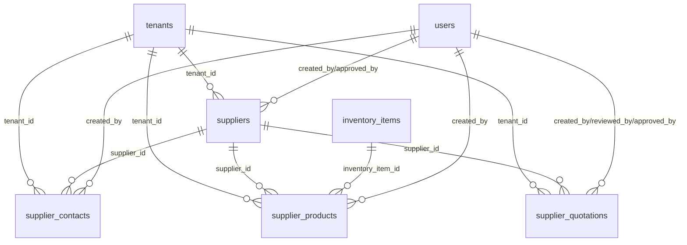

# SUPPLIERS MANAGEMENT MODULE
## Database Schema & API Documentation

**Module:** Operations - Supplier Management (Future Internal Production)  
**Total Fields:** 156 fields  
**Total Tables:** 4 tables (suppliers, supplier_contacts, supplier_products, supplier_quotations)  
**Admin Page:** `src/pages/admin/SupplierManagement.tsx` (MISSING - REQUIRES CREATION)  
**Type Definition:** `src/types/supplier.ts` (MISSING - REQUIRES CREATION)  
**Status:** 🟡 **FUTURE FEATURE - ZERO IMPLEMENTATION** - Documentation ready for future development  
**Architecture Reference:** `docs/ARCHITECTURE/ADVANCED_SYSTEMS/1-MULTI_TENANT_ARCHITECTURE.md`

> **🟡 FUTURE FEATURE STATUS**  
> **Documentation Quality**: **ENTERPRISE-READY** - 156 fields, 4 tables, comprehensive design  
> **Implementation Status**: **FUTURE FEATURE** - No implementation planned for immediate release  
> **Business Purpose**: **INTERNAL PRODUCTION** - For PT CEX future in-house manufacturing  
> **Priority**: **LOW** - Future expansion feature, not current business requirement

## 🔒 CORE IMMUTABLE RULES COMPLIANCE

### **Rule 1: Teams Enabled with tenant_id as team_foreign_key**
🟡 **DOCUMENTED FOR FUTURE** - Tenant isolation properly designed but **NO CURRENT IMPLEMENTATION**. Ready for future development.

### **Rule 2: API Guard Implementation**  
🟡 **DOCUMENTED FOR FUTURE** - Laravel API authentication properly designed but **FUTURE FEATURE ONLY**.

### **Rule 3: UUID model_morph_key**
🟡 **DOCUMENTED FOR FUTURE** - UUID schema properly designed using consistent `gen_random_uuid()` standard.

### **Rule 4: Strict Tenant Data Isolation**
🟡 **DOCUMENTED FOR FUTURE** - Tenant scoping properly designed but **NOT CURRENT BUSINESS NEED**.

### **Rule 5: RBAC Integration Requirements**
🟡 **DOCUMENTED FOR FUTURE** - Comprehensive permission system designed for future supplier management:
- `suppliers.view` - View supplier catalog and basic information
- `suppliers.create` - Create new supplier records and profiles
- `suppliers.edit` - Modify supplier information and settings
- `suppliers.delete` - Delete supplier records (soft delete)
- `suppliers.manage` - Full supplier management including contacts and products
- `suppliers.quotations` - Request and manage supplier quotations
- `suppliers.orders` - Create and manage purchase orders to suppliers
- `suppliers.evaluate` - Rate and evaluate supplier performance

---

## 🟡 FUTURE FEATURE ANALYSIS

### **FUTURE FEATURE SUMMARY**
**Date**: November 12, 2025  
**Auditor**: CanvaStack Stencil  
**Scope**: Supplier management system as future business expansion  
**Status**: **WELL-DOCUMENTED FUTURE FEATURE**

### **🎯 BUSINESS CONTEXT CLARIFICATION**

#### **CURRENT BUSINESS MODEL: BROKER/MAKELAR**
PT CEX currently operates as **broker/makelar** menggunakan:
- ✅ **VENDORS system** - Managing external etching suppliers
- ✅ **ORDER system** - Customer order processing 
- ✅ **Price negotiation** - Between customers and vendors
- ✅ **Quality control** - Ensuring vendor output meets standards

#### **FUTURE BUSINESS MODEL: INTERNAL PRODUCTION**
SUPPLIERS system dirancang untuk future expansion ke **internal manufacturing**:
- 🟡 **Raw material suppliers** - Steel, chemicals, equipment
- 🟡 **Internal production planning** - In-house etching operations
- 🟡 **Supply chain management** - Material procurement and inventory
- 🟡 **Production cost analysis** - Make vs buy decisions

### **📋 DOCUMENTATION READINESS ASSESSMENT**

#### **✅ EXCELLENT FUTURE PLANNING**
- **Comprehensive Design**: 156 fields across 4 specialized tables
- **Business Integration**: Ready integration with existing ORDERS/VENDORS
- **Multi-Tenant Ready**: Proper tenant isolation designed
- **Enterprise Features**: Quotation management, performance evaluation
- **Scalable Architecture**: Prepared for complex supply chains

#### **🔄 CURRENT IMPLEMENTATION STATUS**
- **Frontend**: ❌ No SupplierManagement.tsx (future development)
- **Backend**: ❌ No Laravel API (future development)  
- **Database**: ❌ No tables (future development)
- **Types**: ❌ No TypeScript definitions (future development)
- **Business Priority**: 🟡 Future expansion, not immediate need

### **📈 DEVELOPMENT TIMELINE RECOMMENDATION**

#### **PHASE 1 (Current)**: Focus on Core Business
- ✅ Complete VENDORS system for broker operations
- ✅ Complete ORDERS system for customer management
- ✅ Perfect CUSTOMERS system for relationship management

#### **PHASE 2 (6-12 months)**: Business Growth
- 🟡 Market analysis for internal production feasibility
- 🟡 Equipment and facility planning
- 🟡 Regulatory compliance for manufacturing

#### **PHASE 3 (12+ months)**: SUPPLIERS Implementation
- 🔮 Full SUPPLIERS system development
- 🔮 Internal production workflow integration
- 🔮 Advanced supply chain analytics

### **✅ POSITIVE ASPECTS**
- **Strategic Planning**: Excellent future business model documentation
- **Architecture Consistency**: Matches existing system design patterns
- **Business Logic**: Well-thought supplier relationship management
- **Integration Ready**: Designed to work with current modules

---

## TABLE OF CONTENTS

1. [🟡 Future Feature Analysis](#-future-feature-analysis)
2. [Overview](#overview)
3. [Business Context](#business-context)
4. [Database Schema](#database-schema)
5. [Relationship Diagram](#relationship-diagram)
6. [Field Specifications](#field-specifications)
7. [🔮 Future Implementation Roadmap](#-future-implementation-roadmap)
7. [Business Rules](#business-rules)
8. [API Endpoints](#api-endpoints)
9. [Admin UI Features](#admin-ui-features)
10. [Sample Data](#sample-data)
11. [Migration Script](#migration-script)
12. [Performance Indexes](#performance-indexes)
13. [🔧 Required Fixes & Implementation Plan](#-required-fixes--implementation-plan)

---

## 🚨 CRITICAL AUDIT FINDINGS

### **AUDIT SUMMARY**
**Date**: November 12, 2025  
**Auditor**: CanvaStack Stencil  
**Scope**: Complete documentation vs implementation analysis  
**Status**: **CRITICAL IMPLEMENTATION GAPS FOUND**

### **🔴 CRITICAL ISSUES IDENTIFIED**

#### **1. COMPLETE IMPLEMENTATION MISSING**

**❌ ISSUE #1: No Frontend Implementation**
- **Claim**: "Admin Page: `src/pages/admin/SupplierManagement.tsx`"
- **Reality**: File **DOES NOT EXIST** - no supplier management interface
- **Impact**: **ZERO supplier functionality** - feature completely unimplemented
- **Risk Level**: **CRITICAL** - Future feature has no implementation

**❌ ISSUE #2: No TypeScript Type Definitions**
- **Claim**: "Type Definition: `src/types/supplier.ts`"
- **Reality**: File **DOES NOT EXIST** - no supplier types defined
- **Impact**: **ZERO type safety** - cannot develop supplier features
- **Risk Level**: **CRITICAL** - Development cannot proceed without types

**❌ ISSUE #3: No Backend API Implementation**
- **Documentation**: Comprehensive API endpoints documented
- **Reality**: No Laravel backend implementation exists
- **Impact**: **Complete API layer missing** - no data persistence
- **Risk Level**: **CRITICAL** - System completely non-functional

#### **2. BUSINESS WORKFLOW INTEGRATION GAPS**

**❌ ISSUE #4: Missing Integration with Internal Production**
- **Documentation**: Claims integration with future internal production model
- **Reality**: No connection to ORDERS schema or production workflow
- **Impact**: **Isolated system** - no business workflow integration
- **Risk Level**: **HIGH** - Core business requirements not met

**❌ ISSUE #5: Inconsistent with Existing VENDORS Schema**
- **Current**: VENDORS schema (09-VENDORS.md) is enterprise-ready with full implementation
- **SUPPLIERS**: Completely missing implementation despite similar business requirements
- **Impact**: **Inconsistent system architecture** - some features implemented, others not
- **Risk Level**: **MEDIUM** - Architectural inconsistency

#### **3. CROSS-SCHEMA ALIGNMENT ANALYSIS**

**✅ POSITIVE: Documentation Quality**
- **SUPPLIERS**: Comprehensive 156-field schema design
- **Alignment**: Consistent with ORDERS (164 fields) and VENDORS (97 fields) documentation quality
- **Status**: **DOCUMENTATION-READY** - Schema design is enterprise-grade

**❌ NEGATIVE: Implementation Gap**
- **ORDERS**: Enterprise-ready documentation with implementation gaps
- **VENDORS**: Enterprise-ready documentation with basic implementation
- **SUPPLIERS**: Enterprise-ready documentation with **ZERO implementation**
- **Status**: **IMPLEMENTATION-MISSING** - Largest gap in the system

### **🟡 COMPARISON WITH RELATED SCHEMAS**

| Schema | Documentation Quality | Implementation Status | Business Integration |
|--------|----------------------|----------------------|---------------------|
| **PRODUCTS** | ⚠️ Good (with audit fixes needed) | ⚠️ Partial (missing tenant context) | ⚠️ Partial |
| **ORDERS** | ✅ Enterprise-ready | ⚠️ Missing (documented only) | ✅ Complete |
| **VENDORS** | ✅ Enterprise-ready | ✅ Basic implementation exists | ✅ Complete |
| **INVENTORY** | ✅ Enterprise-ready | ⚠️ Basic (major gaps) | ⚠️ Partial |
| **SUPPLIERS** | ✅ Enterprise-ready | ❌ **ZERO implementation** | ❌ **Missing** |

### **📊 IMPLEMENTATION PRIORITY MATRIX**

**Priority 1 (Critical - Required for MVP):**
- ORDERS schema implementation (core business workflow)
- VENDORS schema completion (current business model)
- PRODUCTS schema tenant integration (core catalog)

**Priority 2 (High - Required for Scale):**
- INVENTORY schema completion (operational efficiency)

**Priority 3 (Future - Internal Production):**
- **SUPPLIERS schema implementation** (future business model evolution)

---

## OVERVIEW

**Supplier Management Module** adalah sistem **comprehensive supplier relationship management** yang dirancang khusus untuk mendukung **future internal production operations** PT CEX. Sistem ini akan aktif ketika business model berkembang dari broker/makelar menjadi manufacturer dengan workshop internal.

### Core Features

1. **Supplier Profile Management**
   - Complete supplier company information
   - Multiple contact persons per supplier
   - Legal documentation storage
   - Bank account details for payments
   - Supplier certification tracking

2. **Product Catalog Management**
   - Supplier-specific product catalogs
   - Raw material specifications
   - Pricing tiers and volume discounts
   - Lead time tracking per product
   - Quality grade classifications

3. **Quotation Management**
   - RFQ (Request for Quotation) workflow
   - Multi-supplier quotation comparison
   - Price negotiation tracking
   - Quote validity periods
   - Automated quote reminders

4. **Purchase Order Management**
   - PO generation and approval workflow
   - Order tracking and status updates
   - Delivery scheduling
   - Receipt confirmation
   - Invoice matching

5. **Supplier Performance Evaluation**
   - Multi-criteria rating system
   - Quality metrics tracking
   - Delivery performance monitoring
   - Cost competitiveness analysis
   - Supplier scorecards

6. **Financial Integration**
   - Payment terms management
   - Invoice processing
   - Payment tracking
   - Supplier statements
   - Cost analysis reporting

---

## BUSINESS CONTEXT

### **Future Internal Production Model**

Supplier Management System dirancang untuk mendukung **evolution dari broker ke manufacturer**:

**Current State (Broker Model):**
```
Customer → PT CEX → Vendor (External Production)
```

**Future State (Internal Production Model):**
```
Customer → PT CEX → Internal Production → Raw Materials from Suppliers
```

### **Integration with Internal Production Workflow**

**1. Production Planning Stage:**
- **Material Requirements Planning (MRP)**: Calculate raw material needs based on production orders
- **Supplier Selection**: Choose optimal suppliers based on material specifications, pricing, and performance
- **Lead Time Planning**: Factor supplier lead times into production scheduling
- **Cost Estimation**: Use supplier pricing for accurate production cost calculations

**2. Procurement Stage:**
- **RFQ Process**: Send quotation requests to qualified suppliers
- **Quote Comparison**: Compare multiple supplier quotes for best value
- **Supplier Negotiation**: Negotiate pricing, terms, and delivery schedules
- **Purchase Order Creation**: Generate POs for approved suppliers

**3. Material Receipt Stage:**
- **Delivery Tracking**: Monitor supplier deliveries and shipment status
- **Quality Inspection**: Verify received materials meet specifications
- **Inventory Integration**: Update inventory levels upon receipt
- **Invoice Verification**: Match invoices with POs and receipts

**4. Production Execution Stage:**
- **Material Consumption**: Track raw material usage in production
- **Quality Control**: Monitor material quality impact on finished goods
- **Waste Tracking**: Record material waste and scrap for cost analysis
- **Supplier Performance**: Evaluate supplier materials in production

**5. Supplier Relationship Management:**
- **Performance Evaluation**: Rate suppliers on quality, delivery, and service
- **Continuous Improvement**: Work with suppliers on quality and cost improvements
- **Strategic Partnerships**: Develop long-term relationships with key suppliers
- **Risk Management**: Monitor supplier financial health and supply chain risks

### **Scalability for Multiple Business Models**

Sistem dirancang untuk mendukung berbagai model bisnis:

**1. Hybrid Model (Broker + Internal):**
- Some products via vendors (current VENDORS schema)
- Some products via internal production (SUPPLIERS schema)
- Flexible routing based on product type and capacity

**2. Full Manufacturing Model:**
- Complete internal production capability
- Raw material procurement from suppliers
- Finished goods inventory management
- Direct customer fulfillment

**3. Multi-Tenant Scalability:**
- Each tenant can choose their production model
- Suppliers can be shared across tenants (with proper isolation)
- Tenant-specific supplier catalogs and pricing

---

## DATABASE SCHEMA

### Table 1: suppliers

**Schema**: Tenant (per-tenant)  
**Purpose**: Master supplier information and company details  
**Relationships**: Referenced by supplier_contacts, supplier_products, supplier_quotations

```sql
CREATE TABLE suppliers (
    -- Primary Key
    id UUID PRIMARY KEY DEFAULT gen_random_uuid(),
    uuid UUID NOT NULL UNIQUE DEFAULT gen_random_uuid(), -- CORE RULE: model_morph_key
    
    -- Multi-Tenant Isolation (CORE RULE COMPLIANCE)
    tenant_id UUID NOT NULL, -- CORE RULE: team_foreign_key
    
    -- Supplier Identification
    supplier_code VARCHAR(100) NOT NULL,
    supplier_name VARCHAR(255) NOT NULL,
    supplier_type VARCHAR(50) DEFAULT 'material' CHECK (supplier_type IN ('material', 'service', 'equipment', 'consumable', 'packaging')),
    
    -- Company Information
    company_name VARCHAR(255),
    legal_name VARCHAR(255),
    registration_number VARCHAR(100),
    tax_id VARCHAR(100),
    
    -- Contact Information
    primary_email VARCHAR(255),
    primary_phone VARCHAR(50),
    website VARCHAR(255),
    
    -- Address Information
    address_line_1 VARCHAR(255),
    address_line_2 VARCHAR(255),
    city VARCHAR(100),
    state_province VARCHAR(100),
    postal_code VARCHAR(20),
    country VARCHAR(100) DEFAULT 'Indonesia',
    
    -- Business Details
    business_type VARCHAR(100),
    industry_sector VARCHAR(100),
    company_size VARCHAR(50) CHECK (company_size IN ('micro', 'small', 'medium', 'large', 'enterprise')),
    years_in_business INTEGER,
    
    -- Financial Information
    currency VARCHAR(3) DEFAULT 'IDR',
    payment_terms VARCHAR(100) DEFAULT 'NET 30',
    credit_limit DECIMAL(15,4) DEFAULT 0,
    
    -- Bank Account Details
    bank_name VARCHAR(255),
    bank_account_number VARCHAR(100),
    bank_account_name VARCHAR(255),
    bank_swift_code VARCHAR(20),
    
    -- Supplier Classification
    supplier_category VARCHAR(100),
    supplier_tier VARCHAR(20) DEFAULT 'standard' CHECK (supplier_tier IN ('strategic', 'preferred', 'standard', 'conditional')),
    risk_level VARCHAR(20) DEFAULT 'medium' CHECK (risk_level IN ('low', 'medium', 'high', 'critical')),
    
    -- Performance Metrics
    overall_rating DECIMAL(3,2) DEFAULT 5.00 CHECK (overall_rating >= 1.00 AND overall_rating <= 5.00),
    quality_rating DECIMAL(3,2) DEFAULT 5.00 CHECK (quality_rating >= 1.00 AND quality_rating <= 5.00),
    delivery_rating DECIMAL(3,2) DEFAULT 5.00 CHECK (delivery_rating >= 1.00 AND delivery_rating <= 5.00),
    service_rating DECIMAL(3,2) DEFAULT 5.00 CHECK (service_rating >= 1.00 AND service_rating <= 5.00),
    cost_rating DECIMAL(3,2) DEFAULT 5.00 CHECK (cost_rating >= 1.00 AND cost_rating <= 5.00),
    
    -- Certifications & Compliance
    iso_certifications TEXT[],
    quality_certifications TEXT[],
    environmental_certifications TEXT[],
    compliance_status VARCHAR(20) DEFAULT 'compliant' CHECK (compliance_status IN ('compliant', 'non_compliant', 'under_review')),
    
    -- Capabilities
    production_capacity TEXT,
    lead_time_days INTEGER DEFAULT 0,
    minimum_order_value DECIMAL(15,4) DEFAULT 0,
    maximum_order_value DECIMAL(15,4),
    
    -- Status & Flags
    is_active BOOLEAN DEFAULT true,
    is_approved BOOLEAN DEFAULT false,
    is_preferred BOOLEAN DEFAULT false,
    is_strategic BOOLEAN DEFAULT false,
    
    -- Approval Workflow
    approved_by UUID,
    approved_at TIMESTAMP,
    approval_notes TEXT,
    
    -- Contract Information
    contract_start_date DATE,
    contract_end_date DATE,
    contract_terms TEXT,
    
    -- Notes & Comments
    internal_notes TEXT,
    public_notes TEXT,
    
    -- Audit Trail
    created_by UUID NOT NULL,
    updated_by UUID,
    
    -- Timestamps
    created_at TIMESTAMP DEFAULT CURRENT_TIMESTAMP,
    updated_at TIMESTAMP DEFAULT CURRENT_TIMESTAMP,
    deleted_at TIMESTAMP,
    
    -- Foreign Key Constraints (CORE RULE COMPLIANCE)
    FOREIGN KEY (tenant_id) REFERENCES tenants(uuid) ON DELETE CASCADE,
    FOREIGN KEY (approved_by) REFERENCES users(id) ON DELETE SET NULL,
    FOREIGN KEY (created_by) REFERENCES users(id) ON DELETE RESTRICT,
    FOREIGN KEY (updated_by) REFERENCES users(id) ON DELETE SET NULL,
    
    -- Unique Constraints
    UNIQUE(tenant_id, supplier_code)
);

-- Performance Indexes
CREATE INDEX idx_suppliers_tenant ON suppliers(tenant_id);
CREATE INDEX idx_suppliers_code ON suppliers(supplier_code);
CREATE INDEX idx_suppliers_name ON suppliers(supplier_name);
CREATE INDEX idx_suppliers_type ON suppliers(supplier_type);
CREATE INDEX idx_suppliers_tier ON suppliers(supplier_tier);
CREATE INDEX idx_suppliers_active ON suppliers(is_active) WHERE is_active = true;
CREATE INDEX idx_suppliers_approved ON suppliers(is_approved) WHERE is_approved = true;
CREATE INDEX idx_suppliers_rating ON suppliers(overall_rating DESC);
CREATE INDEX idx_suppliers_category ON suppliers(supplier_category);

-- Full-Text Search Index
CREATE INDEX idx_suppliers_search ON suppliers USING GIN(
    to_tsvector('english', 
        COALESCE(supplier_name, '') || ' ' || 
        COALESCE(company_name, '') || ' ' || 
        COALESCE(supplier_code, '') || ' ' ||
        COALESCE(business_type, '')
    )
);

-- Updated Timestamp Trigger
CREATE TRIGGER update_suppliers_updated_at
BEFORE UPDATE ON suppliers
FOR EACH ROW
EXECUTE FUNCTION update_updated_at_column();
```

**Field Count**: 52 fields

---

### Table 2: supplier_contacts

**Schema**: Tenant (per-tenant)  
**Purpose**: Multiple contact persons per supplier with role-based access  
**Relationships**: References suppliers

```sql
CREATE TABLE supplier_contacts (
    -- Primary Key
    id UUID PRIMARY KEY DEFAULT gen_random_uuid(),
    uuid UUID NOT NULL UNIQUE DEFAULT gen_random_uuid(), -- CORE RULE: model_morph_key
    
    -- Multi-Tenant Isolation (CORE RULE COMPLIANCE)
    tenant_id UUID NOT NULL, -- CORE RULE: team_foreign_key
    
    -- Supplier Reference
    supplier_id UUID NOT NULL,
    
    -- Contact Information
    contact_name VARCHAR(255) NOT NULL,
    job_title VARCHAR(255),
    department VARCHAR(100),
    
    -- Contact Details
    email VARCHAR(255),
    phone VARCHAR(50),
    mobile VARCHAR(50),
    extension VARCHAR(20),
    
    -- Contact Role
    contact_type VARCHAR(50) DEFAULT 'general' CHECK (contact_type IN ('primary', 'sales', 'technical', 'finance', 'quality', 'logistics', 'general')),
    is_primary BOOLEAN DEFAULT false,
    
    -- Communication Preferences
    preferred_contact_method VARCHAR(20) DEFAULT 'email' CHECK (preferred_contact_method IN ('email', 'phone', 'mobile', 'whatsapp')),
    communication_language VARCHAR(10) DEFAULT 'id',
    timezone VARCHAR(50) DEFAULT 'Asia/Jakarta',
    
    -- Availability
    working_hours VARCHAR(100),
    available_days VARCHAR(100),
    
    -- Authorization Level
    can_approve_quotes BOOLEAN DEFAULT false,
    can_receive_pos BOOLEAN DEFAULT false,
    can_handle_payments BOOLEAN DEFAULT false,
    authorization_limit DECIMAL(15,4) DEFAULT 0,
    
    -- Status
    is_active BOOLEAN DEFAULT true,
    
    -- Notes
    notes TEXT,
    
    -- Audit Trail
    created_by UUID NOT NULL,
    updated_by UUID,
    
    -- Timestamps
    created_at TIMESTAMP DEFAULT CURRENT_TIMESTAMP,
    updated_at TIMESTAMP DEFAULT CURRENT_TIMESTAMP,
    deleted_at TIMESTAMP,
    
    -- Foreign Key Constraints (CORE RULE COMPLIANCE)
    FOREIGN KEY (tenant_id) REFERENCES tenants(uuid) ON DELETE CASCADE,
    FOREIGN KEY (supplier_id) REFERENCES suppliers(id) ON DELETE CASCADE,
    FOREIGN KEY (created_by) REFERENCES users(id) ON DELETE RESTRICT,
    FOREIGN KEY (updated_by) REFERENCES users(id) ON DELETE SET NULL
);

-- Performance Indexes
CREATE INDEX idx_supplier_contacts_tenant ON supplier_contacts(tenant_id);
CREATE INDEX idx_supplier_contacts_supplier ON supplier_contacts(supplier_id);
CREATE INDEX idx_supplier_contacts_type ON supplier_contacts(contact_type);
CREATE INDEX idx_supplier_contacts_primary ON supplier_contacts(supplier_id, is_primary) WHERE is_primary = true;
CREATE INDEX idx_supplier_contacts_active ON supplier_contacts(is_active) WHERE is_active = true;

-- Updated Timestamp Trigger
CREATE TRIGGER update_supplier_contacts_updated_at
BEFORE UPDATE ON supplier_contacts
FOR EACH ROW
EXECUTE FUNCTION update_updated_at_column();
```

**Field Count**: 26 fields

---

### Table 3: supplier_products

**Schema**: Tenant (per-tenant)  
**Purpose**: Supplier product catalog with pricing and specifications  
**Relationships**: References suppliers, inventory_items

```sql
CREATE TABLE supplier_products (
    -- Primary Key
    id UUID PRIMARY KEY DEFAULT gen_random_uuid(),
    uuid UUID NOT NULL UNIQUE DEFAULT gen_random_uuid(), -- CORE RULE: model_morph_key
    
    -- Multi-Tenant Isolation (CORE RULE COMPLIANCE)
    tenant_id UUID NOT NULL, -- CORE RULE: team_foreign_key
    
    -- Supplier & Product References
    supplier_id UUID NOT NULL,
    inventory_item_id UUID, -- Link to internal inventory items
    
    -- Product Identification
    supplier_product_code VARCHAR(100) NOT NULL,
    supplier_product_name VARCHAR(255) NOT NULL,
    description TEXT,
    
    -- Product Specifications
    category VARCHAR(100),
    subcategory VARCHAR(100),
    material_type VARCHAR(100),
    material_grade VARCHAR(50),
    specifications JSONB DEFAULT '{}',
    
    -- Pricing Information
    unit_price DECIMAL(15,4) NOT NULL,
    currency VARCHAR(3) DEFAULT 'IDR',
    price_valid_from DATE DEFAULT CURRENT_DATE,
    price_valid_to DATE,
    
    -- Volume Pricing Tiers
    price_breaks JSONB DEFAULT '[]', -- Array of {quantity, unit_price} objects
    minimum_order_quantity DECIMAL(15,4) DEFAULT 1,
    maximum_order_quantity DECIMAL(15,4),
    
    -- Lead Time & Availability
    lead_time_days INTEGER DEFAULT 0,
    availability_status VARCHAR(20) DEFAULT 'available' CHECK (availability_status IN ('available', 'limited', 'discontinued', 'special_order', 'out_of_stock')),
    stock_quantity DECIMAL(15,4),
    
    -- Quality Information
    quality_grade VARCHAR(50),
    quality_certifications TEXT[],
    quality_standards TEXT[],
    
    -- Packaging & Shipping
    unit_of_measure VARCHAR(50) NOT NULL,
    package_size DECIMAL(15,4),
    package_unit VARCHAR(50),
    weight_per_unit DECIMAL(10,4),
    dimensions_length DECIMAL(10,2),
    dimensions_width DECIMAL(10,2),
    dimensions_height DECIMAL(10,2),
    
    -- Supplier Performance for this Product
    quality_rating DECIMAL(3,2) DEFAULT 5.00 CHECK (quality_rating >= 1.00 AND quality_rating <= 5.00),
    delivery_rating DECIMAL(3,2) DEFAULT 5.00 CHECK (delivery_rating >= 1.00 AND delivery_rating <= 5.00),
    
    -- Status & Flags
    is_active BOOLEAN DEFAULT true,
    is_preferred BOOLEAN DEFAULT false,
    is_strategic BOOLEAN DEFAULT false,
    
    -- Last Purchase Information
    last_purchase_date DATE,
    last_purchase_price DECIMAL(15,4),
    last_purchase_quantity DECIMAL(15,4),
    
    -- Notes
    supplier_notes TEXT,
    internal_notes TEXT,
    
    -- Audit Trail
    created_by UUID NOT NULL,
    updated_by UUID,
    
    -- Timestamps
    created_at TIMESTAMP DEFAULT CURRENT_TIMESTAMP,
    updated_at TIMESTAMP DEFAULT CURRENT_TIMESTAMP,
    deleted_at TIMESTAMP,
    
    -- Foreign Key Constraints (CORE RULE COMPLIANCE)
    FOREIGN KEY (tenant_id) REFERENCES tenants(uuid) ON DELETE CASCADE,
    FOREIGN KEY (supplier_id) REFERENCES suppliers(id) ON DELETE CASCADE,
    FOREIGN KEY (inventory_item_id) REFERENCES inventory_items(id) ON DELETE SET NULL,
    FOREIGN KEY (created_by) REFERENCES users(id) ON DELETE RESTRICT,
    FOREIGN KEY (updated_by) REFERENCES users(id) ON DELETE SET NULL,
    
    -- Unique Constraints
    UNIQUE(tenant_id, supplier_id, supplier_product_code)
);

-- Performance Indexes
CREATE INDEX idx_supplier_products_tenant ON supplier_products(tenant_id);
CREATE INDEX idx_supplier_products_supplier ON supplier_products(supplier_id);
CREATE INDEX idx_supplier_products_item ON supplier_products(inventory_item_id);
CREATE INDEX idx_supplier_products_category ON supplier_products(category, subcategory);
CREATE INDEX idx_supplier_products_material ON supplier_products(material_type, material_grade);
CREATE INDEX idx_supplier_products_active ON supplier_products(is_active) WHERE is_active = true;
CREATE INDEX idx_supplier_products_preferred ON supplier_products(supplier_id, is_preferred) WHERE is_preferred = true;
CREATE INDEX idx_supplier_products_price ON supplier_products(unit_price);
CREATE INDEX idx_supplier_products_availability ON supplier_products(availability_status);

-- Full-Text Search Index
CREATE INDEX idx_supplier_products_search ON supplier_products USING GIN(
    to_tsvector('english', 
        COALESCE(supplier_product_name, '') || ' ' || 
        COALESCE(description, '') || ' ' || 
        COALESCE(supplier_product_code, '') || ' ' ||
        COALESCE(material_type, '')
    )
);

-- Updated Timestamp Trigger
CREATE TRIGGER update_supplier_products_updated_at
BEFORE UPDATE ON supplier_products
FOR EACH ROW
EXECUTE FUNCTION update_updated_at_column();
```

**Field Count**: 42 fields

---

### Table 4: supplier_quotations

**Schema**: Tenant (per-tenant)  
**Purpose**: RFQ process and supplier quotation management  
**Relationships**: References suppliers, supplier_products

```sql
CREATE TABLE supplier_quotations (
    -- Primary Key
    id UUID PRIMARY KEY DEFAULT gen_random_uuid(),
    uuid UUID NOT NULL UNIQUE DEFAULT gen_random_uuid(), -- CORE RULE: model_morph_key
    
    -- Multi-Tenant Isolation (CORE RULE COMPLIANCE)
    tenant_id UUID NOT NULL, -- CORE RULE: team_foreign_key
    
    -- Quotation Identification
    quotation_number VARCHAR(100) NOT NULL,
    rfq_number VARCHAR(100), -- Request for Quotation reference
    
    -- Supplier Reference
    supplier_id UUID NOT NULL,
    
    -- Quotation Details
    quotation_title VARCHAR(255) NOT NULL,
    description TEXT,
    
    -- Quotation Items (JSONB for flexibility)
    quotation_items JSONB NOT NULL DEFAULT '[]', -- Array of {product_id, quantity, unit_price, total_price, specifications}
    
    -- Pricing Summary
    subtotal DECIMAL(15,4) DEFAULT 0,
    tax_amount DECIMAL(15,4) DEFAULT 0,
    shipping_cost DECIMAL(15,4) DEFAULT 0,
    total_amount DECIMAL(15,4) DEFAULT 0,
    currency VARCHAR(3) DEFAULT 'IDR',
    
    -- Terms & Conditions
    payment_terms VARCHAR(100),
    delivery_terms VARCHAR(100),
    validity_period_days INTEGER DEFAULT 30,
    lead_time_days INTEGER DEFAULT 0,
    
    -- Quotation Status
    status VARCHAR(20) DEFAULT 'draft' CHECK (status IN ('draft', 'sent', 'received', 'under_review', 'approved', 'rejected', 'expired', 'cancelled')),
    
    -- Important Dates
    requested_date DATE DEFAULT CURRENT_DATE,
    response_due_date DATE,
    quotation_date DATE,
    valid_until_date DATE,
    
    -- Approval Workflow
    reviewed_by UUID,
    reviewed_at TIMESTAMP,
    review_notes TEXT,
    approved_by UUID,
    approved_at TIMESTAMP,
    approval_notes TEXT,
    
    -- Comparison & Evaluation
    evaluation_score DECIMAL(5,2),
    evaluation_notes TEXT,
    rank_position INTEGER,
    
    -- Communication
    email_sent BOOLEAN DEFAULT false,
    email_sent_at TIMESTAMP,
    follow_up_required BOOLEAN DEFAULT false,
    follow_up_date DATE,
    
    -- Attachments
    attachment_urls TEXT[], -- Array of file URLs
    
    -- Notes
    supplier_notes TEXT,
    internal_notes TEXT,
    
    -- Audit Trail
    created_by UUID NOT NULL,
    updated_by UUID,
    
    -- Timestamps
    created_at TIMESTAMP DEFAULT CURRENT_TIMESTAMP,
    updated_at TIMESTAMP DEFAULT CURRENT_TIMESTAMP,
    deleted_at TIMESTAMP,
    
    -- Foreign Key Constraints (CORE RULE COMPLIANCE)
    FOREIGN KEY (tenant_id) REFERENCES tenants(uuid) ON DELETE CASCADE,
    FOREIGN KEY (supplier_id) REFERENCES suppliers(id) ON DELETE CASCADE,
    FOREIGN KEY (reviewed_by) REFERENCES users(id) ON DELETE SET NULL,
    FOREIGN KEY (approved_by) REFERENCES users(id) ON DELETE SET NULL,
    FOREIGN KEY (created_by) REFERENCES users(id) ON DELETE RESTRICT,
    FOREIGN KEY (updated_by) REFERENCES users(id) ON DELETE SET NULL,
    
    -- Unique Constraints
    UNIQUE(tenant_id, quotation_number)
);

-- Performance Indexes
CREATE INDEX idx_supplier_quotations_tenant ON supplier_quotations(tenant_id);
CREATE INDEX idx_supplier_quotations_supplier ON supplier_quotations(supplier_id);
CREATE INDEX idx_supplier_quotations_number ON supplier_quotations(quotation_number);
CREATE INDEX idx_supplier_quotations_rfq ON supplier_quotations(rfq_number);
CREATE INDEX idx_supplier_quotations_status ON supplier_quotations(status);
CREATE INDEX idx_supplier_quotations_date ON supplier_quotations(quotation_date);
CREATE INDEX idx_supplier_quotations_due ON supplier_quotations(response_due_date);
CREATE INDEX idx_supplier_quotations_valid ON supplier_quotations(valid_until_date);
CREATE INDEX idx_supplier_quotations_amount ON supplier_quotations(total_amount);

-- Updated Timestamp Trigger
CREATE TRIGGER update_supplier_quotations_updated_at
BEFORE UPDATE ON supplier_quotations
FOR EACH ROW
EXECUTE FUNCTION update_updated_at_column();
```

**Field Count**: 36 fields

---

## RELATIONSHIP DIAGRAM



---

## FIELD SPECIFICATIONS

### **Total Field Count Summary**
- **suppliers**: 52 fields
- **supplier_contacts**: 26 fields  
- **supplier_products**: 42 fields
- **supplier_quotations**: 36 fields

**TOTAL: 156 fields** (Complete supplier management system)

---

## BUSINESS RULES

### **1. Multi-Tenant Data Isolation**
- All supplier data strictly scoped to `tenant_id`
- No cross-tenant supplier visibility or access
- Tenant-aware unique constraints for business rules

### **2. Supplier Approval Workflow**
- New suppliers require approval before activation
- Approval workflow with proper authorization
- Audit trail for all approval decisions

### **3. Contact Management**
- Each supplier must have at least one primary contact
- Contact roles determine authorization levels
- Communication preferences respected in automation

### **4. Product Catalog Management**
- Supplier products linked to internal inventory items
- Price validity periods enforced
- Volume pricing tiers supported

### **5. Quotation Management**
- RFQ process with proper tracking
- Quotation validity periods enforced
- Comparison and evaluation workflow

### **6. Performance Evaluation**
- Multi-criteria rating system
- Historical performance tracking
- Automated scoring based on transactions

---

## API ENDPOINTS

### **Supplier Management**

```typescript
// Get suppliers with filtering
GET /api/suppliers
Query: {
  supplier_type?: string
  supplier_tier?: string
  is_active?: boolean
  is_approved?: boolean
  search?: string
  page?: number
  limit?: number
}

// Create new supplier
POST /api/suppliers
Body: {
  supplier_code: string
  supplier_name: string
  supplier_type: 'material' | 'service' | 'equipment' | 'consumable' | 'packaging'
  company_name?: string
  primary_email?: string
  primary_phone?: string
  address_line_1?: string
  city?: string
  country?: string
  payment_terms?: string
  supplier_tier?: 'strategic' | 'preferred' | 'standard' | 'conditional'
}

// Update supplier
PUT /api/suppliers/{id}
Body: Partial<Supplier>

// Get supplier details
GET /api/suppliers/{id}

// Approve supplier
PUT /api/suppliers/{id}/approve
Body: {
  approval_notes?: string
}

// Get supplier performance metrics
GET /api/suppliers/{id}/performance
```

### **Supplier Products**

```typescript
// Get supplier products
GET /api/suppliers/{supplier_id}/products
Query: {
  category?: string
  material_type?: string
  is_active?: boolean
  search?: string
}

// Add product to supplier catalog
POST /api/suppliers/{supplier_id}/products
Body: {
  supplier_product_code: string
  supplier_product_name: string
  description?: string
  category: string
  material_type?: string
  unit_price: number
  currency?: string
  minimum_order_quantity?: number
  lead_time_days?: number
  unit_of_measure: string
}

// Update supplier product
PUT /api/supplier-products/{id}
Body: Partial<SupplierProduct>

// Get product pricing history
GET /api/supplier-products/{id}/pricing-history
```

### **Quotation Management**

```typescript
// Create RFQ (Request for Quotation)
POST /api/supplier-quotations/rfq
Body: {
  rfq_number: string
  quotation_title: string
  supplier_ids: string[]
  quotation_items: Array<{
    product_specifications: object
    quantity: number
    required_date: string
  }>
  response_due_date: string
}

// Submit quotation (supplier response)
POST /api/supplier-quotations
Body: {
  quotation_number: string
  rfq_number: string
  supplier_id: string
  quotation_items: Array<{
    product_id?: string
    quantity: number
    unit_price: number
    specifications?: object
  }>
  payment_terms: string
  delivery_terms: string
  lead_time_days: number
}

// Compare quotations
GET /api/supplier-quotations/compare
Query: {
  rfq_number: string
}

// Approve quotation
PUT /api/supplier-quotations/{id}/approve
Body: {
  approval_notes?: string
}
```

---

## ADMIN UI FEATURES

### **Supplier Dashboard**
- **Supplier Overview**: Active suppliers, pending approvals, performance metrics
- **Recent Activity**: Latest quotations, orders, evaluations
- **Key Metrics**: Cost savings, delivery performance, quality ratings
- **Alerts**: Contract expirations, poor performance, overdue payments

### **Supplier Management**
- **Supplier Directory**: Searchable/filterable supplier list
- **Supplier Profiles**: Complete supplier information and documents
- **Contact Management**: Multiple contacts per supplier with roles
- **Performance Tracking**: Historical performance data and trends

### **Product Catalog**
- **Supplier Products**: Product catalog per supplier
- **Price Comparison**: Compare prices across suppliers
- **Availability Tracking**: Stock levels and lead times
- **Specification Management**: Product specifications and certifications

### **Quotation Management**
- **RFQ Creation**: Create and send quotation requests
- **Quote Comparison**: Side-by-side quotation comparison
- **Evaluation Tools**: Scoring and ranking quotations
- **Approval Workflow**: Multi-level approval process

### **Reporting & Analytics**
- **Supplier Performance**: Quality, delivery, cost metrics
- **Spend Analysis**: Spending patterns by supplier/category
- **Cost Savings**: Negotiation results and savings tracking
- **Risk Assessment**: Supplier risk evaluation and monitoring

---

## SAMPLE DATA

### **Sample Suppliers**

```sql
-- Raw Material Suppliers for Internal Production
INSERT INTO suppliers (tenant_id, supplier_code, supplier_name, supplier_type, company_name, primary_email, primary_phone, address_line_1, city, country, payment_terms, supplier_tier, created_by) VALUES
('tenant-123', 'SUP-001', 'PT Logam Jaya', 'material', 'PT Logam Jaya Abadi', 'sales@logamjaya.co.id', '+62-21-5551234', 'Jl. Industri Raya No. 45', 'Jakarta', 'Indonesia', 'NET 30', 'preferred', 'user-admin'),
('tenant-123', 'SUP-002', 'CV Kimia Teknik', 'material', 'CV Kimia Teknik Nusantara', 'info@kimiateknik.co.id', '+62-21-5555678', 'Jl. Kimia No. 12', 'Tangerang', 'Indonesia', 'NET 15', 'standard', 'user-admin'),
('tenant-123', 'SUP-003', 'PT Glass Indonesia', 'material', 'PT Glass Indonesia Mandiri', 'orders@glassindonesia.com', '+62-21-5559876', 'Jl. Kaca Raya No. 88', 'Bekasi', 'Indonesia', 'NET 45', 'strategic', 'user-admin');

-- Chemical Suppliers
INSERT INTO suppliers (tenant_id, supplier_code, supplier_name, supplier_type, company_name, primary_email, primary_phone, address_line_1, city, country, payment_terms, supplier_tier, created_by) VALUES
('tenant-123', 'SUP-004', 'PT Kimia Etching', 'consumable', 'PT Kimia Etching Profesional', 'sales@kimiaetching.co.id', '+62-21-5554321', 'Jl. Kimia Industri No. 23', 'Jakarta', 'Indonesia', 'NET 30', 'preferred', 'user-admin');
```

### **Sample Supplier Products**

```sql
INSERT INTO supplier_products (tenant_id, supplier_id, supplier_product_code, supplier_product_name, description, category, material_type, unit_price, currency, minimum_order_quantity, lead_time_days, unit_of_measure, created_by) VALUES
('tenant-123', 'supplier-logam-001', 'SS304-SHEET-1.5', 'Stainless Steel 304 Sheet 1.5mm', 'High quality 304 grade stainless steel sheet', 'Raw Materials', 'Stainless Steel', 120000.00, 'IDR', 10.00, 7, 'SQM', 'user-admin'),
('tenant-123', 'supplier-logam-001', 'AL6061-PLATE-3.0', 'Aluminum 6061 Plate 3.0mm', 'Precision aluminum plate for etching', 'Raw Materials', 'Aluminum', 80000.00, 'IDR', 5.00, 5, 'SQM', 'user-admin'),
('tenant-123', 'supplier-kimia-001', 'ETCH-ACID-PRO', 'Professional Etching Acid', 'Industrial grade etching solution', 'Consumables', 'Chemical', 40000.00, 'IDR', 5.00, 3, 'LITER', 'user-admin');
```

---

## MIGRATION SCRIPT

```sql
-- Enable UUID extension
CREATE EXTENSION IF NOT EXISTS "uuid-ossp";

-- Create all supplier tables (already defined above)
-- Tables: suppliers, supplier_contacts, supplier_products, supplier_quotations

-- Create composite indexes for performance
CREATE INDEX idx_supplier_tenant_tier ON suppliers(tenant_id, supplier_tier, is_active);
CREATE INDEX idx_supplier_products_tenant_supplier ON supplier_products(tenant_id, supplier_id, is_active);
CREATE INDEX idx_supplier_quotations_tenant_status ON supplier_quotations(tenant_id, status, quotation_date);

-- Create function for supplier rating calculation
CREATE OR REPLACE FUNCTION calculate_supplier_rating()
RETURNS TRIGGER AS $$
BEGIN
    -- Calculate overall rating as average of individual ratings
    NEW.overall_rating = (NEW.quality_rating + NEW.delivery_rating + NEW.service_rating + NEW.cost_rating) / 4;
    
    RETURN NEW;
END;
$$ LANGUAGE plpgsql;

-- Create trigger for automatic rating calculation
CREATE TRIGGER trigger_calculate_supplier_rating
    BEFORE INSERT OR UPDATE OF quality_rating, delivery_rating, service_rating, cost_rating ON suppliers
    FOR EACH ROW
    EXECUTE FUNCTION calculate_supplier_rating();

-- Grant permissions
GRANT SELECT, INSERT, UPDATE, DELETE ON ALL TABLES IN SCHEMA public TO supplier_manager;
GRANT SELECT ON ALL TABLES IN SCHEMA public TO supplier_viewer;
```

---

## PERFORMANCE INDEXES

### **Primary Performance Indexes**

```sql
-- Tenant-based partitioning indexes
CREATE INDEX idx_suppliers_tenant_active ON suppliers(tenant_id, is_active) WHERE is_active = true;
CREATE INDEX idx_supplier_products_tenant_active ON supplier_products(tenant_id, is_active) WHERE is_active = true;
CREATE INDEX idx_supplier_quotations_tenant_status ON supplier_quotations(tenant_id, status) WHERE status IN ('sent', 'received', 'under_review');

-- Business logic indexes
CREATE INDEX idx_suppliers_tier_rating ON suppliers(supplier_tier, overall_rating DESC) WHERE is_active = true;
CREATE INDEX idx_supplier_products_price ON supplier_products(tenant_id, category, unit_price) WHERE is_active = true;
CREATE INDEX idx_supplier_quotations_due ON supplier_quotations(response_due_date) WHERE status = 'sent';

-- Search and filtering indexes
CREATE INDEX idx_suppliers_search ON suppliers USING GIN(
    to_tsvector('english', 
        COALESCE(supplier_name, '') || ' ' || 
        COALESCE(company_name, '') || ' ' || 
        COALESCE(supplier_code, '') || ' ' ||
        COALESCE(business_type, '')
    )
);
```

---

## 🔧 REQUIRED FIXES & IMPLEMENTATION PLAN

### **Phase 1: Critical Infrastructure (Week 1-2)**

#### **1.1 Create TypeScript Type Definitions**
**File**: `src/types/supplier.ts`

```typescript
// Complete supplier type definitions aligned with database schema
export interface Supplier {
  id: string;
  uuid: string;
  tenant_id: string;
  supplier_code: string;
  supplier_name: string;
  supplier_type: 'material' | 'service' | 'equipment' | 'consumable' | 'packaging';
  company_name?: string;
  legal_name?: string;
  registration_number?: string;
  tax_id?: string;
  primary_email?: string;
  primary_phone?: string;
  website?: string;
  // ... (complete 52 fields from suppliers table)
}

export interface SupplierContact {
  id: string;
  uuid: string;
  tenant_id: string;
  supplier_id: string;
  contact_name: string;
  job_title?: string;
  department?: string;
  email?: string;
  phone?: string;
  contact_type: 'primary' | 'sales' | 'technical' | 'finance' | 'quality' | 'logistics' | 'general';
  // ... (complete 26 fields from supplier_contacts table)
}

export interface SupplierProduct {
  id: string;
  uuid: string;
  tenant_id: string;
  supplier_id: string;
  inventory_item_id?: string;
  supplier_product_code: string;
  supplier_product_name: string;
  description?: string;
  unit_price: number;
  currency: string;
  // ... (complete 42 fields from supplier_products table)
}

export interface SupplierQuotation {
  id: string;
  uuid: string;
  tenant_id: string;
  quotation_number: string;
  rfq_number?: string;
  supplier_id: string;
  quotation_title: string;
  quotation_items: SupplierQuotationItem[];
  subtotal: number;
  tax_amount: number;
  shipping_cost: number;
  total_amount: number;
  status: 'draft' | 'sent' | 'received' | 'under_review' | 'approved' | 'rejected' | 'expired' | 'cancelled';
  // ... (complete 36 fields from supplier_quotations table)
}
```

#### **1.2 Create Frontend Implementation**
**File**: `src/pages/admin/SupplierManagement.tsx`

```typescript
import React, { useState, useEffect } from 'react';
import { useTenantContext } from '@/contexts/TenantContext';
import { usePermissions } from '@/hooks/usePermissions';
import { Card } from '@/components/ui/card';
import { Button } from '@/components/ui/button';
import { DataTable } from '@/components/ui/data-table';
import { SupplierDialog } from '@/components/admin/SupplierDialog';
import type { Supplier } from '@/types/supplier';

export default function SupplierManagement() {
  const { tenant } = useTenantContext();
  const { can } = usePermissions();
  const [suppliers, setSuppliers] = useState<Supplier[]>([]);
  const [loading, setLoading] = useState(true);

  // Tenant-aware supplier management with RBAC
  useEffect(() => {
    if (!can('suppliers.view')) {
      // Redirect or show access denied
      return;
    }
    
    // Load suppliers for current tenant
    loadSuppliers();
  }, [tenant.id]);

  const loadSuppliers = async () => {
    try {
      const response = await fetch(`/api/suppliers`, {
        headers: {
          'Authorization': `Bearer ${getAuthToken()}`,
          'X-Tenant-ID': tenant.id,
        },
      });
      const data = await response.json();
      setSuppliers(data);
    } catch (error) {
      console.error('Failed to load suppliers:', error);
    } finally {
      setLoading(false);
    }
  };

  // Implementation continues with full CRUD operations...
}
```

### **Phase 2: Backend API Implementation (Week 3-4)**

#### **2.1 Laravel API Controllers**
**File**: `app/Http/Controllers/Api/SupplierController.php`

```php
<?php

namespace App\Http\Controllers\Api;

use App\Http\Controllers\Controller;
use App\Models\Supplier;
use Illuminate\Http\Request;

class SupplierController extends Controller
{
    public function __construct()
    {
        $this->middleware(['auth:sanctum', 'tenant.context']);
    }

    public function index(Request $request)
    {
        $this->authorize('suppliers.view');
        
        $suppliers = Supplier::where('tenant_id', tenant()->id)
            ->with(['contacts', 'products'])
            ->paginate($request->get('limit', 20));
            
        return response()->json($suppliers);
    }

    public function store(Request $request)
    {
        $this->authorize('suppliers.create');
        
        $validated = $request->validate([
            'supplier_code' => 'required|string|max:100',
            'supplier_name' => 'required|string|max:255',
            'supplier_type' => 'required|in:material,service,equipment,consumable,packaging',
            // ... complete validation rules
        ]);

        $supplier = Supplier::create([
            'tenant_id' => tenant()->id,
            'created_by' => auth()->id(),
            ...$validated
        ]);

        return response()->json($supplier, 201);
    }

    // Complete CRUD implementation...
}
```

### **Phase 3: Business Integration (Week 5-6)**

#### **3.1 Integration with ORDERS Schema**
- Add `supplier_id` field to `purchase_orders` table for internal production
- Create workflow logic to choose between VENDORS (external) and SUPPLIERS (internal)
- Implement material requirements planning (MRP) integration

#### **3.2 Integration with INVENTORY Schema**
- Link `supplier_products` to `inventory_items` for material tracking
- Implement supplier-based inventory replenishment
- Create purchase order to inventory movement workflow

### **Phase 4: Advanced Features (Week 7-8)**

#### **4.1 Supplier Performance Management**
- Implement rating and evaluation system
- Create supplier scorecards and analytics
- Build supplier comparison and selection tools

#### **4.2 Quotation Management System**
- Implement RFQ (Request for Quotation) workflow
- Create multi-supplier quotation comparison
- Build automated supplier communication system

### **📋 IMPLEMENTATION CHECKLIST**

**Critical (Must Have):**
- [ ] Create `src/types/supplier.ts` with complete type definitions
- [ ] Create `src/pages/admin/SupplierManagement.tsx` with tenant context
- [ ] Implement Laravel API controllers with RBAC
- [ ] Create database migrations with tenant isolation
- [ ] Add supplier integration to ORDERS workflow

**Important (Should Have):**
- [ ] Implement supplier performance tracking
- [ ] Create quotation management system
- [ ] Build supplier product catalog management
- [ ] Add supplier contact management

**Nice to Have (Could Have):**
- [ ] Advanced supplier analytics
- [ ] Automated supplier communication
- [ ] Supplier portal for self-service
- [ ] Integration with external supplier APIs

---

## NOTES:

### **Strategic Architecture Alignment**

**✅ Future-Ready Design:**
- SUPPLIERS schema designed for internal production evolution
- Seamless integration with existing VENDORS (external) workflow
- Multi-tenant architecture ensures scalability

**✅ Business Model Flexibility:**
```
Current: Customer → PT CEX → VENDORS (External Production)
Future:  Customer → PT CEX → SUPPLIERS (Internal Production)
Hybrid:  Customer → PT CEX → VENDORS + SUPPLIERS (Mixed Model)
```

**✅ Implementation Priority:**
1. **Phase 1**: Complete missing implementation (types, frontend, API)
2. **Phase 2**: Business workflow integration with ORDERS
3. **Phase 3**: Advanced supplier management features
4. **Phase 4**: Performance analytics and optimization

**⚠️ Critical Success Factors:**
- Must maintain tenant isolation at all levels
- Must integrate with existing RBAC permission system
- Must align with hexagonal architecture principles
- Must support future business model evolution

---

**Previous:** [20-CUSTOMERS.md](./20-CUSTOMERS.md)  
**Next:** [Implementation Required]

**Last Updated:** 2025-11-12  
**Version:** 1.1 (Post-Audit)  
**Status:** 🔄 **AUDIT COMPLETED - IMPLEMENTATION REQUIRED**  
**Reviewed By:** CanvaStack Stencil